# Alex AI — Complete Platform Report (Full Edition)

**Document:** `Alex_report.md`  
**Date:** June 16, 2026 (authoritative snapshot)  
**Author:** Platform engineering summary (codebase-derived)  
**Status:** Code complete for P0 + P1; AWS infra session-dependent (see §34.12)  
**Companion docs:** `P0_report.md`, `Alex_AI_2.0.md`, `Alex_chat_intelligence.md`, `Alex_Trading_Floor_2.0.md`, `Alex_Master_Implementation_Plan.md`, `Alex_Fixes.md`, `Agentic_Usecase.md`, `usecases.md`, `RIA.md`, `DM_apply.md`, `Startup.md`, `Ophelia.md`

---

## Table of Contents

1. [Executive Summary](#1-executive-summary)
2. [Unified Vision — Three Intelligence Layers](#2-unified-vision--three-intelligence-layers)
3. [What Alex Is — Problem, Positioning, USP](#3-what-alex-is--problem-positioning-usp)
4. [Competitive Landscape](#4-competitive-landscape)
5. [Business Model, Pricing & Unit Economics](#5-business-model-pricing--unit-economics)
6. [Architecture Overview](#6-architecture-overview)
7. [Sequence Diagrams — Per Route](#7-sequence-diagrams--per-route)
8. [Technology Stack](#8-technology-stack)
9. [AI Capabilities — Deep Dive](#9-ai-capabilities--deep-dive)
10. [Prompt Engineering Patterns](#10-prompt-engineering-patterns)
11. [MCP Server Configuration](#11-mcp-server-configuration)
12. [RAG & Context Service](#12-rag--context-service)
13. [Async Portfolio Research Pipeline](#13-async-portfolio-research-pipeline)
14. [Trading Floor — Complete Specification](#14-trading-floor--complete-specification)
15. [Guardrails & Safety](#15-guardrails--safety)
16. [Observability](#16-observability)
17. [Security & Authentication](#17-security--authentication)
18. [Complete API Reference](#18-complete-api-reference)
19. [SSE Event Types](#19-sse-event-types)
20. [Database Schema — Full Reference](#20-database-schema--full-reference)
21. [Environment Variables](#21-environment-variables)
22. [Infrastructure & Terraform](#22-infrastructure--terraform)
23. [Deployment & Operations](#23-deployment--operations)
24. [Test Suite & Verification](#24-test-suite--verification)
25. [Cost Model & Pricing Math](#25-cost-model--pricing-math)
26. [Implementation Status & Roadmap](#26-implementation-status--roadmap)
27. [Production Engineering Pillars](#27-production-engineering-pillars)
28. [Ophelia.md — Engineering Narrative Mapping](#28-opheliamd--engineering-narrative-mapping)
29. [Regulatory Positioning & Moat](#29-regulatory-positioning--moat)
30. [Key Concepts Glossary](#30-key-concepts-glossary)
31. [File Reference Map](#31-file-reference-map)
32. [Known Gaps & Technical Debt](#32-known-gaps--technical-debt)
33. [Change Log & Documentation Policy](#33-change-log--documentation-policy)
34. [Current Application State — Authoritative Snapshot (June 16, 2026)](#34-current-application-state--authoritative-snapshot-june-16-2026)
35. [Latest Functionalities Shipped — June 2026 Batch](#35-latest-functionalities-shipped--june-2026-batch)

---

## 1. Executive Summary

**Alex** is a production-grade, multi-agent AI financial intelligence platform deployed on AWS. It is **not** a brokerage, robo-advisor, or ChatGPT skin. It is an **AI-native financial intelligence layer** that sits on top of a user's portfolio.

### What is built today (code shipped)

| Layer | Capability | Status |
|-------|------------|--------|
| **Brain** | Unified chat with auto-routing (Chat / Fast / Deep / Debater / Parallel) | ✅ Code live |
| **Router intelligence** | Hybrid regex + LLM finance gate; scoped deep research; session follow-ups | ✅ FIX-001–012 |
| **Research** | Fast (yfinance), Deep (SEC + Playwright MCP), Multi-agent comparison | ✅ Code live |
| **Memory** | Per-user pgvector RAG, chunked ingest, semantic search, chat sessions | ✅ FIX-009 |
| **Autonomous** | 2-hour portfolio research → digest cards on dashboard | ✅ Pipeline live |
| **Hands** | 6-agent trading floor debate + trade log (advisory) | ✅ Code live |
| **Observability** | `/observe` tokens + cost per query, latency/tool/MCP pass-fail | ✅ FIX-007 |
| **Ops** | Dashboard cost widget + live **Refresh now** → `alex-ops-agent` | ✅ FIX-008 |
| **Safety** | Router guardrails, Bedrock guardrail, policy flags, off-topic blocks | ✅ Code live |
| **Audit trail** | `Alex_Fixes.md` FIX-001–012 + §33 CL-019–026 | ✅ Maintained |

> **Operational note (June 16, 2026):** ECS researcher deployed with FIX-012 (`sha256:55ae23f5…`). SageMaker + Aurora + Lambdas persist across sessions. See [§34.12](#3412-operational-state--session-lifecycle).

### One-line pitch

> **"Alex is the AI research team and trading floor you can't afford to hire — transparent, remembered, and always watching your portfolio."**

### Verified production metrics (June 16, 2026)

| Metric | Value |
|--------|-------|
| P0 foundation tests | **51 passed** (`scripts/test_p0.sh`) |
| P1 query router tests | **62 passed** (`scripts/tests/test_p1_router.py`) |
| pgvector RAG verification | `scripts/test_pgvector_rag.py` + `scripts/rag_maintenance.py` |
| Aurora schema tables | **24+** verified via `aurora_warmup.py` |
| Terraform modules | **9** (`0_vpc` … `9_trading_floor`) |
| Frontend API routes | **23** Next.js handlers (incl. `/api/trading/reset`) |
| ECS researcher endpoints | **13** FastAPI routes |
| Lambda agents | **8** functions |
| SageMaker embedding | `alex-embedding` — **InService** when session running |
| research_vectors rows | **~921** after FIX-009 cleanup (session-dependent) |
| Current ALB (session) | `http://alex-alb-1816782403.us-east-1.elb.amazonaws.com` |
| Frontend (Vercel) | `https://ai-financial-advisor-t6kt-abi2503s-projects.vercel.app` — HTTP 200 |
| Documentation change log | **CL-001 → CL-026** (see §33) |
| Platform fix audit log | **FIX-001 → FIX-012** (`Alex_Fixes.md`) |
| GitHub | `main` @ `cc8618c` — FIX-007–012 batch pushed June 16, 2026 |

> **Full inventory:** See [§34](#34-current-application-state--authoritative-snapshot-june-16-2026) and [§35](#35-latest-functionalities-shipped--june-2026-batch) for complete shipped vs planned breakdown.

---

## 2. Unified Vision — Three Intelligence Layers

Alex is designed as three interconnected intelligence layers sharing one data plane:

```mermaid
flowchart TB
    subgraph brain["Alex AI 2.0 — Brain"]
        CHAT[Unified Chat]
        ROUTER[Query Router]
        RAG[RAG Engine]
        SYNTH[Synthesizer — roadmap]
    end

    subgraph quant["Quant Intelligence — Numbers — P13 roadmap"]
        QNT[Quant MCP Layer]
        CHARTS[Charts + Indicators]
    end

    subgraph hands["Trading Floor 2.0 — Hands"]
        ORCH[Orchestrator]
        DEBATE[6-Agent Debate]
        SIM[(simulated_trades)]
        RL[RL Weights — roadmap]
    end

    subgraph observe["Observability"]
        OBS[/observe]
    end

    CHAT --> ROUTER --> RAG
    ROUTER --> SYNTH
    QNT --> DEBATE
    RAG --> DEBATE
    ORCH --> DEBATE --> SIM
    DEBATE --> RL
    CHAT --> OBS
    DEBATE --> OBS
    RAG --> OBS
```

### User journey (target state)

1. Ask Alex anything → intelligent, remembered, sourced commentary
2. Alex's research enriches trading floor agent debates automatically
3. Trading floor autonomously paper-trades a simulation seeded from user's portfolio
4. Alex proactively compares simulation performance vs real holdings
5. Everything visible on `/observe` — cost, latency, guardrails, agent votes

### Why three layers instead of one chatbot

| Single chatbot | Alex three-layer model |
|----------------|------------------------|
| One model, one cost profile | Tiered models — Lite for chat, Pro for depth |
| Answers from training data | Tool-augmented — live prices, SEC filings, browser |
| No autonomous behavior | 2h portfolio research without user prompting |
| Black-box recommendations | 5 agents debate with stored votes and reasoning |
| No learning loop | RL weights improve agent trust over time (roadmap) |

**USP:** The product is the **orchestration infrastructure** — routing, memory, tools, specialists, safety, observability — not just the LLM response.

---

## 3. What Alex Is — Problem, Positioning, USP

### 3.1 The problem Alex solves

Most "AI financial advisors" are one model answering everything. They:

- Cannot choose between a 5-second price lookup and a 5-minute SEC filing analysis
- Have no memory across sessions scoped to *your* portfolio
- Cannot show *which tools failed* or *what a query cost*
- Mix trading advice with research without guardrails
- Treat all questions the same — greetings, bond education, and NVDA 10-K analysis get identical treatment

### 3.2 What Alex is NOT

| Not this | Why |
|----------|-----|
| A brokerage (Robinhood, IBKR) | No real trade execution — avoids SEC broker-dealer registration |
| A robo-advisor (Wealthfront) | Does not manage money or give personalized investment advice |
| A signal service | Shows reasoning and debate, not blind "buy now" tips |
| ChatGPT with a finance skin | Live market data, agent debates, portfolio memory, quant tools |

### 3.3 USP table

| USP | What it means | Why competitors rarely do this |
|-----|---------------|-------------------------------|
| **Intelligent auto-routing** | One chat box; Alex picks Chat / Fast / Deep / Debater / Block | Requires router + multiple agent paths, not one prompt |
| **Tiered model economics** | Nova Lite for chat/router; Nova Pro for deep research & debate | Most apps use one expensive model for everything |
| **Tool-augmented research** | yfinance, EdgarTools, Playwright MCP — not hallucinated prices | Real financial data requires integration work |
| **Trading floor debate** | 5 specialist agents vote in parallel with weighted synthesis | Unique multi-persona architecture with observability |
| **Per-user RAG memory** | pgvector scoped by Clerk user + session | Most demos use global or no vector store |
| **Observable AI** | Every query logs latency, tools, MCP, guardrails, cost | Black-box AI cannot be debugged or trusted in prod |
| **Guardrails at router + output** | Off-topic, policy flags, Bedrock guardrail — logged | Safety is layered, not one filter at the end |
| **Portfolio-aware intelligence** | Holdings drive auto-research cards and context injection | Connects research to *your* positions |
| **Simulation vs reality** | Compare paper-trade P&L to real portfolio (roadmap) | No competitor shows "what agents would have done" |
| **Debate memory** | `trading_floor_intelligence` vector store (roadmap) | Agents learn from past debates, not isolated votes |

---

## 4. Competitive Landscape

### 4.1 Feature comparison matrix

| Competitor | What they do | Price | Alex advantage |
|------------|-------------|-------|----------------|
| **ChatGPT / Claude** | General AI, no live data | ~$20/mo | Live market data, portfolio-aware, agent debates, memory |
| **Perplexity Finance** | Search + summarize news | Free–$20/mo | Deeper SEC research, quant indicators, trading simulation |
| **Koyfin** | Charts + fundamentals dashboard | $0–$300/yr | Conversational + autonomous agents + debate transparency |
| **Seeking Alpha** | Crowdsourced stock analysis | $240/yr | AI agents with quant data, not human bloggers |
| **TradingView** | Charts + social ideas | $0–$360/yr | AI interprets charts + connects to portfolio + simulates trades |
| **Composer** | AI-driven trading strategies | $30/mo + fees | More transparent (see agent debates), paper sim first |
| **Magnifi** | AI search for ETFs/stocks | $14/mo | Deeper single-stock research, multi-agent, quant MCP |
| **Bloomberg Terminal** | Institutional everything | $24,000/yr | ~1/100th the price, ~80% of what retail needs |
| **Human RIA** | Personalized advice | 0.5–1% AUM | ~10× cheaper, always available, full transparency |

### 4.2 Alex's unique wedge (no competitor has all four)

1. **Multi-agent debate transparency** — 5 agents arguing bull vs bear with quant evidence, every vote stored
2. **Collective debate memory** — `trading_floor_intelligence` vector store (agents learn from past debates)
3. **Simulation vs reality comparison** — "agents would have done better today" proactive insight
4. **Unified intelligence graph** — chat + research + quant + trading in one per-user memory

### 4.3 Landing page positioning

- Hero: **"Bloomberg-level research"** at a fraction of Bloomberg Terminal cost (`frontend/app/page.tsx`)
- Archive comparison: Bloomberg Terminal **$24,000/year** vs Alex subscription model

---

## 5. Business Model, Pricing & Unit Economics

### 5.1 Proposed pricing tiers (`Startup.md`)

| Tier | Price | Features |
|------|-------|----------|
| **Free** | $0 | 5 Alex queries/day, 1 portfolio ticker, manual trading analysis |
| **Pro** | $29/mo | Unlimited queries, full portfolio, autonomous 2h research, simulation |
| **Quant** | $49/mo | Pro + chart rendering, options flow, technical indicators, priority deep research |
| **Team** | $99/mo | Quant + 3 seats, shared watchlists, limited API access |

**Rationale:** Retail investors already pay $14–30/mo for inferior AI finance tools. Alex offers more depth at comparable price.

**Target:** 1,000 paying users × $29/mo = **$29,000 MRR** ($348k ARR)

### 5.2 Additional revenue paths (roadmap)

| Model | Example | Target MRR |
|-------|---------|------------|
| B2B Intelligence API | $0.05/query research API | $5,000 |
| White-label for RIAs | $200–500/mo per advisor seat | $6,000 |
| Affiliate brokerage referral | $50–200 per funded account | $5,000 at scale |
| Data licensing | Agent Sentiment Index for quant funds | $1,000–5,000/mo |

### 5.3 What Alex sells (and does not)

**Sells:** Intelligence, transparency, time saved  
**Does not sell:** Trade execution (avoids broker-dealer registration)

---

## 6. Architecture Overview

### 6.1 High-level system diagram

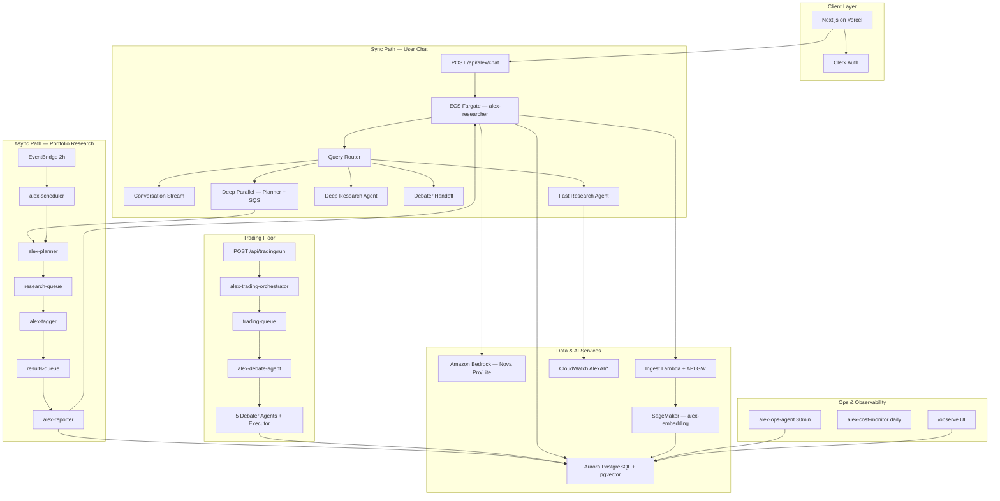

### 6.2 Architecture decisions — rationale

| Choice | Rationale | USP impact |
|--------|-----------|------------|
| **ECS Fargate for researcher** | Long SSE streams (3–5 min), Playwright MCP needs persistent Chromium | Deep research with browser automation |
| **Lambda for orchestration** | Event-driven, pay-per-invocation; no idle cost for scheduler/tagger | Cost-efficient autonomous pipeline |
| **SQS between agents** | Decouples planner from reporter; survives crashes; backpressure | Production reliability, not demo fragility |
| **Aurora + RDS Data API** | Serverless-friendly from Vercel without VPC peering | pgvector RAG from edge frontend |
| **Vercel for frontend** | Fast deploys, Clerk integration, API route proxy to AWS | Consumer-grade UX on enterprise backend |
| **Bedrock Nova** | AWS-native, guardrail integration, no API key in browser | Enterprise security posture |
| **Tiered models** | 10–50× cost difference Lite vs Pro | Sustainable unit economics at scale |
| **SSM Parameter Store** | Runtime config without redeploy (trading mode, ECS URL) | Ops agility |

### 6.3 Shared data layer — who writes, who reads

| Table | Written By | Read By |
|-------|-----------|---------|
| `portfolios` | User (portfolio page) | RAG, trading orchestrator, scheduler |
| `portfolio_digests` | Portfolio research reporter | Dashboard, RAG, trading context |
| `research_vectors` | Ingest pipeline, research agents | RAG context_service |
| `chat_sessions` | Alex chat turns | RAG conversation history |
| `simulated_trades` | Trading debate agent | Trading UI, RAG (roadmap) |
| `agent_observations` | All agents | `/observe` |
| `query_latency_metrics` | LatencyTracker | `/observe`, analytics |
| `cost_snapshots` | ops-agent, cost-monitor | Dashboard OpsCostWidget |

### 6.4 Unified chat request flow (P1)

```
User types in /research
    → POST /api/alex/chat (Next.js, Clerk auth)
    → ECS POST /research/route (classify_query)
    → SSE routing event + reasoning steps
    → Dispatch by route:
         chat      → /research/conversation/stream (Nova Lite, streaming)
         debater   → /research/debater/stream (specialist + yfinance)
         fast      → /research/stream (Nova Lite agent + tools, ~60s)
         deep+mcp  → /research/deep/stream (Nova Pro + EdgarTools + Playwright MCP)
         deep+parallel → frontend invokes alex-planner → SQS poll → synthesize
    → LatencyTracker + QueryTrace flush to Aurora
    → Optional ingest to research_vectors; chat_sessions save
    → /observe shows tool/MCP/API pass-fail
```

---

## 7. Sequence Diagrams — Per Route

### 7.1 Chat route (education / greeting)

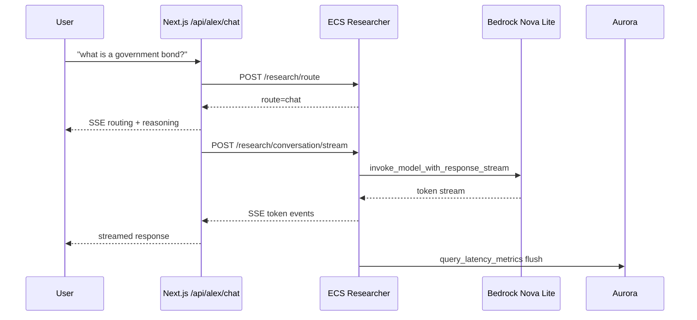

**Latency target:** 1–3s to first token; total <10s  
**No reasoning card** in UI for chat route

### 7.2 Fast research route

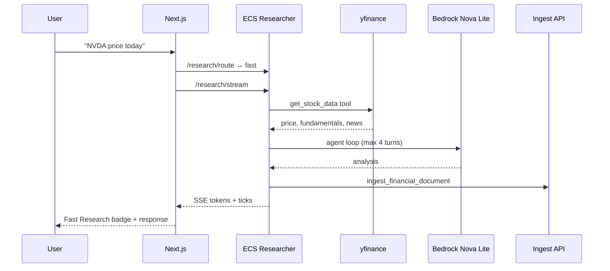

**Latency target:** ~30–90s  
**Model:** Nova Lite; **Cost:** ~$0.001–0.01 per query

### 7.3 Deep research route (MCP)

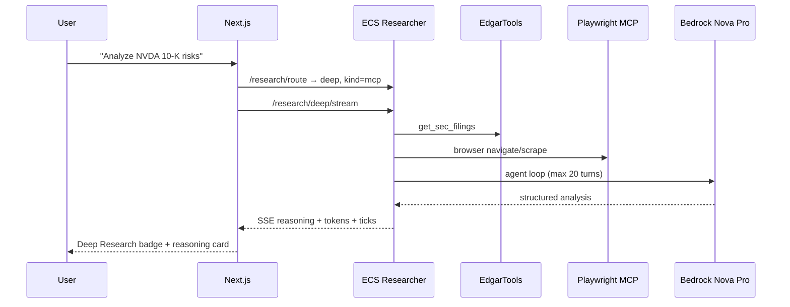

**Latency target:** 3–5 minutes  
**Model:** Nova Pro; **Shows reasoning card** in UI

### 7.4 Deep parallel route

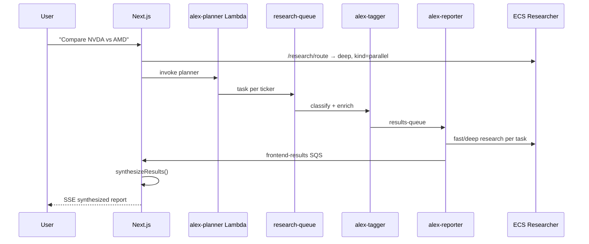

**Latency target:** 2–4 minutes (parallel)  
**Concept:** Map-reduce over agents

### 7.5 Debater handoff route

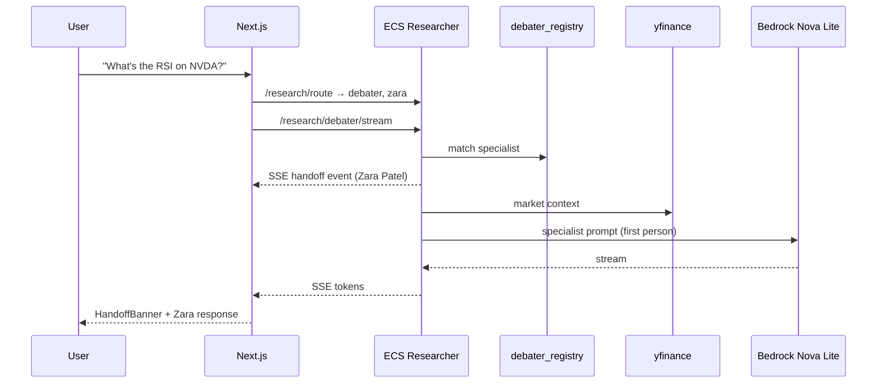

**USP:** Visible "Delegating to Zara Patel — Quantitative Strategist"

### 7.6 Guardrail block (no LLM)

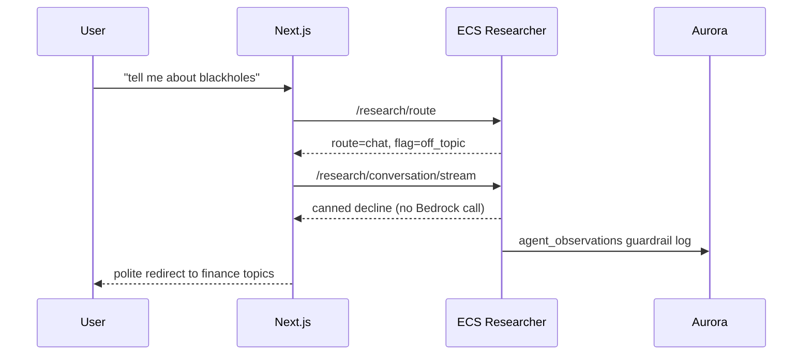

**Rationale:** Zero LLM cost; instant; consistent; auditable

### 7.7 Async portfolio research (2h)

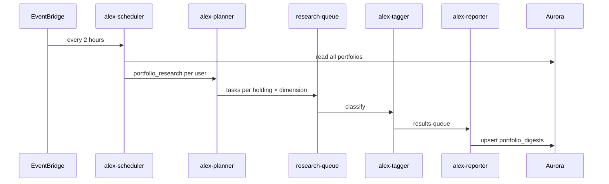

**USP:** Autonomous intelligence — user never asks

### 7.8 Trading floor debate

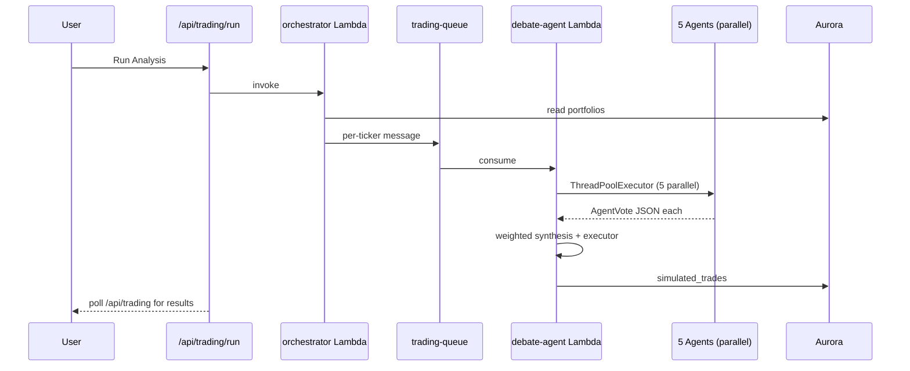

---

## 8. Technology Stack

### 8.1 Languages & frameworks

| Layer | Technology | Version / Notes |
|-------|------------|---------------|
| Frontend | Next.js, React, TypeScript | Next 16, React 19 |
| Styling | Tailwind CSS | v4 |
| Auth | Clerk | JWT sessions; `userId` = Clerk ID everywhere |
| Backend API | FastAPI (Python) | Researcher on ECS port 8000 |
| Agents | OpenAI Agents SDK + LiteLLM | Bedrock adapter for Nova models |
| IaC | Terraform | Modules `0_vpc` … `9_trading_floor` |
| Container | Docker linux/amd64 | Playwright MCP + Chromium baked in |

### 8.2 AWS services (complete list)

| Service | Role in Alex |
|---------|--------------|
| VPC | Public subnets (ALB, ECS), private (Aurora) |
| ECS Fargate | `alex-researcher` behind ALB |
| Lambda | planner, tagger, reporter, scheduler, cost-monitor, ops-agent, trading orchestrator, debate-agent |
| SQS | research-queue, results-queue, frontend-results, trading-queue, DLQ |
| EventBridge | Portfolio research 2h; ops 30min; cost monitor daily 8AM |
| Aurora Serverless v2 | PostgreSQL + pgvector |
| RDS Data API | SQL from Vercel/Lambda without persistent connections |
| SageMaker Serverless | `alex-embedding` — all-MiniLM-L6-v2 (384-dim) |
| Bedrock | Nova Pro, Nova Lite; financial guardrail |
| API Gateway | Ingest/search HTTP API for vectors |
| CloudWatch | `AlexAI/*` custom metrics; dashboards |
| SSM Parameter Store | Trading config, ECS URL, per-agent models |
| Secrets Manager | Aurora credentials |
| SES | Cost/ops alert emails |
| Cost Explorer | Ops agent billing data |
| ECR | Researcher container images |
| SNS | `alex-ai-alarms` for guardrail/error alerts |

### 8.3 AI models — use case matrix

| Use case | Model | Input $/1K | Output $/1K | Why |
|----------|-------|------------|-------------|-----|
| Query router (optional) | Nova Lite | $0.00006 | $0.00024 | Sub-second; pennies |
| Chat, fast, debater handoff | Nova Lite | $0.00006 | $0.00024 | Tool-augmented sufficient |
| Deep research, debate voters, executor | Nova Pro | $0.0008 | $0.0032 | Complex reasoning, MCP chains |
| Elena (risk agent) | Nova Lite | $0.00006 | $0.00024 | Rule-like scoring; cost opt |
| Embeddings | all-MiniLM-L6-v2 | $0.0001/1K invocations | — | 384-dim; fast retrieval |
| Claude 3.5 Sonnet (fallback ref) | — | $0.003 | $0.015 | 5× more expensive than Nova Pro |

### 8.4 Data & tool libraries

| Library | Purpose | Cost |
|---------|---------|------|
| **yfinance** | Live prices, fundamentals, 52-week range | Free |
| **EdgarTools** | SEC 10-K, 10-Q, 8-K — structured, compliant | Free |
| **@playwright/mcp** | Headless browser for deep web research | Free (compute) |
| **httpx** | Yahoo Finance RSS news headlines | Free |
| **pgvector** | Cosine similarity search in Aurora | Included |
| **Polygon.io** | Options, aggregates (trading floor) | Paid (optional) |
| **Alpha Vantage** | Technical indicators fallback | Free tier |

### 8.5 Latency expectations per route

| Route | Time to first token | Total duration | Reasoning card |
|-------|--------------------:|---------------:|:--------------:|
| Chat | 1–3s | <10s | No |
| Guardrail block | <1s | <1s | No |
| Debater handoff | 2–5s | 15–45s | Handoff banner |
| Fast research | 5–15s | 30–90s | No |
| Deep (MCP) | 10–30s | 3–5 min | Yes |
| Deep parallel | 15–30s | 2–4 min | Yes |
| Trading debate | N/A | 60–120s per ticker | N/A |

---

## 9. AI Capabilities — Deep Dive

Each section: **what**, **concept**, **implementation**, **rationale**, **USP**.

---

### 9.1 Alex Query Router (P1) ✅ — enhanced June 2026

**What:** Classifies every user message into the correct execution path without a manual Fast/Deep toggle.

**Concept:** *Hybrid policy-first routing* — deterministic regex for guardrails, SEC education, tickers, and follow-ups; optional Nova Lite **LLM finance gate** for ambiguous education (vega, gamma, stop loss variants) without growing regex lists.

**Routes:**

| Route | When | Example |
|-------|------|---------|
| `chat` | Greetings, education, off-topic, policy flags, SEC concepts | "what is a government bond?" |
| `chat` (`sec_education`) | Conceptual SEC/filing questions — no ticker | "difference between 10-K and 8-K" |
| `debater` | Specialist domain + ticker | "What's the RSI on NVDA?" |
| `fast` | Ticker + live data; pronoun/vague follow-ups on market topics | "NVDA price today"; "give its PE ratio" |
| `deep` (mcp) | SEC/EDGAR/filing signals; insider follow-ups | "Analyze NVDA 10-K risks"; "any other details?" after Form 4 |
| `deep` (parallel) | Multi-ticker comparison | "Compare NVDA vs AMD" |

**Priority order (hard overrides):**
1. Policy flag → canned decline
2. Social/greeting
3. SEC conceptual education (`sec_education`) — no live EDGAR fetch
4. **Contextual follow-up** — pronouns, vague continuation, prior-topic routing
5. **LLM finance gate** — ambiguous `explain/what is` without regex match (`ROUTER_USE_LLM_GATE`)
6. Off-topic → polite redirect
7. Educational finance (regex fast-path)
8. Debater handoff
9. High-confidence deep (SEC or parallel)
10. Live research → fast
11. Default → chat (not fast)

**Scoped deep research** (`infer_research_scope`):

| Scope | Trigger | Tools fetched |
|-------|---------|---------------|
| `filing_10k` | 10-K / annual report | 10-K only |
| `filing_8k` | 8-K | 8-K only |
| `filing_10q` | 10-Q / quarterly | 10-Q only |
| `filing_form4` | insider / Form 4 | Form 4 only |
| `analyst_only` | MarketBeat / price targets | Analyst browser |
| `options_only` | options flow | Options browser |
| `sec_full` | Broad SEC + company name | 10-K + Form 4 + analyst + options |
| `inferred` | Keyword inference | Minimum tools needed |

**Session follow-up intelligence (FIX-002, FIX-006, FIX-012):**

| Mechanism | Purpose |
|-----------|---------|
| `_has_pronoun_reference()` | `its`, `the stock`, `that company` → resolve ticker from context |
| `_is_vague_continuation()` | `any other details`, `what else`, `tell me more` → keep session topic |
| `_infer_context_topic()` | Last ALEX message topic: insider, sec, sentiment, market |
| `enrich_follow_up_query()` | Expand vague query + force `filing_form4` for insider follow-ups |
| `ACTIVE TICKER` directive | Injected into fast/deep agent — prevents portfolio hijack (e.g. ASML vs NVDA) |
| `COMPANY_ALIASES` | `micron` → `MU`, etc. |
| `NON_TICKER_WORDS` | `PE`, `EPS` not mistaken for tickers |

**Stub recovery:** If deep agent returns ingest confirmation instead of SEC content, `_recover_deep_sec_response()` fetches EdgarTools data directly (FIX-001).

**Key router signals** (`query_router.py`):
- `OFF_TOPIC_SIGNALS`, `POLICY_FLAG_PATTERNS`, `INVESTING_EDU_PATTERNS`
- `MCP_SIGNALS`, `PARALLEL_SIGNALS`, `SEC_FILING_PATTERN`
- Session context **only** for follow-ups — prevents stale hijacking ("Hey Alex?" → chat)

**Files:** `backend/researcher/query_router.py`, `backend/researcher/server.py`, `scripts/tests/test_p1_router.py` (**62 tests**), `Alex_Fixes.md` (FIX-001–012)

**Rationale:** Regex-first avoids LLM latency on obvious cases; LLM gate scales education without per-concept patterns; scoped deep avoids over-fetching analyst/options on a 10-K-only question.

**USP:** Smart receptionist with memory — user never picks a mode, and follow-ups stay on topic.

---

### 9.2 Unified Chat (Conversation Mode) ✅

**What:** Conversational financial assistant for greetings, education, general Q&A.

**Concept:** *Lightweight streaming LLM* — Bedrock `invoke_model_with_response_stream` for low TTFT.

**Behaviors:**
- Streams tokens (~1–2s to first token)
- Skips session DB lookup for education (speed)
- Canned responses for `off_topic` and `policy_flag` — no LLM call
- `education`, `conversation`, and `sec_education` intents stream via Nova Lite (not canned)
- No reasoning card in UI for chat route

**Files:** `server.py` → `generate_conversation_reply`, `stream_bedrock_conversation`; `AlexChat.tsx`

**USP:** ChatGPT feel for finance basics, bounded by guardrails.

---

### 9.3 Fast Research ✅

**What:** Live market data + news analysis on a specific ticker in ~60 seconds.

**Concept:** *Tool-augmented agent (TAG)* — OpenAI Agents SDK + Nova Lite; max 4 turns.

**Tools:** `get_stock_data` (yfinance + Yahoo RSS), `ingest_financial_document` (pgvector)

**Context:** `build_full_context(fast=True)` — skips heavy RAG embed (~2–4s saved)

**Files:** `server.py` → `run_data_agent`, `/research/stream`; `tools.py`; `prompts.py`

**USP:** Sub-minute research with real prices, not training data.

---

### 9.4 Deep Research ✅

**What:** SEC filings, web browsing, comprehensive analysis in 3–5 minutes.

**Concept:** *MCP-augmented agent* — Nova Pro + EdgarTools + Playwright MCP.

**Tools:** `get_sec_filings`, `ingest_financial_document`, Playwright browser tools

**Model:** Nova Pro, 20 max turns

**Files:** `server.py`, `mcp_servers.py`, `Dockerfile` (Chromium pre-installed)

**USP:** Compliant SEC access + browser automation — rare in retail AI finance.

---

### 9.5 Deep Parallel (Multi-Agent Comparison) ✅

**What:** Decomposes comparative queries into parallel research tasks.

**Concept:** *Map-reduce over agents* — Planner → SQS → tagger → reporter → frontend synthesis.

**Files:** `frontend/lib/deepResearch.ts`, `backend/agents/planner.py`, `reporter.py`

**USP:** Hedge-fund-style comparative analysis from a chat box.

---

### 9.6 Debater Agent Handoff ✅

**What:** Routes domain-specific questions to Trading Floor specialist personas.

**Concept:** *Agent handoff* — same personas as trading floor; research-only (no trades).

| Agent | Title | Domain signals |
|-------|-------|----------------|
| Marcus Chen | Growth Analyst | revenue, moats, earnings, bull case |
| Victoria Sterling | Short-Side Director | bear case, overvaluation, short interest |
| Zara Patel | Quant Strategist | RSI, MACD, technicals, options flow |
| Reid Morrison | Macro Strategist | Fed, rates, recession, sector rotation |
| Elena Vasquez | Chief Risk Officer | position sizing, drawdown, concentration |

**SSE `handoff` event:** `{id, name, title, expertise}`

**Files:** `debater_registry.py`, `debater_handoff.py`, `AlexChat.tsx` (HandoffBanner)

**USP:** Visible delegation to named specialists — only platform connecting chat UX to debate personas.

---

### 9.7 Alex Synthesizer — Roadmap (P4)

**What:** Commentary layer that transforms raw agent output into Alex's voice.

**Concept:** *Post-processing synthesis* — fast = 2–3 paragraphs; deep = hedge fund memo style.

**Why needed:** Today raw agent output is shown; synthesizer adds personality, proactive trading comparison, disclaimer injection.

**Target files:** `backend/researcher/synthesizer.py` (planned)

---

## 10. Prompt Engineering Patterns

**File:** `backend/researcher/prompts.py`

### 10.1 Universal patterns (all modes)

- Date injection: `datetime.now().strftime("%B %d, %Y")`
- Section dividers with `═══` blocks
- Mandatory numbered tool sequences (STEP 1–N)
- Explicit ✅/❌ output rules ("Returning full analysis is SUCCESS")
- Disclaimer footer on every response
- Guardrail decline templates for guaranteed returns, YOLO, insider tips

### 10.2 Fast agent (`get_fast_agent_instructions`)

- Nova Lite; **one tool call max** (`get_stock_data`)
- Fixed markdown table for live data + 4–5 analysis bullets
- No SEC, no ingest in fast mode

### 10.3 Standard sync agent (`get_agent_instructions`)

- 4 tools: `get_stock_data`, `get_news`, `get_sec_filings`, `ingest_financial_document`
- Mandatory 5-step sequence ending with full analysis return
- Playwright only for analyst ratings, earnings transcripts — **not** for prices/news/SEC

### 10.4 Deep research (`get_deep_research_instructions`)

- SEC first via EdgarTools, then Playwright for MarketBeat, UnusualWhales, transcripts
- 10-turn budget, 4 data sources required
- Structured output: SEC summary, insider activity, analyst ratings, options flow, synthesis

### 10.5 Trading agent prompts

**Files:** `backend/agents/trading/prompts/{marcus,victoria,zara,reid,elena,executor}.py`

- Each agent returns JSON vote schema: `action`, `confidence`, `reasoning`, `key_factors`
- Executor synthesizes narrative from all votes
- Confidence capped at 95% (`base_agent.py` guardrail)

### 10.6 Pipeline agent prompts

| Agent | Output format |
|-------|---------------|
| Planner | JSON array, max 5 tasks |
| Tagger | JSON classification: category, priority, tickers, sentiment |
| Reporter | Structured report + card digest JSON for portfolio path |

---

## 11. MCP Server Configuration

**File:** `backend/researcher/mcp_servers.py`

| Setting | Value |
|---------|-------|
| Package | `@playwright/mcp@0.0.74` |
| Container path | `/usr/local/lib/node_modules/@playwright/mcp/cli.js` |
| Local dev | `npx @playwright/mcp@0.0.74` |
| Args | `--headless`, `--isolated`, `--no-sandbox`, `--ignore-https-errors` |
| Timeout | 120s default |
| Used in | `/research/deep/stream` only |
| Trace logging | `query_trace.py` → `mcp_servers` in `query_latency_metrics` |

### Why MCP for deep research only

| Data source | Access method | Why not MCP |
|-------------|---------------|-------------|
| Stock prices | yfinance direct | Faster, structured |
| SEC filings | EdgarTools direct | Compliant, structured |
| Analyst ratings | Playwright MCP | Dynamic JS pages |
| Options flow | Playwright MCP | No free structured API |
| Earnings transcripts | Playwright MCP | Scattered sources |

### Quant MCP roadmap (P13)

Planned: `price_mcp`, `technical_mcp`, `options_flow_mcp`, `fred_mcp`, `chart_mcp` — powers Zara and quant-routed Alex queries.

---

## 12. RAG & Context Service

**File:** `backend/researcher/context_service.py` (576 lines)

### 12.1 Concept

*Retrieval-augmented generation* — embed query via SageMaker → cosine search in pgvector → inject top-k chunks into agent prompt. **Scoped by `user_id` + `session_id`** (P0 fix).

### 12.2 Six use cases

| # | Use case | Source | Rationale |
|---|----------|--------|-----------|
| 1 | Conversation follow-ups | `chat_sessions` JSONB | "What about their debt?" after NVDA query |
| 2 | Cross-session memory | `research_vectors` similarity | Remember prior research across sessions |
| 3 | Portfolio intelligence | `portfolios` holdings | "Your ASML position is worth $X today" |
| 4 | Contradiction detection | New vs prior vector content | Flag when new research contradicts old |
| 5 | Sector pattern recognition | Recent research themes | "You've researched 3 semiconductors this week" |
| 6 | Proactive suggestions | Stale ticker detection | `/suggestions` endpoint |

### 12.3 Ingest path

```
Research agent → ingest_financial_document tool
    → API Gateway POST /ingest (x-api-key)
    → alex-ingest Lambda
    → SageMaker embed (384-dim)
    → Aurora research_vectors (user_id, session_id, chunk_index)
```

### 12.4 Identity resolution

- Clerk `userId` → `users.clerk_id` → `users.id` UUID
- `ingest_pgvector._resolve_db_user_id()` ensures vectors never leak between users

### 12.5 Roadmap gaps (P2)

- Tagger-gated ingest (only durable research stored)
- Dedicated `rag_engine.py` with chunking + MMR reranking
- `rag_attributions` table for observability
- RAGAS evaluation gates (faithfulness >0.91, relevancy >0.87)

**USP:** Alex remembers *your* research — not generic internet knowledge.

### 12.6 Shipped enhancements (FIX-009, June 2026)

| Feature | Implementation | Impact |
|---------|----------------|--------|
| **Paragraph chunking** | `backend/ingest/rag_utils.py` — `chunk_content()` ~1200 chars | Long answers split into retrievable vectors (Micron → 3 chunks) |
| **Subquery vector search** | `ORDER BY score DESC` subquery in `ingest_pgvector.py` + `context_service.py` | Fixes RDS Data API returning 0 rows on full-table `<=>` ORDER BY |
| **SageMaker throttle retry** | Exponential backoff on `ThrottlingException` in ingest Lambda | `/search` no longer 502 on embed spikes |
| **Lambda-first search** | `frontend/app/api/search/route.ts` → API Gateway before ECS fallback | Reliable semantic search path |
| **Vector maintenance** | `scripts/rag_maintenance.py` — purge debug vectors, re-chunk tickers, `--verify` | Removed 48 junk vectors; Micron score 0.67+ |
| **E2E verification** | `scripts/test_pgvector_rag.py` | Automated semantic search smoke tests |

**Ingest auto-chunk:** `ingest_financial_document` tool now chunks before embed — agents no longer store monolithic blobs.

**Remaining gaps (P2/P3):** Tagger-gated ingest, `rag_engine.py` MMR reranking, `rag_attributions` observability, RAGAS CI gate.

## 13. Async Portfolio Research Pipeline

### 13.1 Flow

```
EventBridge rate(2 hours)
    → alex-scheduler Lambda
    → reads all portfolios from Aurora
    → async-invokes alex-planner per user (task: portfolio_research)
    → planner queues tasks per holding × dimension
    → alex-tagger classifies (portfolio tasks pass through)
    → alex-reporter generates research via ECS
    → upsert portfolio_digests
    → optional ingest to research_vectors
```

### 13.2 Dimension rotation (`portfolio_research.py`)

| Cycle | Dimensions researched |
|-------|----------------------|
| Standard | news, price, fundamentals, sector |
| Every 3rd cycle | + SEC deep research bonus |

### 13.3 Output schema (`portfolio_digests`)

- `headline`, `sentiment`, `dimensions` (JSONB), `key_news`, `ticker`, `user_id`
- Rendered as cards on `/dashboard`

### 13.4 Why async instead of on-demand only

| On-demand only | + Async pipeline |
|----------------|------------------|
| User must remember to ask | Alex watches portfolio proactively |
| Research stale between sessions | Fresh digest every 2 hours |
| No background intelligence | Dashboard always has current cards |

**USP:** Autonomous portfolio intelligence — the product works while you sleep.

---

## 14. Trading Floor — Complete Specification

### 14.1 Architecture

**Files:** `backend/agents/trading/core/orchestrator.py`, `debate_engine.py`, `debate_agent.py`

```
Trigger (manual / EventBridge / force=true)
    → orchestrator reads portfolios from Aurora
    → creates/resumes trading_simulations (default $10k if empty)
    → enriches holdings with get_market_data()
    → queues per-ticker to SQS (or run_direct_analysis in-process)
    → debate-agent Lambda consumes
    → run_debate() with ThreadPoolExecutor (5 parallel agents)
    → weighted synthesis + executor narrative
    → stores simulated_trades + agent_observations
```

### 14.2 Six agents

| Agent | Role | Default model | File |
|-------|------|---------------|------|
| Marcus Chen | Growth / bull | Nova Pro | `agents/marcus.py` |
| Victoria Sterling | Bear / short-side | Nova Pro | `agents/victoria.py` |
| Zara Patel | Quant / technical | Nova Pro | `agents/zara.py` |
| Reid Morrison | Macro / Fed | Nova Pro | `agents/reid.py` |
| Elena Vasquez | Risk / sizing | Nova Lite | `agents/elena.py` |
| Executor | Synthesis narrative | Nova Pro | `debate_engine.run_executor()` |

### 14.3 Mode weights (`debate_engine.py`)

| Mode | Marcus | Zara | Reid | Victoria | Elena |
|------|--------|------|------|----------|-------|
| aggressive | 2.0 | 1.5 | 1.0 | 0.5 | 0.5 |
| neutral | 1.0 | 1.0 | 1.0 | 1.0 | 1.0 |
| safe | 0.5 | 0.5 | 1.0 | 1.5 | 2.0 |

**Rationale:** Aggressive mode amplifies growth/quant voices; safe mode amplifies risk/bear voices. User-configurable via SSM `/alex/trading/mode`.

### 14.4 Decision math

```python
ACTION_VALUES = {"BUY": 1.0, "TRIM": 0.2, "HOLD": 0.0, "SELL": -1.0}

# Weighted score thresholds:
# avg > 0.3  → BUY
# avg > 0.05 → HOLD
# avg > -0.3 → TRIM
# else       → SELL

# Share sizing:
# BUY  = 5% of holding value × confidence
# SELL = full position
# TRIM = 25% of position
```

### 14.5 Market data context (`tools/market_data.py`)

Aggregates per ticker:
- **Fundamentals:** P/E, forward P/E, revenue growth, EPS growth, profit margin, market cap
- **Technicals:** RSI(14), signal, 50MA/200MA position, options sentiment
- **Sentiment:** analyst rating, price target, fear/greed, short interest
- **News:** top 3 headlines

Data sources: yfinance (primary), Polygon.io, Alpha Vantage (fallbacks)

### 14.6 SSM configuration (`terraform/9_trading_floor`)

| Parameter | Default | Purpose |
|-----------|---------|---------|
| `/alex/trading/enabled` | true | Master on/off switch |
| `/alex/trading/mode` | neutral | aggressive / neutral / safe |
| `/alex/trading/max_position_pct` | — | Position size cap |
| `/alex/trading/models/{agent}` | Nova Pro/Lite | Per-agent model override |

### 14.7 Triggers

| Trigger | Schedule / Action |
|---------|-------------------|
| Manual | `POST /api/trading/run` from UI |
| EventBridge | 9:30 AM, 2:00 PM, 3:45 PM (per docs) |
| `force=true` | Bypasses SSM enabled check |

### 14.8 Researcher debater handoff (chat only)

Same personas, different path:
- Registry: `debater_registry.py` — pattern matching
- Handoff: `debater_handoff.py` — yfinance + Nova specialist prompt
- Route: `/research/debater/stream` — no simulated trade

**USP:** Transparent AI committee — every vote, reasoning, confidence stored and visible.

### 14.9 Debate context reset (✅ shipped June 14, 2026)

**Rationale:** Testing Trading Floor requires a clean simulation slate without wiping chat/research memory. Users need repeatable debate runs from a known portfolio seed.

| Item | Detail |
|------|--------|
| **Tech** | Next.js API routes, RDS Data API (`@aws-sdk/client-rds-data`), Clerk auth |
| **Files** | `frontend/lib/tradingDb.ts`, `frontend/app/api/trading/reset/route.ts`, `frontend/app/api/trading/toggle/route.ts`, `frontend/app/trading/page.tsx` |
| **Behavior** | Deletes user-scoped trading tables; re-seeds `trading_simulations` + `agent_positions` from `portfolios` |
| **Tables cleared** | `trading_floor_intelligence`, `simulated_trades`, `agent_positions`, `trading_daily_pnl`, `trading_events`, `scout_candidates`, `rl_weights`, `trading_simulations` |
| **Tables kept** | `portfolios`, `portfolio_digests`, `research_vectors`, `chat_sessions` |
| **UI** | ↺ Reset Context button + “Fresh context on enable” checkbox on `/trading` |
| **API** | `POST /api/trading/reset` `{ confirm: true }`; `POST /api/trading/toggle` `{ enabled, reset_context? }` |
| **Verification** | Manual on `/trading`; P0 static tests unchanged (38/38) |

### 14.10 Planned — Trading Floor 2.0 extensions (`Alex_Trading_Floor_2.0.md`)

Documented in companion spec; not yet implemented unless marked ✅ above.

| Phase | Feature | Rationale | Key tech |
|-------|---------|-----------|----------|
| **P0.6** | Full Fresh Start toggle | New-user state for demos/testing — wipe all user Aurora rows | `frontend/lib/freshStart.ts`, `POST /api/account/fresh-start`, type-to-confirm UI |
| **P1** | Paper trade executor | Simulation must update `agent_positions`, not advisory-only | `trade_executor.py`, wired in `debate_engine` |
| **P1.5** | Dashboard recommendation approval | Human-in-the-loop before real `portfolios` changes | `trading_recommendations` table, `portfolio_applier.py`, `TradingRecommendations.tsx` |
| **P3-lite** | Context bridge | Debates read `portfolio_digests` + `research_vectors` | `context_builder.py`, SageMaker embed |
| **P13** | Quant trader (Zara) | Live RSI/MACD/options via MCP, not text-only | `mcp/quant/*`, `quant_snapshots`, `quant_context.py` |
| **P5** | Tools-only actions | All mutations via registered tools — no agent SQL | `tool_gateway.py`, `tool_invocations` table |
| **P5.5** | Tagger agent + observe tags | Full `/observe` filterability; tag assignment not hardcoded | `agents/tagger.py`, `event_tags` table, `ObserveTagPills.tsx` |

### 14.11 Planned — Alex Comprehensive Cost Agent (P21)

Documented in [`Alex_Master_Implementation_Plan.md` — P21](Alex_Master_Implementation_Plan.md#alex-comprehensive-cost-agent-p21); spec only.

| Item | Detail |
|------|--------|
| **Goal** | Single daily FinOps report aggregating AWS infra + all agent LLM costs + per-session chat cost + external APIs + trading debate spend |
| **Synthesis** | Alex (Nova Lite) narrative from all collectors |
| **Delivery** | EventBridge `cron(0 7 * * ? *)` → `alex-cost-agent` Lambda → SES → `abhishek.suresh2503@gmail.com` |
| **Replaces** | Fragmented `cost_monitor` (AWS-only) + ops weekly cost email |
| **Storage** | `cost_daily_reports` table; extends `/api/costs` + `/observe` Daily Cost Report panel |
| **Effort** | 3–4 days after P11 (P21-lite possible earlier with CloudWatch estimates) |

See [§33](#33-change-log--documentation-policy) for session change log and [Data Source & MCP Registry in `Alex_Trading_Floor_2.0.md`](Alex_Trading_Floor_2.0.md#data-source--mcp-registry).

---

## 15. Guardrails & Safety

### 15.1 Multi-layer model

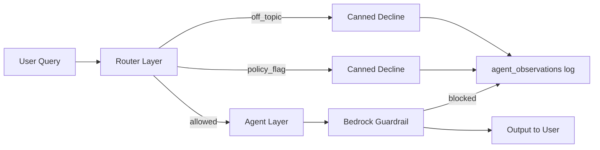

### 15.2 Layer details

| Layer | Mechanism | Example | Cost |
|-------|-----------|---------|------|
| Router policy flag | Regex `POLICY_FLAG_PATTERNS` | "I want to short stocks aggressively" | $0 |
| Router off-topic | `OFF_TOPIC_SIGNALS` + finance topic check | "tell me about blackholes" | $0 |
| SEC education routing | `_is_sec_conceptual_education()` — no ticker | "explain Form 4 filings" → chat, not deep | $0 |
| Trading education | `INVESTING_EDU_PATTERNS` + LLM finance gate | "explain stop loss?", "what is vega?" | ~$0 or 1 Nova Lite call |
| Canned decline | No LLM call | Instant, consistent | $0 |
| Bedrock guardrail | `apply_guardrail()` on output | Harmful financial advice | ~$0.001 |
| Trading confidence cap | max 95% in `base_agent.py` | Prevents overconfidence | — |
| Trading action validation | Pydantic models | Invalid actions rejected | — |
| Observability log | `log_guardrail_observation()` | Every block on `/observe` | — |

### 15.3 Policy flag patterns (sample)

- `(i want|help me)...short` → risky_short_intent
- `how (do|can|should) i short` → actionable_short_advice
- `yolo`, `all in`, `life savings` → reckless_sizing
- `pump`, `manipulate`, `insider` → manipulation_intent

### 15.4 Regulatory rationale

Alex provides **research and simulation**, not personalized investment advice or trade execution. Guardrails + disclaimers + paper-only trading reduce liability surface.

**USP:** Safety is observable — audit trail of every block, not a black box.

---

## 16. Observability

### 16.1 Concept

*AI ops as first-class product feature* — every query is a traced transaction with structured pass/fail per external dependency.

### 16.2 Per-query metrics (`query_latency_metrics`)

| Field | Meaning |
|-------|---------|
| `total_ms` | End-to-end latency |
| `context_ms` | RAG + session load time |
| `agent_ms` | LLM agent execution time |
| `guardrail_ms` | Bedrock guardrail check time |
| `first_token_ms` | Time to first streamed token |
| `input_tokens` | Bedrock input tokens (FIX-007) |
| `output_tokens` | Bedrock output tokens (FIX-007) |
| `cost_usd` | Per-query Bedrock cost via `bedrock_cost.py` (FIX-007) |
| `tools_called` | JSON array with pass/fail per tool |
| `mcp_servers` | JSON array with pass/fail per MCP |
| `data_sources` | External API outcomes |
| `route`, `model`, `user_id`, `success` | Classification metadata |

**Cost attribution:** `backend/researcher/bedrock_cost.py` — Nova Lite ($0.00006/1K in, $0.00024/1K out), Nova Pro ($0.0008/1K in, $0.0032/1K out). Stream usage from Bedrock Converse `metadata.usage`; fallback `chars//4` estimate when absent.

**Chat route label:** Conversation queries tagged **chat observability** on `/observe` for FinOps filtering.

### 16.3 Per-agent metrics (`agent_observations`)

- Tokens in/out, cost USD, latency, guardrail hits
- Action distribution (BUY/SELL/HOLD/TRIM counts)
- `data_used` — which RAG chunks influenced vote (roadmap)

### 16.4 Planned — Tagger agent & tool observability (P5.5)

Per `Alex_Trading_Floor_2.0.md`: all tool/MCP/action events will receive structured tags via **Tagger agent** (Nova Lite) into `event_tags`; mutations logged in `tool_invocations`. `/observe` will add Tag Explorer, Data Source Map, and Tool Invocation Log panels. See `Alex_report.md` CL-003, §14.10.

### 16.5 UI surfaces

| Surface | Data | Refresh |
|---------|------|---------|
| `/observe` | Query latency, **tokens + cost**, guardrails, agent stats, tool/MCP pass-fail | 30s auto-refresh |
| Dashboard `OpsCostWidget` | Today, Week, MTD AWS cost, service breakdown, health | 30 min + **Refresh now** |
| CloudWatch `AlexAI/*` | Custom metrics from researcher + trading | Real-time |
| Terraform dashboard | `Alex-AI-Platform` — error rate, latency alarms | AWS console |

**Dashboard refresh (FIX-008):** `POST /api/ops` invokes `alex-ops-agent` `{ action: monitor }` then returns fresh `cost_snapshots` + `ops_snapshots`. Widget shows loading/error states.

### 16.6 Ops agent (`alex-ops-agent`)

- Schedule: EventBridge `rate(30 minutes)` + weekly `cron(0 8 ? * 2 *)` (Monday 08:00 UTC) — **ENABLED**
- Upserts `cost_snapshots` with live Cost Explorer data
- Stores `ops_snapshots` with 7-service health check
- **On-demand:** Dashboard **Refresh now** → `POST /api/ops` (FIX-008)
- Verified MTD: **$10.52** (June 2026)
- **Planned P21:** ops retains health + 30-min dashboard refresh; daily cost synthesis moves to `alex-cost-agent`

### 16.7 Planned — Daily FinOps email (P21)

- `alex-cost-agent` aggregates: Cost Explorer, `agent_observations`, `query_latency_metrics`, `ops_snapshots`, CloudWatch `AlexAI/*`, external API estimator
- Alex (Nova Lite) synthesizes report → `cost_daily_reports` → SES daily to `abhishek.suresh2503@gmail.com`
- See `Alex_Master_Implementation_Plan.md` P21, CL-006

### 16.8 RAGAS quality gates (roadmap P17)

| Metric | Threshold |
|--------|-----------|
| Answer Relevancy | > 0.87 |
| Faithfulness | > 0.91 |
| Hallucination rate | < 5% |

**USP:** Production-grade AI observability — not logs, but structured dependency health per query.

---

## 17. Security & Authentication

### 17.1 Clerk auth flow

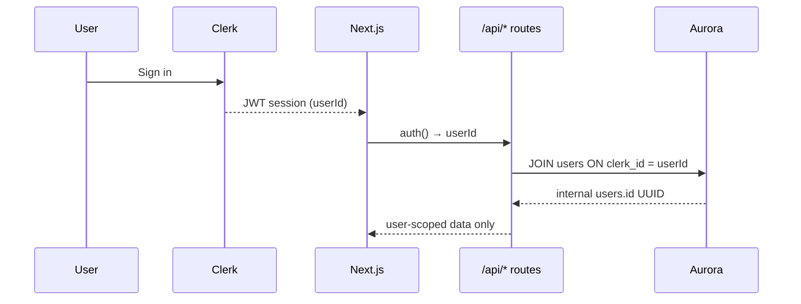

### 17.2 Protected routes (`frontend/proxy.ts`)

| Protected (middleware) | Public |
|---------------------|--------|
| `/dashboard`, `/research`, `/portfolio`, `/history` | `/`, `/sign-in`, `/sign-up` |

**Note:** `/trading`, `/observe`, `/charts`, `/retirement` rely on API-level `auth()` — not middleware-protected.

### 17.3 API auth pattern

- Server routes: `auth()` from `@clerk/nextjs/server` → 401 if no `userId`
- Client pages: `useUser()` hook
- Ingest API: `x-api-key` header (`ALEX_API_KEY`) — service-to-service only
- No AWS credentials in browser — all AWS calls via Next.js API routes

### 17.4 Data isolation

- All RAG vectors scoped by `user_id`
- `chat_sessions` unique index on `(user_id, session_id)` — P0 fix
- Portfolio queries always JOIN `users u ON u.clerk_id = :clerk_id`

### 17.5 Why Clerk + Vercel + AWS

| Choice | Rationale |
|--------|-----------|
| Clerk | Production auth in hours; OAuth; session management |
| API routes as proxy | AWS credentials never exposed to client |
| RDS Data API | No VPC peering needed from Vercel serverless |

---

## 18. Complete API Reference

### 18.1 Frontend Next.js API routes

| Route | Methods | Auth | Purpose |
|-------|---------|------|---------|
| `/api/alex/chat` | POST | Clerk | **Unified chat SSE** — all routes |
| `/api/alex/session` | GET, POST | Clerk | Chat session CRUD |
| `/api/research` | POST | Clerk | Fast or multi-agent (legacy) |
| `/api/research/stream` | POST | Clerk | Proxy ECS fast SSE |
| `/api/research/deep` | POST | Clerk | Proxy ECS deep sync |
| `/api/research/deep/stream` | POST | Clerk | Proxy ECS deep SSE |
| `/api/portfolio` | GET, POST, DELETE, PATCH | Clerk | Holdings CRUD |
| `/api/portfolio/prices` | POST | Clerk | Live price fetch |
| `/api/portfolio-research` | GET | Clerk | Digest cards |
| `/api/trading` | GET | Clerk | Simulation state, trades |
| `/api/trading/run` | POST | Clerk | Invoke orchestrator Lambda |
| `/api/trading/toggle` | GET, POST | Clerk | SSM trading enabled; optional `reset_context` on enable |
| `/api/trading/reset` | POST | Clerk | Reset debate context (trading tables only, re-seed from portfolio) |
| `/api/account/fresh-start` | POST | Clerk | 🔲 P0.6 — full user Aurora wipe (planned) |
| `/api/trading/recommendations` | GET | Clerk | 🔲 P1.5 — pending dashboard recs (planned) |
| `/api/trading/recommendations/[id]/approve` | POST | Clerk | 🔲 P1.5 — apply to portfolios (planned) |
| `/api/trading/recommendations/[id]/dismiss` | POST | Clerk | 🔲 P1.5 — dismiss rec (planned) |
| `/api/observe` | GET | Clerk | Observability data |
| `/api/ops` | GET | Clerk | Ops snapshots + health |
| `/api/costs` | GET, POST | Clerk | Cost snapshots + manual monitor |
| `/api/history` | GET | Clerk | Research history |
| `/api/suggestions` | GET | Clerk | Proactive suggestions |
| `/api/search` | POST | Clerk | Vector search |
| `/api/auto-research` | GET | Clerk | Trigger auto-research |
| `/api/retirement` | POST | Clerk | Retirement planning |
| `/api/users/sync` | POST | Clerk | Clerk → Aurora users upsert |

**ECS URL resolution:** `frontend/lib/config.ts` — SSM `/alex/ecs_url` with 5-min cache; fallback `ECS_URL`.

### 18.2 ECS Researcher endpoints (`server.py`)

| Endpoint | Method | Purpose |
|----------|--------|---------|
| `/` | GET | Service info + timestamp |
| `/health` | GET | Config check (API, region, model) |
| `/research/route` | POST | Query classification |
| `/research/conversation/stream` | POST | Chat SSE |
| `/research/debater/stream` | POST | Debater handoff SSE |
| `/research` | POST | Sync fast research |
| `/research/deep` | POST | Sync deep research |
| `/research/stream` | POST | Fast research SSE |
| `/research/auto` | GET | Auto trending-topic research |
| `/research/deep/stream` | POST | Deep research SSE + MCP |
| `/research/multi/stream` | POST | Parallel status placeholder |
| `/suggestions` | GET | Proactive suggestions |
| `/test-network` | GET | Network connectivity test |

**ALB:** `http://alex-alb-1816782403.us-east-1.elb.amazonaws.com` (current session; SSM `/alex/ecs_url` — URL changes when ECS Terraform recreates ALB)

### 18.3 API Gateway (Ingest Lambda)

| Path | Method | Auth | Handler |
|------|--------|------|---------|
| `/ingest` | POST | API key | Embed + pgvector store |
| `/search` | POST | API key | Vector similarity search |

### 18.4 Lambda functions (no HTTP — invoked directly)

| Function | Handler | Trigger |
|----------|---------|---------|
| `alex-planner` | `planner.lambda_handler` | Direct invoke, scheduler |
| `alex-tagger` | `tagger.lambda_handler` | SQS research-queue |
| `alex-reporter` | `reporter.lambda_handler` | SQS results-queue |
| `alex-scheduler` | `scheduler.lambda_handler` | EventBridge 2h |
| `alex-cost-monitor` | `cost_monitor.lambda_handler` | EventBridge daily 8AM |
| `alex-ops-agent` | `ops_agent.lambda_handler` | EventBridge 30min |
| `alex-trading-orchestrator` | `orchestrator.lambda_handler` | API, EventBridge |
| `alex-debate-agent` | `debate_agent.lambda_handler` | SQS trading-queue |

---

## 19. SSE Event Types

### 19.1 Frontend `/api/alex/chat` events

| Event `type` | Payload | When |
|--------------|---------|------|
| `routing` | `routing`, `steps`, `display_route` | After ECS `/research/route` |
| `reasoning` | `content` (string) | Router steps + mode messages |
| `reasoning_done` | — | Before token stream |
| `token` | `content` | Word chunks (parallel deep synthesis) |
| `done` | `route`, `deep_kind`, `latency`, `timedOut` | Completion |
| `error` | `content` | Any failure |

**Passthrough from ECS:** debater, chat, fast, deep stream events below.

### 19.2 ECS Researcher SSE events

| Event `type` | Fields | Routes |
|--------------|--------|--------|
| `reasoning` | `content` | conversation, debater, fast, deep |
| `reasoning_done` | — | all stream endpoints |
| `token` | `content` | all stream endpoints |
| `tick` | `elapsed_ms` | fast, deep (heartbeat) |
| `handoff` | `debater` {id, name, title, expertise} | debater only |
| `done` | `route`, `latency`, `debater`, `time_to_answer` | all streams |
| `error` | `content` | all streams |
| `status` | `content` | multi/stream placeholder |

### 19.3 UI mapping (`AlexChat.tsx`)

| Route | Badge | Reasoning card | Special UI |
|-------|-------|:--------------:|------------|
| chat | — | No | — |
| fast | Fast Research | No | — |
| deep | Deep Research | Yes | — |
| debater | — | No | Amber HandoffBanner |
| block | — | No | Canned decline |

---

## 20. Database Schema — Full Reference

**Schema management:** `scripts/aurora_warmup.py` — idempotent DDL for all tables.

### 20.1 Core tables

**`users`**
- `id` UUID PK, `clerk_id` UNIQUE, `email`, `name`, timestamps

**`portfolios`**
- `user_id`, `ticker`, `company`, `shares`, `purchase_price`, `asset_class`, `sector`, `notes`
- Index: `portfolios_user_ticker_uidx`

**`preferences`**
- Risk tolerance, sectors

### 20.2 Chat & RAG

**`chat_sessions`**
- `user_id`, `session_id`, `turns` JSONB, timestamps
- Index: `chat_sessions_user_session_uidx` on `(user_id, session_id)`

**`research_vectors`**
- `embedding` vector(384), `content`, `user_id`, `session_id`, `chunk_index`, `query`, `chunk_type`, `ticker`
- pgvector cosine index

**`research_sessions`**
- Full Q&A history with `vector_id` link

**`rag_attributions`** (roadmap)
- Which chunks influenced which response

**`session_metadata`** (roadmap)
- Session complexity, route distribution

### 20.3 Portfolio intelligence

**`portfolio_digests`**
- `user_id`, `ticker`, `headline`, `sentiment`, `dimensions` JSONB, `key_news`, `updated_at`

### 20.4 Observability

**`query_latency_metrics`**
- Full latency breakdown + tools/MCP JSON + route + model

**`agent_observations`**
- Per-agent tokens, cost, guardrail hits, actions

**`ops_snapshots`**
- Platform health, service breakdown, `daily_cost`

**`cost_snapshots`**
- MTD, weekly, daily AWS costs from Cost Explorer

**`cost_alerts`**
- Threshold breach history

**`ragas_evaluations`** (roadmap P17)
- Faithfulness, relevancy, hallucination scores

### 20.5 Trading floor

**`trading_simulations`**
- Virtual account state, cash balance, total value

**`simulated_trades`**
- `ticker`, `action`, `shares`, `price`, `confidence`, `agent_votes` JSONB, `agent_debate` JSONB
- `target_price`, `stop_loss`, `realized_pnl`, `outcome`, `trigger`

**`agent_positions`**
- Current simulated positions per agent

**`trading_daily_pnl`** (roadmap)
- Daily simulation P&L tracking

**`user_trading_config`**
- Trading mode, agent model overrides

**`rl_weights`** (roadmap)
- Per-user adaptive agent weights

**`trading_events`** (roadmap)
- Event timeline for `/observe`

**`trading_floor_intelligence`** (roadmap P14)
- Debate memory vector store

**`scout_candidates`** (roadmap P9)
- Scout agent discoveries

**`quant_snapshots`** (roadmap P13)
- Structured quant data per ticker

### 20.6 Knowledge graph (roadmap)

**`knowledge_graph_entities`**, **`knowledge_graph_relationships`**
- Entity-relationship graph for unified memory

---

## 21. Environment Variables

> **Security note:** Never commit `.env` or `.env.local` values. Variable names only below.

### 21.1 Root `.env` (backend + scripts)

| Category | Variables |
|----------|-----------|
| AWS core | `AWS_ACCOUNT_ID`, `DEFAULT_AWS_REGION`, `AWS_REGION` |
| SageMaker | `SAGEMAKER_ENDPOINT_NAME`, `SAGEMAKER_ENDPOINT` |
| Ingest API | `ALEX_API_ENDPOINT`, `ALEX_API_KEY`, `NEXT_PUBLIC_API_URL` |
| ECS/ECR | `ECS_SERVICE_URL`, `ECR_REPOSITORY_URL`, `ECS_CLUSTER_NAME`, `ECS_URL` |
| Aurora | `DB_CLUSTER_ARN`, `DB_CLUSTER_ENDPOINT`, `DB_SECRET_ARN`, `DB_NAME` |
| SQS | `SQS_RESEARCH_QUEUE_URL`, `SQS_RESULTS_QUEUE_URL`, `FRONTEND_RESULTS_QUEUE_URL` |
| Lambdas | `PLANNER_FUNCTION`, `TAGGER_FUNCTION`, `REPORTER_FUNCTION` |
| Clerk | `CLERK_PUBLISHABLE_KEY`, `CLERK_SECRET_KEY` |
| Guardrails | `GUARDRAIL_ID`, `GUARDRAIL_VERSION` |
| Trading data | `POLYGON_API_KEY`, `ALPHA_VANTAGE_KEY` |

### 21.2 Frontend `frontend/.env.local`

| Category | Variables |
|----------|-----------|
| Clerk | `NEXT_PUBLIC_CLERK_*`, `CLERK_SECRET_KEY`, sign-in/up URLs |
| AWS | `AWS_REGION`, `AWS_ACCESS_KEY_ID`, `AWS_SECRET_ACCESS_KEY` |
| Aurora | `DB_CLUSTER_ARN`, `DB_SECRET_ARN`, `DB_NAME` |
| ECS | `ECS_URL`, `NEXT_PUBLIC_ECS_URL` |
| Services | `ALEX_API_KEY`, `PLANNER_FUNCTION`, `SQS_FRONTEND_RESULTS_QUEUE_URL` |

### 21.3 Runtime SSM parameters

| Parameter | Purpose |
|-----------|---------|
| `/alex/ecs_url` | ALB URL for ECS researcher |
| `/alex/trading/enabled` | Trading floor master switch |
| `/alex/trading/mode` | aggressive / neutral / safe |
| `/alex/trading/models/{agent}` | Per-agent Bedrock model |

---

## 22. Infrastructure & Terraform

### 22.1 Module map

| Module | Path | Key resources |
|--------|------|---------------|
| **0_vpc** | `terraform/0_vpc` | VPC 10.0.0.0/16, public/private subnets, IGW |
| **1_permissions** | `terraform/1_permissions` | IAM roles — Bedrock, RDS, SQS, S3 |
| **2_sagemaker** | `terraform/2_sagemaker` | `alex-embedding` serverless, all-MiniLM-L6-v2, 1024MB |
| **3_ingestion** | `terraform/3_ingestion` | `alex-ingest` Lambda, API GW, API key |
| **4_researcher** | `terraform/4_researcher` | ECR, ECS Fargate, ALB 80→8000, task roles |
| **5_database** | `terraform/5_database` | Aurora Serverless v2, Secrets Manager |
| **6_agents** | `terraform/6_agents` | SQS queues, planner/tagger/reporter/scheduler/ops/cost Lambdas, EventBridge |
| **7_guardrails** | `terraform/7_guardrails` | Bedrock guardrail, SNS alarms, CloudWatch dashboard |
| **9_trading_floor** | `terraform/9_trading_floor` | Trading SQS, orchestrator, debate-agent, SSM params |

### 22.2 Deploy order (`scripts/deploy_all.sh`)

```
0_vpc → 1_permissions → 2_sagemaker → 3_ingestion → 5_database → 6_agents → 4_researcher
```

### 22.3 Network topology

| Subnet | Contains | Access |
|--------|----------|--------|
| Public | ALB, ECS Fargate tasks | Internet via IGW |
| Private | Aurora cluster | RDS Data API only (no direct public) |

### 22.4 Why Terraform modules numbered

Each module is independently deployable and testable. Numbering enforces dependency order. Module 8 skipped (reserved). Module 9 added for trading floor without renumbering existing infra.

### 22.5 Infrastructure policy — Terraform-first (mandatory)

**Standing rule (user-mandated):** All AWS infrastructure provisioning and configuration changes MUST go through Terraform. No ad-hoc Console edits or one-off CLI commands to create/update durable resources.

| Via Terraform | Via deploy scripts only (code on existing resources) |
|---------------|-----------------------------------------------------|
| Lambda definitions, IAM, EventBridge schedules, SQS/DLQ, ECS service defs, ALB, Aurora, SageMaker, SSM *resources*, API Gateway, CloudWatch alarms | `deploy.sh` (ECR/ECS), `deploy_trading.sh` (`update-function-code`), `package.sh` (zip artifacts) |

**Workflow for infra changes:**

```
terraform/{module}/main.tf → terraform plan → terraform apply
→ package/deploy application code if needed → health_check.sh → §33 change log
```

**Not allowed:** `aws lambda create-function`, `aws scheduler create-schedule`, manual IAM/policy changes without a matching TF commit. Session scripts (`start_session.sh`) may enable/disable TF-managed schedules and deploy code — they must not create permanent new resources.

See `Alex_Master_Implementation_Plan.md` — [Infrastructure Policy (Terraform-First)](Alex_Master_Implementation_Plan.md#infrastructure-policy-terraform-first).

---

## 23. Deployment & Operations

### 23.1 Scripts reference

| Script | Purpose |
|--------|---------|
| `scripts/deploy_all.sh` | Full Terraform apply all modules |
| `scripts/start_session.sh` | Dev session: IAM wait, SageMaker recreate, ECS+ECR image deploy, aurora warmup, schedulers, trading SSM enable |
| `scripts/stop_session.sh` | Tear down / pause resources |
| `scripts/destroy_all.sh` | Destroy infrastructure |
| `backend/researcher/deploy.sh` | Docker amd64 → ECR → ECS rolling deploy → SSM update |
| `scripts/deploy_ingest.sh` | Package ingest Lambda |
| `scripts/deploy_trading.sh` | Zip trading package → S3 → update Lambdas |
| `scripts/aurora_warmup.py` | Wake Aurora + ensure all tables |
| `scripts/toggle_eventbridge.sh` | Enable/disable 2h scheduler |
| `scripts/health_check.sh` | Health verification |
| `scripts/alex_control.sh` | Platform control utilities |
| `scripts/benchmark_latency.sh` | Latency benchmarking |

### 23.2 Standard change workflow

```
1. Implement change
2. If AWS infra touched → update Terraform (`terraform/{module}/main.tf`) + `terraform plan` / `apply` (see §22.5)
3. Run tests (test_p0.sh / test_p1_router.py)
4. Deploy application code only (deploy.sh / deploy_trading.sh / package.sh) — not new infra via CLI
5. Frontend playbook checkpoints (TEST_PLAYBOOK.md)
6. Verify /observe + /health
7. Document in Alex_report.md §33 Change Log (required — include terraform module if infra)
```

**Infrastructure policy (mandatory):** All durable AWS resources are provisioned via **Terraform** only. See [§22.5](#225-infrastructure-policy--terraform-first-mandatory).

**Documentation policy (mandatory):** Every production-impacting change MUST be recorded in [§33 Change Log](#33-change-log--documentation-policy) with:

| Field | Required content |
|-------|------------------|
| **What changed** | Files, APIs, schema, infra |
| **Rationale** | Why — user need, bug, architecture principle |
| **Tech used** | AWS services, frameworks, models, data sources |
| **Other key items** | Breaking changes, env vars, cost, security, limitations, rollback |
| **Tests / verification** | Commands run, pass criteria |
| **Companion doc** | Update `Alex_Trading_Floor_2.0.md` or `Alex_Master_Implementation_Plan.md` when scope is roadmap-level |

Living specs remain in companion docs; `Alex_report.md` is the **audit trail of what shipped** and **why**.

### 23.3 ECS researcher deploy

```bash
cd backend/researcher && bash deploy.sh
# → docker build linux/amd64
# → ECR push
# → ECS force new deployment
# → SSM /alex/ecs_url updated
```

### 23.4 EventBridge schedules

| Schedule | Function | Purpose |
|----------|----------|---------|
| `rate(2 hours)` | alex-scheduler | Portfolio research |
| `rate(30 minutes)` | alex-ops-agent | Cost + health snapshots |
| `cron(0 8 * * ? *)` | alex-cost-monitor | Daily cost alert |
| Trading times | alex-trading-orchestrator | 9:30 AM, 2PM, 3:45 PM |

### 23.5 Cost alert threshold

- `DAILY_COST_THRESHOLD` default: **$10/day**
- Alert via SES email
- Dashboard shows MTD (Cost Explorer has ~24h lag on "today")

---

## 24. Test Suite & Verification

### 24.1 Automated tests

| File | Tests | What it covers |
|------|-------|----------------|
| `scripts/test_p0.sh` | 51 passed | Foundation: SQL, identity, schema, orchestrator |
| `scripts/tests/test_p0_foundation.py` | — | Static + live Aurora schema checks |
| `scripts/tests/test_p1_router.py` | **62 passed** | Router: chat/fast/deep/debater, scopes, follow-ups, LLM gate, SEC edu |
| `scripts/rag_maintenance.py` | CLI | Vector cleanup, re-chunk, `--verify` semantic scores |
| `scripts/test_pgvector_rag.py` | E2E smoke | API Gateway `/search` + embed pipeline |
| `scripts/test_trading.sh` | E2E | Orchestrator → debate → simulated_trades |
| `scripts/tests/test_ragas.py` | 5 queries | Faithfulness >0.91, relevancy >0.87 |
| `scripts/tests/test_planner.py` | — | Lambda decomposition + SQS |
| `scripts/tests/test_multi_agent.py` | — | Full planner → poll → synthesize |
| `scripts/tests/test_edgar.py` | — | EdgarTools + ECS deep endpoint |

### 24.2 Manual playbook (`scripts/TEST_PLAYBOOK.md`)

| Step | Action | Pass criteria |
|------|--------|---------------|
| 0.1 | `npm run dev` | Ready on :3000 |
| 0.2 | `aurora_warmup.py` | Aurora connected |
| 0.4 | Sign in → dashboard | Name visible |
| 1.1 | Portfolio cards | NVDA/ASML digests |
| NEW | Cost widget | MTD, health badges |
| 2.2 | Fast: "Brief NVDA outlook" | Streams ~60s |
| 3.2 | Deep: SEC query | 3–5 min, reasoning |
| 4.2 | Trading → Run Analysis | Trades queued |
| O.2 | /observe | Tool pass/fail rows |

### 24.3 Quick verification commands

```bash
./scripts/test_p0.sh --full                    # 51 checks
python3 scripts/tests/test_p1_router.py         # 32 checks
python3 scripts/aurora_warmup.py                # Schema OK
curl http://alex-alb-1582546453.us-east-1.elb.amazonaws.com/health
cd backend/researcher && bash deploy.sh         # Deploy ECS
./scripts/test_trading.sh                       # Trading E2E
```

---

## 25. Cost Model & Pricing Math

### 25.1 Per-query cost estimates

| Route | Model | Est. tokens | Est. cost |
|-------|-------|-------------|-----------|
| Chat | Nova Lite | 500–2K | $0.0001–0.001 |
| Fast research | Nova Lite | 2K–8K + tools | $0.001–0.01 |
| Deep research | Nova Pro | 10K–50K + MCP | $0.05–0.25 |
| Debater handoff | Nova Lite | 2K–6K | $0.001–0.01 |
| Trading debate (5 agents) | Nova Pro ×5 | 20K–60K | $0.10–0.50 |
| Embedding ingest | SageMaker | 1 invocation | $0.0000001 |

### 25.2 Infrastructure monthly (observed June 2026)

| Component | Est. monthly |
|-----------|-------------|
| ECS Fargate (researcher) | $15–40 |
| Aurora Serverless v2 | $10–30 |
| Lambda (all agents) | $5–15 |
| SageMaker serverless | $2–10 |
| Bedrock (usage-dependent) | $5–50 |
| Other (SQS, ALB, etc.) | $5–15 |
| **Total observed MTD** | **~$10.52** (early month) |

### 25.3 Unit economics at $29/mo Pro tier

| Assumption | Value |
|------------|-------|
| Avg queries/user/day | 10 |
| Avg cost/query | $0.02 |
| Monthly AI cost/user | ~$6 |
| Gross margin | ~79% at $29/mo |

### 25.4 Cost optimization strategies built in

- Nova Lite for chat/router/fast (10–50× cheaper than Pro)
- Regex router blocks skip LLM entirely
- `build_full_context(fast=True)` skips RAG embed
- Elena uses Nova Lite (risk is more rule-like)
- SageMaker 1024MB not 2048MB (halves inference cost)
- SSM cache TTL 5 min reduces parameter reads

---

## 26. Implementation Status & Roadmap

### 26.1 P0 — ✅ Complete (June 14, 2026)

| # | Item | Status |
|---|------|--------|
| 1 | Fix SQL typos in context_service | ✅ |
| 2 | portfolio_stocks → portfolios | ✅ |
| 3 | user_id/session_id on research_vectors | ✅ |
| 4 | Identity through all research routes | ✅ |
| 5 | agent_observations in warmup | ✅ |
| 6 | simulated_trades schema columns | ✅ |
| 7 | Remove MessageGroupId from orchestrator | ✅ |
| 8 | chat_sessions unique index | ✅ |
| 9 | All tables in aurora_warmup | ✅ |

**Tests:** 51 passed

### 26.2 P1 — ✅ Substantially live (enhanced June 2026)

| Deliverable | Status |
|-------------|--------|
| Query router | ✅ **62 tests** — hybrid regex + LLM gate |
| Scoped deep research | ✅ 10-K / 8-K / 10-Q / Form 4 / analyst / options scopes |
| Session follow-ups | ✅ Pronouns, vague continuation, insider topic routing |
| SEC education vs live SEC | ✅ `sec_education` intent separates concepts from EDGAR fetch |
| Unified /api/alex/chat | ✅ |
| AlexChat component | ✅ No manual toggle |
| Conversation mode | ✅ Streaming + education intents |
| Debater handoff | ✅ 5 specialists |
| Policy + off-topic guardrails | ✅ Logged |
| pgvector RAG reliability | ✅ Chunking, subquery search, maintenance scripts |
| Observe tokens + cost | ✅ Per-query FinOps |
| Dashboard ops refresh | ✅ Live Lambda invoke |
| ECS deployed | ✅ FIX-012 image June 16, 2026 |
| Fix audit trail | ✅ `Alex_Fixes.md` FIX-001–012 |

### 26.3 Full phase roadmap (`Alex_Master_Implementation_Plan.md`)

| Phase | Name | Status | Key deliverable |
|-------|------|--------|-----------------|
| **P0** | Foundation fixes | ✅ Complete | Identity, schema, observability DDL |
| **P1** | Query router + unified chat | ✅ Live | Auto-routing, `AlexChat`, debater handoffs |
| **P2** | RAG engine + session memory | 🔲 Partial | Chunking + subquery search shipped; MMR + `rag_engine.py` planned |
| **P3** | Alex synthesizer + chunked ingest | 🔲 Planned | Commentary layer, Alex voice |
| **P4** | Paper trade executor + simulation UI | 🔲 Planned | `agent_positions` updates |
| **P5** | User trading config + autonomous schedule | 🔲 Planned | EventBridge trading loop |
| **P6** | Context bridge (AI ↔ Trading) | 🔲 Planned | Debates read `research_vectors` |
| **P7** | MCP expansion (SEC, News, Earnings) | 🔲 Planned | `mcp/` gateway |
| **P8** | RL learning loop | 🔲 Planned | `rl_weights` populated |
| **P9** | Scout + Sentinel agents | 🔲 Planned | Discovery + stop-loss monitor |
| **P10** | Unified guardrails | 🔲 Partial | Router + Bedrock live; shared module planned |
| **P11** | Full observability expansion | 🔲 Partial | `/observe` tokens+cost live; 10+ panels planned |
| **P12** | Observer Lambda + daily digests | 🔲 Planned | Email P&L digest |
| **P13** | Quant intelligence layer | 🔲 Planned | Technical MCP, FRED, charts |
| **P14** | Trading floor intelligence vectors | 🔲 Scaffolded | Table exists; ingest not wired |
| **P15** | Async deep sub-agents | 🔲 Planned | Parallel SEC/News/Quant |
| **P17** | RAGAS evaluation framework | 🔲 Partial | `test_ragas.py` exists; CI gate not live |
| **P21** | Comprehensive cost agent | 📝 Spec | Daily FinOps email |
| **P22** | LangSmith tracing | 📝 Spec | Production traces + human review |
| **P23** | LangGraph orchestration | 📝 Spec | 4 selective state graphs |
| **P24** | Agentic RAG engine | 📝 Spec | CRAG/Self-RAG loop on edu + chat |

### 26.4 Trading Floor 2.0 planning session (June 14, 2026)

Approved architecture captured in `Alex_Trading_Floor_2.0.md` (not all implemented):

| Topic | Decision | Rationale |
|-------|----------|-----------|
| Step-by-step implementation | User approves each phase before code | Reviewable diffs; avoid big-bang |
| MVP sequence | P0 → P1 → P1.5 → P3-lite → P2 → P7-min → P13 → P14 | Executor before recommendations; quant after simulation works |
| Recommendation adoption | Dashboard approve only | Simulation ≠ real portfolio; regulatory clarity |
| Fresh Start vs Reset Context | Two tiers | Trading-only test vs full new-user wipe |
| Agent mutations | Tools-only (P5) | Audit trail, idempotency, observe tags |
| Observability tags | Tagger agent (P5.5) | Centralized labeling, not scattered in UI |
| Data sources | Tier 1/2/3 registry | Maps yfinance → future Polygon/FRED MCP |

**Shipped in same session:** debate context reset (§14.9), `start_session.sh` hardening (§33 CL-002).

---

## 27. Production Engineering Pillars

From `Alex_Master_Implementation_Plan.md` — implementable from current setup:

| Pillar | Alex implementation | Why it matters |
|--------|---------------------|----------------|
| **Multi-agent orchestration** | Planner → SQS → tagger → reporter; trading debate ThreadPool | Production agents need decoupling, not monoliths |
| **MCP tool integration** | Playwright MCP for deep research | Standard protocol for tool extensibility |
| **Observability** | query_latency_metrics, agent_observations, /observe | AI without metrics is unmaintainable |
| **Eval & reliability** | RAGAS gates, guardrails, **113** automated tests (62 router + 51 foundation) | Quality must be measured, not assumed |
| **Infrastructure as code** | 9 Terraform modules, deploy scripts | Reproducible environments |
| **Identity & isolation** | Clerk → per-user vectors, sessions | Financial data requires strict scoping |
| **Cost controls** | Tiered models, router blocks, DAILY_COST_THRESHOLD | AI economics must be sustainable |
| **Async durability** | SQS + EventBridge + idempotent DDL | Survives Lambda timeouts and crashes |

---

## 28. Ophelia.md — Engineering Narrative Mapping

`Ophelia.md` maps Alex architecture to enterprise execution-layer engineering (relevant for technical interviews and system design narratives).

### 28.1 Core analogy

| Enterprise problem (Ophelia) | Alex implementation |
|------------------------------|---------------------|
| Intent ≠ confirmed outcome | Confirmed `portfolio_digests`, not chat-only |
| Async durable pipelines | EventBridge 2h → scheduler → planner → SQS → tagger → reporter |
| Sync user path | ECS researcher SSE + Playwright MCP + pgvector ingest |
| Third-party fragility | SEC EDGAR, Playwright MCP, ECS→Bedrock fallback |
| Retries / idempotency | Aurora warm-up retries, SQS decoupling, ON CONFLICT upserts |
| Outcome evals | RAGAS gates, /observe per-query metrics |
| Orchestration | SQS (Alex) ↔ RabbitMQ (Robothons) — same pattern |

### 28.2 Documented hard problems solved

| Problem | Solution |
|---------|----------|
| Aurora NUMERIC stringValue | Explicit casting in RDS Data API queries |
| ECS cold starts | Bedrock fallback in reporter when ECS unavailable |
| SQS visibility = Lambda timeout | Visibility timeout matched to function timeout |
| Stale session hijacking router | Session context only for follow-ups |
| ContextVar reset in streaming | try/except in latency_tracker.py |

### 28.3 Pillars for resume narrative

1. Multi-agent orchestration (planner/taggers/reporters)
2. MCP tool integration (Playwright)
3. Observability (CloudWatch AlexAI/*, query_latency_metrics)
4. Eval/reliability (RAGAS, guardrails)
5. IaC (9 Terraform modules)

---

## 29. Regulatory Positioning & Moat

### 29.1 Regulatory positioning

| Risk | Mitigation |
|------|------------|
| Broker-dealer registration | No real trade execution — paper simulation only |
| Investment adviser registration | Research + education framing; disclaimers on all outputs |
| Signal service liability | Show agent debate reasoning, not blind tips |
| Data privacy | Per-user isolation; Clerk auth; no cross-user vectors |

### 29.2 Moat & defensibility (`Startup.md`)

| Moat layer | Why it's hard to copy |
|------------|----------------------|
| **Multi-agent infrastructure** | 9 Terraform modules, 8 Lambdas, ECS, SQS — months of integration |
| **Per-user memory graph** | RAG + chat + portfolio + debate vectors interconnected |
| **Observability culture** | Pass/fail per tool/MCP — requires instrumentation from day one |
| **Debate transparency** | 5-agent voting with stored JSON — unique UX |
| **Cost-optimized routing** | Nova Lite/Pro tiering with regex-first router |
| **Data flywheel** | More usage → better RL weights → better debates → more usage |

### 29.3 Fundraising narrative

> "Alex is the intelligence layer between retail investors and the market — the research team, quant desk, and risk committee they can't afford, delivered as a $29/month subscription with full transparency."

---

## 30. Key Concepts Glossary

| Concept | Definition | Alex usage |
|---------|------------|------------|
| **Intent routing** | Classify query before agent selection | Regex + optional Nova Lite in query_router |
| **TAG (tool-augmented generation)** | LLM + external tool calls | yfinance, EdgarTools in fast/deep agents |
| **MCP** | Model Context Protocol for tool servers | Playwright browser in deep research |
| **RAG** | Retrieval-augmented generation | SageMaker embed + pgvector per user |
| **SSE** | Server-sent events for streaming | Token-by-token UX in AlexChat |
| **Map-reduce agents** | Split → parallel execute → synthesize | Deep parallel via planner/reporter |
| **Agent handoff** | Delegate to specialist sub-agent | Debater route to Marcus/Zara/etc. |
| **Guardrail layering** | Multiple safety checks at different stages | Router → Bedrock → observability log |
| **Event-driven pipeline** | Async processing via queues + schedules | 2h portfolio research pipeline |
| **Parallel voting** | Multiple agents vote concurrently | ThreadPoolExecutor in debate_engine |
| **Mode weights** | Bias agent influence by risk mode | aggressive/neutral/safe in trading |
| **Paper trading** | Simulated trades, no real money | simulated_trades table |
| **Observability-as-product** | Metrics UI is a user-facing feature | /observe page |
| **pgvector** | PostgreSQL vector extension | 384-dim cosine similarity in Aurora |
| **RDS Data API** | HTTP SQL without persistent connections | Vercel → Aurora without VPC peering |
| **Tiered model economics** | Cheap model for simple, expensive for complex | Nova Lite vs Pro routing |
| **Idempotent DDL** | Schema migrations safe to re-run | aurora_warmup.py |
| **Flywheel** | Usage improves system over time | RL weights roadmap |

---

## 31. File Reference Map

```
ai_financial_advisor/
├── Alex_report.md                    # This document
├── P0_report.md                      # Foundation completion report
├── Alex_AI_2.0.md                    # Conversational AI vision
├── Alex_Trading_Floor_2.0.md         # Trading simulation vision
├── Alex_Master_Implementation_Plan.md # Unified phase plan
├── Startup.md                        # Business model & monetization
├── Ophelia.md                        # Engineering narrative / interview prep
│
├── backend/
│   ├── researcher/                   # ECS FastAPI service (port 8000)
│   │   ├── server.py                 # All endpoints, agents, guardrails
│   │   ├── query_router.py           # P1 routing logic
│   │   ├── context_service.py        # RAG + session memory (6 use cases)
│   │   ├── debater_registry.py       # Specialist pattern matching
│   │   ├── debater_handoff.py        # Debater stream execution
│   │   ├── server.py                 # FastAPI — all research endpoints
│   │   ├── query_router.py           # ✅ P1 intent classification
│   │   ├── debater_registry.py       # ✅ Specialist handoff patterns
│   │   ├── debater_handoff.py        # ✅ Single-agent chat stream
│   │   ├── tools.py                  # yfinance, EdgarTools, ingest
│   │   ├── mcp_servers.py            # Playwright MCP config
│   │   ├── prompts.py                # All agent prompt templates
│   │   ├── latency_tracker.py        # Aurora observability flush
│   │   ├── query_trace.py            # Tool/MCP/API pass-fail
│   │   ├── deploy.sh                 # ECR → ECS deploy
│   │   └── Dockerfile                # Chromium + Playwright baked in
│   │
│   ├── agents/                       # Lambda agents
│   │   ├── planner.py                # Task decomposition
│   │   ├── tagger.py                 # Topic classification
│   │   ├── reporter.py               # Research execution + cards
│   │   ├── scheduler.py              # 2h portfolio trigger
│   │   ├── ops_agent.py              # 30min health + cost
│   │   ├── cost_monitor.py           # Daily cost alerts
│   │   └── portfolio_research.py     # Dimension rotation logic
│   │
│   ├── agents/trading/               # Trading floor
│   │   ├── core/
│   │   │   ├── debate_engine.py      # 6-agent debate + weights
│   │   │   ├── debate_agent.py       # SQS Lambda handler
│   │   │   └── orchestrator.py       # Portfolio → SQS
│   │   ├── agents/                   # marcus, victoria, zara, reid, elena
│   │   ├── prompts/                  # Per-agent vote prompts
│   │   └── tools/market_data.py      # Fundamentals + technicals + sentiment
│   │
│   └── ingest/
│       └── ingest_pgvector.py        # Embed + store vectors
│
├── frontend/
│   ├── app/
│   │   ├── api/alex/chat/route.ts    # Unified SSE entry point
│   │   ├── api/alex/session/route.ts # Session CRUD
│   │   ├── api/trading/              # run, toggle, reset, state
│   │   ├── api/account/fresh-start/  # 🔲 P0.6 planned
│   │   ├── api/observe/route.ts      # Observability API
│   │   ├── api/ops/route.ts          # Cost + health API
│   │   ├── research/page.tsx         # Unified Alex chat UI
│   │   ├── dashboard/page.tsx        # Digests + cost widget
│   │   ├── trading/page.tsx          # Debate UI + reset controls
│   │   └── observe/page.tsx          # Observability UI
│   ├── components/
│   │   ├── AlexChat.tsx              # SSE chat, badges, handoff banner
│   │   ├── OpsCostWidget.tsx         # Live AWS cost on dashboard
│   │   ├── AlexMarkdown.tsx          # Markdown rendering
│   │   ├── TradingRecommendations.tsx # 🔲 P1.5 planned
│   │   ├── FreshStartModal.tsx       # 🔲 P0.6 planned
│   │   └── ObserveTagPills.tsx       # 🔲 P5.5 planned
│   └── lib/
│       ├── deepResearch.ts           # Planner + SQS poll + synthesize
│       ├── config.ts                 # ECS URL from SSM
│       ├── tradingDb.ts              # ✅ resetTradingDebateContext
│       └── freshStart.ts             # 🔲 P0.6 planned
│
├── scripts/
│   ├── test_p0.sh                    # 51 foundation checks
│   ├── tests/test_p1_router.py        # 32 router tests
│   ├── tests/test_p0_foundation.py   # Extended P0 tests
│   ├── test_trading.sh               # Trading E2E
│   ├── aurora_warmup.py              # Schema + wake
│   ├── deploy_all.sh                 # Full Terraform
│   └── TEST_PLAYBOOK.md              # Manual frontend checkpoints
│
└── terraform/
    ├── 0_vpc/ … 9_trading_floor/     # 9 IaC modules

Documentation (strategic):
├── Alex_report.md                    # This report — §34 current state
├── Alex_Master_Implementation_Plan.md
├── Alex_AI_2.0.md / Alex_chat_intelligence.md / Alex_Trading_Floor_2.0.md
├── Agentic_Usecase.md / usecases.md / RIA.md / DM_apply.md / Ophelia.md
```

---

## 32. Known Gaps & Technical Debt

| Gap | Impact | Planned phase |
|-----|--------|---------------|
| No Alex synthesizer — raw agent output shown | No unified Alex voice | P4 |
| ~~No chunking — full responses ingested as single vector~~ | ~~Poor RAG for long answers~~ | ✅ Partial — `rag_utils.py` paragraph chunking (FIX-009) |
| Tagger does not gate vector ingest | Chat noise may pollute vectors | P2 |
| Trading agents don't read Alex research vectors | Debates ignore chat intelligence | P6 |
| No paper trade executor updating positions | simulated_trades not reflected in positions | P7 |
| No RL weights loop | Agent trust static | P8 |
| `/trading`, `/observe` not middleware-protected | Relies on API auth only | Security hardening |
| Multi/stream endpoint is placeholder | 150s status loop only | P15 |
| No proactive sim vs portfolio comparison in chat | Missed USP insight | P4/P6 |
| RAGAS eval not in CI | Quality not gated on deploy | P17 |
| Quant MCP layer not built | Zara lacks live indicator tools | P13 |
| `trading_floor_intelligence` table empty | No debate memory flywheel | P14 |
| Tools-only gateway not built | Agents/APIs still use direct SQL in places | P5 |
| Tagger agent for observe not built | Tags hardcoded in UI only | P5.5 |
| Full Fresh Start not built | Only debate-context reset shipped | P0.6 |
| Dashboard recommendation approval not built | Debates don't surface on dashboard yet | P1.5 |
| ECR push flaky via Docker Desktop proxy | ECS tasks fail without `:latest` image | `deploy.sh` / proxy fix |
| Education answers not vector-cached | Repeat concepts re-hit LLM | `Alex_chat_intelligence.md` C1 / P24 |
| Session follow-up after `sec_education` chat only | *"explain that more"* after conceptual SEC reply | P2 — partial FIX-012 covers live Form 4 follow-ups |
| No LangSmith / LangGraph / Agentic RAG | Eval traces manual; passive RAG only | P22–P24 (spec) |
| No PDF report delivery | Deep research chat-only | `Alex_chat_intelligence.md` C3 |
| No earnings calendar agent | No proactive earnings alerts | `Alex_chat_intelligence.md` C5 |
| Aurora `get_prior_research` SQL type-cast | Logged error in ECS logs | P2 |

---

## 33. Change Log & Documentation Policy

### 33.1 Policy

**Standing rule (user-mandated):** All engineers and agents working on Alex MUST append an entry to this section when shipping or materially planning production changes. No code merge or deploy is considered complete until §33 is updated.

**Infrastructure rule (user-mandated):** Any AWS resource change (Lambda, EventBridge, IAM, SQS, etc.) MUST be made in `terraform/` and applied via `terraform apply` — never ad-hoc CLI/Console. See [§22.5](#225-infrastructure-policy--terraform-first-mandatory).

**Each entry includes:**

1. **ID & date** — `CL-NNN` sequential
2. **Summary** — one line
3. **Rationale** — business/technical why (user need, bug, architecture principle, regulatory posture)
4. **What changed** — files, APIs, schema, infra, UI routes
5. **Tech stack** — AWS services, SDKs, models, data sources, frameworks, env vars touched
6. **Verification** — tests/commands run and pass criteria
7. **Other key items** (as applicable):
   - Breaking changes or migration steps
   - New env vars / SSM parameters / secrets (names only — never values)
   - Cost or latency impact
   - Security / guardrail implications
   - Known limitations, follow-ups, or blocked dependencies
   - Rollback procedure (if infra)
8. **Companion docs** — which `.md` specs were updated (`Alex_Trading_Floor_2.0.md`, `Alex_Master_Implementation_Plan.md`, `Alex_Fixes.md`, etc.)
9. **Status** — ✅ Shipped | 🔲 Planned | 📝 Spec only

**Platform bug fixes:** Agents MUST also append a detailed entry to `Alex_Fixes.md` (FIX-NNN) automatically when fixing conversation routing, agent behavior, chat-path regressions, **RAG/vector search**, **ops/dashboard**, or **observability** issues — no user prompt required. Cross-reference the FIX IDs in the matching §33 CL entry.

**Do not** commit secrets, API keys, or PII in change log entries.

### 33.2 Change log

#### CL-001 — Debate context reset (Trading Floor testing)

| Field | Value |
|-------|-------|
| **Date** | 2026-06-14 |
| **Status** | ✅ Shipped |
| **Summary** | Per-user trading simulation wipe + re-seed from portfolio |
| **Rationale** | Repeatable Trading Floor test runs without clearing chat/RAG; supports “fresh context on enable” workflow |
| **Files** | `frontend/lib/tradingDb.ts`, `frontend/app/api/trading/reset/route.ts`, `frontend/app/api/trading/toggle/route.ts`, `frontend/app/trading/page.tsx` |
| **Tech** | Next.js 14 App Router, Clerk `auth()`, AWS RDS Data API, TypeScript, Aurora PostgreSQL |
| **API** | `POST /api/trading/reset`, extended `POST /api/trading/toggle` |
| **Schema** | DELETE on 8 user-scoped trading tables; INSERT `trading_simulations` + `agent_positions` |
| **Verification** | UI on `/trading`; P0 static 38/38 pass |
| **Companion docs** | `Alex_Trading_Floor_2.0.md` Phase 0.6 comparison table |

#### CL-002 — `start_session.sh` session entrypoint fixes

| Field | Value |
|-------|-------|
| **Date** | 2026-06-14 |
| **Status** | ✅ Shipped |
| **Summary** | Reliable paid-service spin-up after `stop_session.sh` teardown |
| **Rationale** | SageMaker failed on IAM race; ECS failed without ECR image; EventBridge `.env` path broken |
| **Files** | `scripts/start_session.sh`, `scripts/toggle_eventbridge.sh` |
| **Tech** | Bash, Terraform (`2_sagemaker`, `4_researcher`), AWS CLI, Docker/ECR (`backend/researcher/deploy.sh`), SSM Parameter Store |
| **Fixes** | IAM propagation wait (20s); Failed SageMaker cleanup + recreate; `ensure_ecr_image()` auto-deploy; ECS health polling; trading SSM enable on start; fixed `toggle_eventbridge.sh` `.env` path |
| **Verification** | SageMaker `InService`; ECS `/health` healthy; ALB `http://alex-alb-975056483.us-east-1.elb.amazonaws.com` |
| **Companion docs** | `Alex_Trading_Floor_2.0.md` § `start_session.sh` |

#### CL-003 — Trading Floor 2.0 architecture spec (planning only)

| Field | Value |
|-------|-------|
| **Date** | 2026-06-14 |
| **Status** | 📝 Spec only |
| **Summary** | Expanded `Alex_Trading_Floor_2.0.md` with P1.5, P0.6, data/MCP registry, tools-only model, Tagger agent |
| **Rationale** | Single source of truth before step-by-step implementation; aligns research + trading + quant + observe |
| **Key items documented** | Dashboard recommendation approval; Fresh Start toggle; Data Source & MCP Registry (Tier 1–3); Tools-Only Agent Action Model; Tagger Agent & tagged `/observe`; implementation phases P0.6, P1.5, P5.5 |
| **Tech (planned)** | Nova Lite Tagger, `tool_invocations`, `event_tags`, `trading_recommendations`, quant MCP P13, pgvector TFI P14 |
| **Companion docs** | `Alex_Trading_Floor_2.0.md` (primary), cross-ref `Alex_Master_Implementation_Plan.md` |
| **Next step** | User approval → P1 paper trade executor |

#### CL-004 — Documentation policy (this section)

| Field | Value |
|-------|-------|
| **Date** | 2026-06-14 |
| **Status** | ✅ Shipped |
| **Summary** | Mandatory change log in `Alex_report.md` for all future work |
| **Rationale** | User requirement: every change documented with rationale, tech, and verification |
| **Files** | `Alex_report.md` §33, §23.2 workflow update |
| **Tech** | Markdown process — no runtime code |

#### CL-005 — Documentation policy reinforcement

| Field | Value |
|-------|-------|
| **Date** | 2026-06-13 |
| **Status** | ✅ Shipped |
| **Summary** | Strengthened §33 mandatory fields; cross-ref in `Alex_Trading_Floor_2.0.md` |
| **Rationale** | User requirement: every change must be documented in `Alex_report.md` with full rationale, tech used, and other key items before work is considered complete |
| **Files** | `Alex_report.md` §33.1, §23.2, §16.4; `Alex_Trading_Floor_2.0.md` header |
| **Other key items** | Step 6 of §23.2 workflow is blocking; companion specs hold roadmap detail; §33 is audit trail |
| **Verification** | Policy text reviewed; CL-001–CL-004 entries already conform |

#### CL-006 — Alex Comprehensive Cost Agent (P21 spec)

| Field | Value |
|-------|-------|
| **Date** | 2026-06-13 |
| **Status** | 📝 Spec only |
| **Summary** | P21 — unified FinOps agent: aggregate all platform costs, Alex synthesis, daily SES email |
| **Rationale** | User requirement: one daily report covering AWS + every agent + per-session API/LLM cost; current `cost_monitor` + `ops_agent` are fragmented (alert-only or Monday weekly) |
| **Key items documented** | 5-layer cost collectors; `cost_daily_reports` schema; `alex-cost-agent` Lambda; EventBridge 7 AM ET; recipient `abhishek.suresh2503@gmail.com`; deprecate `cost_monitor` schedule; `/observe` panels 32–35 |
| **Tech (planned)** | AWS Cost Explorer, RDS Data API, `agent_observations`, `query_latency_metrics`, CloudWatch, Nova Lite synthesis, SES, EventBridge Scheduler, Terraform `6_agents` |
| **Files (planned)** | `backend/agents/cost_agent.py`, `cost_collectors.py`, `scripts/aurora_warmup.py`, `terraform/6_agents/main.tf`, `frontend/app/api/costs/route.ts`, `scripts/tests/test_p21_cost_agent.py` |
| **Companion docs** | `Alex_Master_Implementation_Plan.md` § P21 (primary), `Alex_report.md` §14.11, §16.7 |
| **Other key items** | P21-lite before P15 uses CloudWatch estimates; full per-session accuracy after `query_latency_metrics.cost_usd`; ops agent keeps health alerts only |
| **Next step** | User approval → implement P21 after P11 baseline |

#### CL-007 — Terraform-first infrastructure policy

| Field | Value |
|-------|-------|
| **Date** | 2026-06-13 |
| **Status** | ✅ Shipped (policy) |
| **Summary** | Mandatory: all AWS infra changes via Terraform only |
| **Rationale** | User requirement — infra always updated via Terraform; prevents drift, undocumented Console/CLI resources, and unreproducible environments |
| **Files** | `Alex_Master_Implementation_Plan.md` (header + Infrastructure Policy section), `Alex_report.md` §22.5, §23.2, §33.1 |
| **Other key items** | Deploy scripts (`deploy.sh`, `deploy_trading.sh`) update **code** on TF-managed resources only; `start_session.sh` is session lifecycle not infra provisioning; P21 `alex-cost-agent` example cites `terraform/6_agents` |
| **Verification** | Policy documented; existing modules `0_vpc`–`9_trading_floor` remain source of truth |

#### CL-008 — Agentic AI use cases & beginner setup guide

| Field | Value |
|-------|-------|
| **Date** | 2026-06-14 |
| **Status** | ✅ Shipped |
| **Summary** | New `usecases.md` — cross-industry use cases, startup ideas, beginner replication plan |
| **Rationale** | User request: document what else the Alex agentic infra can solve, viable startups, and how beginners can build a similar stack |
| **Files** | `usecases.md` (new), `Alex_Master_Implementation_Plan.md` document index |
| **Key items** | 10 cross-industry use cases; Tier A/B/C startup matrix; 5-phase beginner plan (12 weeks); decision scoring framework; Terraform apply order |
| **Companion docs** | Cross-ref `Startup.md`, `Alex_report.md` §22, `Alex_Master_Implementation_Plan.md` |

#### CL-009 — RIA Copilot product spec (`RIA.md`)

| Field | Value |
|-------|-------|
| **Date** | 2026-06-14 |
| **Status** | 📝 Spec only |
| **Summary** | Full RIA Copilot report — white-label Alex for registered investment advisors |
| **Rationale** | User request: document RIA Copilot and how to leverage Alex architecture (highest-ARPU B2B path per `usecases.md` A2) |
| **Files** | `RIA.md` (new), cross-ref `usecases.md`, `Startup.md`, `Alex_Master_Implementation_Plan.md` |
| **Key items** | Firm→advisor→client tenancy; `client_memos` + `compliance_audit_log` schema; component reuse matrix (70–95%); phases R0–R4; $300/advisor/mo; 6–8 week MVP; human-in-the-loop approval |
| **Tech (planned)** | Reuse Alex scheduler, reporter, debate engine, RAG, guardrails, Terraform 0–9; Clerk Organizations; no new TF modules for MVP |
| **Other key items** | Not robo-advisor — advisor approves all client-facing output; compliance export for SEC/FINRA exams |
| **Next step** | Complete Alex MVP Sprints 1–3 → R0 tenancy |

#### CL-010 — Expanded startup use cases in `usecases.md`

| Field | Value |
|-------|-------|
| **Date** | 2026-06-14 |
| **Status** | ✅ Shipped |
| **Summary** | Added 12 use cases (§3.11–3.22) and 18+ startup ideas (A6–A11, B6–B12, C4–C5, D1–D3) |
| **Rationale** | User request: more startup-worthy use cases leveraging Alex architecture |
| **Files** | `usecases.md` §3, §5, §8, Summary |
| **Key additions** | FP&A Copilot, Family Office, CRE Credit Memo, SellerFloor, Incident Commander, GrantPulse, TaxImpact AI, PriorArt Scout, FranchisePulse, BriefingAI, CoverageCommittee, M&A Target Scout, platform plays (AgenticOS, Debate API) |
| **Other key items** | Alex reuse % column on all startup tiers; fixed broken A2/A3 table; BriefingAI flagged as fastest non-finance pivot (90%) |

#### CL-011 — Ophelia integrations section in `usecases.md`

| Field | Value |
|-------|-------|
| **Date** | 2026-06-14 |
| **Status** | ✅ Shipped |
| **Summary** | §9 Ophelia Integrations — 10 Alex-based projects mapped to Ophelia execution thesis |
| **Rationale** | User request: read `Ophelia.md` thesis and suggest buildable use-case projects on Alex architecture |
| **Files** | `usecases.md` §9, TOC §10, document index |
| **Key items** | Ophelia 4-theme summary; Alex↔Ophelia map; projects: ConfirmGate, Provider Adapter SDK, Paper Book, Multi-Party Coordinator, Idempotent Gateway, Observability v2, MCP Gateway, BriefingAI, Resilience Lab, Outcome Eval; 30-day sprint plan; schema stubs |
| **Companion docs** | `Ophelia.md` (primary), cross-ref `RIA.md`, `Alex_Master_Implementation_Plan.md` P5/P15/P17/P18 |

#### CL-012 — `DM_apply.md` LinkedIn outreach generator

| Field | Value |
|-------|-------|
| **Date** | 2026-06-14 |
| **Status** | ✅ Shipped |
| **Summary** | `DM_apply.md` — paste JD/LinkedIn message + `DM` → one-paragraph tailored outreach |
| **Rationale** | User request: reusable prompt file referencing resume, Alex code, and docs for job outreach |
| **Files** | `DM_apply.md` |
| **Key items** | Agent instructions; resume proof bank; Alex proof bank with code anchors; DM formula (80–120 words); tailoring by company type; 5 example DMs; JD keyword map; optional context tags |
| **Companion docs** | `Abhishek_Resume.pdf`, `Alex_report.md`, `Ophelia.md`, `usecases.md` |

#### CL-013 — `DM_apply.md` Results Log + append policy

| Field | Value |
|-------|-------|
| **Date** | 2026-06-14 |
| **Status** | ✅ Shipped |
| **Summary** | Results Log section — all future `DM` requests append generated copy here |
| **Rationale** | User request: persist outreach results in `DM_apply.md` for reuse |
| **Files** | `DM_apply.md` § Results Log, agent instructions updated |
| **Key items** | First entry: $250M raise hiring post (comment + follow-up DM) |

#### CL-014 — Warm intro templates in `DM_apply.md`

| Field | Value |
|-------|-------|
| **Date** | 2026-06-14 |
| **Status** | ✅ Shipped |
| **Summary** | § Warm Intro templates — mutual intro, standalone "what I build", hiring fit, email subjects |
| **Rationale** | User request: generic template with placeholders for profile + deployed link |
| **Files** | `DM_apply.md` |
| **Key items** | Placeholder key (`[DEMO_URL]`, `[LINKEDIN_URL]`, `[GITHUB_URL]`, etc.); 4 templates + short blurb + filled example |

#### CL-015 — `Alex_chat_intelligence.md` conversation routing plan

| Field | Value |
|-------|-------|
| **Date** | 2026-06-14 |
| **Status** | 📝 Spec only |
| **Summary** | Chat intelligence plan — edu fast search + vector ingest, SEC unchanged, deep PDF, debater handoffs, earnings calendar agent |
| **Rationale** | User request: improve Alex chat routing for education, filings, deep reports, debater agents, proactive earnings |
| **Files** | `Alex_chat_intelligence.md` |
| **Key items** | C1 edu_fast (vector-first + glossary seed + ingest); C2 SEC keep current; C3 PDF report agent + MCP; C4 debater expansion; C5 earnings calendar agent; C6 nine agentic addons; router/schema/SSE changes; 3-week sprint |
| **Companion docs** | `Alex_AI_2.0.md`, `query_router.py`, `debater_registry.py`, `Alex_Master_Implementation_Plan.md` P2/P6/P7 |

#### CL-016 — `Agentic_Usecase.md` current-setup agentic catalog

| Field | Value |
|-------|-------|
| **Date** | 2026-06-14 |
| **Status** | ✅ Shipped |
| **Summary** | Agentic use cases grounded in live Alex — Tier A (10 today) through Tier E (B2B) |
| **Rationale** | User request: suggest agentic use cases with current setup |
| **Files** | `Agentic_Usecase.md` |
| **Key items** | 10 Tier A (no code); 8 Tier B extensions; 6 composed workflows; 7 demo packs; matrix; build order |
| **Companion docs** | `usecases.md` (cross-industry), `Alex_report.md`, `Alex_chat_intelligence.md` |

#### CL-017 — LangChain Family + Agentic RAG sections in master plan

| Field | Value |
|-------|-------|
| **Date** | 2026-06-14 |
| **Status** | 📝 Spec only |
| **Summary** | `Alex_Master_Implementation_Plan.md` — LangChain Family (P22–P23) + Agentic RAG (P24) |
| **Rationale** | User request: feasibility of LangGraph, LangChain, LangSmith + agentic RAG |
| **Files** | `Alex_Master_Implementation_Plan.md` § LangChain Family, § Agentic RAG, phases table, sprint order, decision checklist |
| **Key items** | Incremental adoption (no full rewrite); P22 LangSmith traces; P23 LangGraph for 4 flows; LangChain retrievers only; P24 CRAG/Self-RAG graph; native Python fallback; P17 Path C eval gate |
| **Verdict** | ✅ Feasible — LangSmith first, Agentic RAG with P2, LangGraph selective |

#### CL-018 — Full `Alex_report.md` current-state refresh (§34)

| Field | Value |
|-------|-------|
| **Date** | 2026-06-15 |
| **Status** | ✅ Shipped |
| **Summary** | Authoritative §34 snapshot — complete current application inventory |
| **Rationale** | User request: report must represent current state of Alex with all details |
| **Files** | `Alex_report.md` §1, §26.3, §32, §34, §18 ALB URL, TOC |
| **Key items** | Shipped vs planned matrix; 11 UI pages; 22 API routes; 24+ tables; 8 Lambdas; session ops state; documentation ecosystem; P22–P24 specs |

#### CL-019 — Chat intelligence routing fixes (FIX-001 – FIX-005)

| Field | Value |
|-------|-------|
| **Date** | 2026-06-15 |
| **Status** | ✅ Shipped + deployed |
| **Summary** | Query router + deep agent fixes: SEC stubs, follow-up context, scoped deep research, SEC education routing, canned-reply bypass |
| **Rationale** | User-reported chat regressions: Micron SEC returned storage stub not filings; NVDA follow-up returned ASML; 10-K queries over-fetched analyst/options; conceptual SEC questions hit Deep Research or off-scope canned reply; `ALEX` ticker hallucination from chat role prefix |
| **Fix IDs** | FIX-001 (SEC stub), FIX-002 (follow-up pronoun), FIX-003 (scoped deep), FIX-004 (sec_education routing), FIX-005 (canned block + ALEX ticker) — see `Alex_Fixes.md` |
| **Files** | `backend/researcher/query_router.py`, `backend/researcher/server.py`, `backend/researcher/prompts.py`, `backend/researcher/tools.py`, `backend/researcher/context_service.py`, `scripts/tests/test_p1_router.py`, `Alex_Fixes.md` |
| **Tech** | Python regex router, Nova Pro deep agent, Nova Lite conversation, EdgarTools `get_sec_filings`, ingest stub detection, `COMPANY_ALIASES`, `ResearchScope` / `infer_research_scope`, `sec_education` intent, ECS Fargate |
| **Key routing rules** | No ticker + SEC concept → `chat`/`sec_education`; company/ticker + SEC → scoped `deep`; 10-K only → `filing_10k` scope; follow-up `its` → resolve ticker from last ALEX message |
| **Verification** | `python3 scripts/tests/test_p1_router.py` — 50/50 pass; live ALB `/research/route` confirms `sec_education` for conceptual queries |
| **Deploy** | `backend/researcher/deploy.sh` ×2 (22:32 + 22:51 UTC); ALB `http://alex-alb-1816782403.us-east-1.elb.amazonaws.com`; SSM `/alex/ecs_url` updated |
| **Known follow-ups** | Aurora `get_prior_research` SQL type-cast error in logs; frontend badge for `sec_education` (P3) |
| **Companion docs** | `Alex_Fixes.md` (primary audit), `Alex_chat_intelligence.md` (planned C1–C6) |

#### CL-020 — Follow-up sentiment context (FIX-006)

| Field | Value |
|-------|-------|
| **Date** | 2026-06-15 |
| **Status** | ✅ Shipped + deployed |
| **Summary** | Pronoun follow-ups like *"what is its market sentiment?"* resolve session ticker and route to fast research |
| **Rationale** | After Micron deep research, user referred with *"its"* — router sent chat + canned off-scope instead of MU fast research |
| **Fix ID** | FIX-006 — see `Alex_Fixes.md` |
| **Files** | `backend/researcher/query_router.py`, `backend/researcher/server.py`, `scripts/tests/test_p1_router.py` |
| **Verification** | `python3 scripts/tests/test_p1_router.py` — 51/51 pass; Micron context → `fast` / `MU` |
| **Companion docs** | `Alex_Fixes.md` FIX-006 |

#### CL-021 — Observe page LLM tokens + AWS cost (FIX-007)

| Field | Value |
|-------|-------|
| **Date** | 2026-06-15 |
| **Status** | ✅ Shipped + deployed |
| **Summary** | `/observe` shows input/output tokens and AWS Bedrock cost per query; chat route tag → **chat observability** |
| **Rationale** | User needs FinOps visibility per chat query — latency alone is insufficient for cost attribution on Nova Lite/Pro |
| **Fix ID** | FIX-007 — see `Alex_Fixes.md` |
| **Files** | `backend/researcher/bedrock_cost.py` (new), `latency_tracker.py`, `server.py`, `scripts/aurora_warmup.py`, `frontend/app/api/observe/route.ts`, `frontend/app/observe/page.tsx` |
| **Tech** | Bedrock Converse stream `metadata.usage`, Aurora `query_latency_metrics.input_tokens/output_tokens/cost_usd`, Nova Lite list pricing ($0.00006/1K in, $0.00024/1K out) |
| **Verification** | Aurora warmup migrations pass; new queries after ECS deploy show token/cost on `/observe` |
| **Other key items** | Pre-deploy queries show $0 — only new traffic gets Bedrock usage; fallback `chars//4` estimate when usage metadata absent |
| **Companion docs** | `Alex_Fixes.md` FIX-007 |

#### CL-022 — Dashboard ops refresh invokes alex-ops-agent (FIX-008)

| Field | Value |
|-------|-------|
| **Date** | 2026-06-15 |
| **Status** | ✅ Shipped |
| **Summary** | Dashboard **Refresh now** triggers live `alex-ops-agent` run instead of re-reading stale Aurora snapshots |
| **Rationale** | User clicked refresh but timestamp never updated — widget only polled DB, never invoked ops Lambda |
| **Fix ID** | FIX-008 — see `Alex_Fixes.md` |
| **Files** | `frontend/app/api/ops/route.ts`, `frontend/components/OpsCostWidget.tsx` |
| **Tech** | `@aws-sdk/client-lambda` `InvokeCommand` → `alex-ops-agent` `{ action: monitor }`; then `GET /api/ops` |
| **Verification** | Manual refresh updates Last refresh; Lambda invoke `health_score: 100` |
| **Companion docs** | `Alex_Fixes.md` FIX-008 |

#### CL-023 — pgvector semantic search pipeline (FIX-009)

| Field | Value |
|-------|-------|
| **Date** | 2026-06-15 |
| **Status** | ✅ Shipped + deployed |
| **Summary** | Fix `/search` 502, RDS Data API 0-result bug, debug vector cleanup, Micron chunked re-ingest |
| **Rationale** | RAG returned wrong/empty results; Micron follow-ups could not use prior research (score &lt; 0.65) |
| **Fix ID** | FIX-009 — see `Alex_Fixes.md` |
| **Files** | `backend/ingest/ingest_pgvector.py`, `rag_utils.py`, `context_service.py`, `frontend/app/api/search/route.ts`, `scripts/rag_maintenance.py`, `scripts/test_pgvector_rag.py` |
| **Tech** | pgvector subquery `ORDER BY score DESC`; SageMaker throttle retry; paragraph chunking (1200 chars); Lambda-first `/api/search` |
| **Verification** | `python3 scripts/rag_maintenance.py --verify` — Micron score 0.67+; API GW HTTP 200; 48 junk vectors removed |
| **Other key items** | `scripts/rag_maintenance.py --all` for repeat cleanup; ingest λ + ECS researcher redeployed |
| **Companion docs** | `Alex_Fixes.md` FIX-009 |

#### CL-024 — Trading education routing (FIX-010)

| Field | Value |
|-------|-------|
| **Date** | 2026-06-15 |
| **Status** | ✅ Shipped + deployed |
| **Summary** | *"explain stop loss?"* routes to chat/education instead of canned off-topic block |
| **Rationale** | Valid investing concepts were rejected because educational frame without `FINANCE_TOPIC_PATTERNS` match → off_topic |
| **Fix ID** | FIX-010 — see `Alex_Fixes.md` |
| **Files** | `backend/researcher/query_router.py`, `backend/researcher/server.py`, `scripts/tests/test_p1_router.py` |
| **Verification** | `python3 scripts/tests/test_p1_router.py` — 55/55 pass |
| **Companion docs** | `Alex_Fixes.md` FIX-010 |

#### CL-025 — LLM finance gate for education (FIX-011)

| Field | Value |
|-------|-------|
| **Date** | 2026-06-16 |
| **Status** | ✅ Shipped + deployed |
| **Summary** | Ambiguous investing questions use Nova Lite finance gate — no per-concept regex sprawl |
| **Rationale** | User: Alex must understand concepts like vega/gamma without adding few-shot patterns for each term |
| **Fix ID** | FIX-011 — see `Alex_Fixes.md` |
| **Files** | `backend/researcher/query_router.py`, `backend/researcher/server.py`, `scripts/tests/test_p1_router.py` |
| **Tech** | `_llm_finance_gate()` Nova Lite; `ROUTER_USE_LLM_GATE`; hybrid regex-then-LLM order |
| **Verification** | 59/59 router tests; mocked gate for vega/gamma/theta |
| **Companion docs** | `Alex_Fixes.md` FIX-011 |

#### CL-026 — Vague follow-up after insider research (FIX-012)

| Field | Value |
|-------|-------|
| **Date** | 2026-06-16 |
| **Status** | ✅ Shipped + deployed |
| **Summary** | *"are there any other details?"* after AMD Form 4 routes to deep MCP, not generic chat |
| **Rationale** | User asked for more AMD insider data; router lost session ticker/topic on vague continuation |
| **Fix ID** | FIX-012 — see `Alex_Fixes.md` |
| **Files** | `backend/researcher/query_router.py`, `backend/researcher/server.py`, `scripts/tests/test_p1_router.py` |
| **Tech** | `_is_vague_continuation`, `_infer_context_topic`, `enrich_follow_up_query`, insider → `filing_form4` |
| **Verification** | 62/62 router tests; AMD insider vague follow-up cases |
| **Companion docs** | `Alex_Fixes.md` FIX-012 |

#### CL-027 — Platform report sync (FIX-001–012 functionalities)

| Field | Value |
|-------|-------|
| **Date** | 2026-06-16 |
| **Status** | ✅ Shipped |
| **Summary** | `Alex_report.md` updated with all June 2026 shipped functionalities — §9, §12, §15–16, §26, §32, §34, new §35 |
| **Rationale** | User request: report must document latest platform capabilities, not only change-log entries |
| **Files** | `Alex_report.md` |
| **Key sections** | Hybrid router, scoped deep, follow-ups, RAG chunking/subquery, observe tokens+cost, ops refresh, 62 router tests |
| **Companion docs** | `Alex_Fixes.md`, §33 CL-019–026 |

#### CL-028 — CEO/leadership fast research (FIX-013)

| Field | Value |
|-------|-------|
| **Date** | 2026-06-16 |
| **Status** | ✅ Code shipped — ECS deploy pending |
| **Summary** | *"CEO of TSLA"* returns named executives from Yahoo Finance, not a generic market table |
| **Rationale** | User screenshot: fast research ignored the actual question |
| **Fix ID** | FIX-013 — see `Alex_Fixes.md` |
| **Files** | `tools.py`, `prompts.py`, `query_router.py`, `server.py`, `test_p1_router.py` |
| **Tech** | `companyOfficers` → KEY PEOPLE; `leadership` intent; question-first fast prompt |
| **Verification** | 65/65 router tests |

---

## 34. Current Application State — Authoritative Snapshot (June 16, 2026)

> **Purpose:** Single source of truth for what Alex **is today** — shipped code, live infra, specs-only plans, and operational caveats. Supersedes scattered status notes elsewhere when they conflict.

### 34.1 What Alex is (today)

**Alex** is a multi-agent AI financial intelligence platform on AWS:

- **Not** a brokerage, robo-advisor, or ChatGPT skin
- **Is** an AI-native research + simulation layer over a user's portfolio
- **Primary UX:** unified chat (`/research`) with automatic routing — no Fast/Deep toggle
- **Autonomous layer:** 2-hour portfolio research → dashboard digest cards
- **Trading layer:** 6-agent debate committee → advisory paper trades (positions not auto-updated)
- **Ops layer:** `/observe` tokens + cost per query; dashboard **Refresh now** invokes ops agent
- **Audit:** `Alex_Fixes.md` FIX-001–012 with matching §33 CL entries

**Regulatory posture:** Research + education + paper simulation — not personalized investment advice or real execution.

---

### 34.2 Shipped vs planned — master matrix

| Capability | Shipped (code live) | Planned (spec / partial) |
|------------|---------------------|---------------------------|
| Query router (5 routes + intents) | ✅ Hybrid regex + LLM gate; `sec_education`; follow-ups | Edu fast search route (`Alex_chat_intelligence.md` C1) |
| Scoped deep research | ✅ 10-K / 8-K / 10-Q / Form 4 / analyst / options / sec_full | Broader MCP forms (P7) |
| Session follow-ups | ✅ Pronouns, vague continuation, insider→Form 4 (FIX-012) | Follow-up after `sec_education` chat only |
| Unified chat SSE | ✅ `/api/alex/chat` | Suggestion chips, PDF artifact events |
| Fast research | ✅ yfinance + tools + ACTIVE TICKER directive | Agentic RAG context (P24) |
| Deep SEC + MCP | ✅ Playwright + EdgarTools + stub recovery | SEC/News/Earnings MCP expansion (P7) |
| Deep parallel compare | ✅ Planner → SQS → reporter | P15 async sub-agents on ECS |
| Debater handoffs (5) | ✅ `debater_registry.py` | Committee mini-debate (C6.2) |
| Conversation / education | ✅ Nova Lite + LLM finance gate (vega, stop loss, etc.) | Vector-first edu + ingest (C1) |
| Guardrails | ✅ Policy flags, off-topic, Bedrock, investing edu patterns | Unified `guardrails.py` (P10) |
| pgvector RAG ingest | ✅ Chunked ingest, subquery search, maintenance scripts | Tagger-gated ingest (P2/P3) |
| Semantic search API | ✅ Lambda-first `/api/search` + throttle retry | HNSW index at scale (P3) |
| Session memory | ✅ `chat_sessions`, user-scoped vectors | `rag_engine.py` hybrid retrieval (P2) |
| Portfolio digests (2h) | ✅ scheduler pipeline | — |
| Trading floor debate | ✅ 6 agents, SQS, manual run | Autonomous EventBridge (P5) |
| Paper trade log | ✅ `simulated_trades` | Executor updates positions (P4) |
| Debate context reset | ✅ `/api/trading/reset` | Full Fresh Start P0.6 |
| Observability UI | ✅ `/observe` tokens, cost, latency, guardrails | Full panels + RAGAS + LangSmith (P11/P17/P22) |
| Cost monitoring | ✅ ops_agent, cost widget, **POST /api/ops** refresh | P21 comprehensive cost agent |
| Fix audit trail | ✅ `Alex_Fixes.md` | — |
| RAGAS eval script | ✅ `test_ragas.py` local | CI gate + Aurora persist (P17) |
| Synthesizer | ❌ | P3 commentary layer |
| Quant MCP / charts | ❌ | P13 |
| RL agent weights | ❌ Table only | P8 |
| Trading floor intelligence | ❌ Table only | P14 ingest |
| LangSmith / LangGraph | ❌ | P22–P23 (spec) |
| Agentic RAG | ❌ | P24 (spec) |
| RIA white-label | ❌ | `RIA.md` spec |
| Dashboard rec approval | ❌ | P1.5 |

---

### 34.3 User-facing application surfaces

| Route | Page | Purpose | Auth |
|-------|------|---------|------|
| `/` | Landing | Marketing, sign-in CTA | Public |
| `/dashboard` | Dashboard | Portfolio digests, cost widget, holdings summary | Clerk |
| `/research` | Alex Chat | **Primary** — unified chat with router badges | Clerk |
| `/portfolio` | Portfolio | Holdings CRUD, live prices | Clerk |
| `/trading` | Trading Floor | Run debate, trade log, toggle, reset context | Clerk |
| `/observe` | Observability | Cost, latency, guardrails, health | Clerk |
| `/history` | History | Past research sessions | Clerk |
| `/charts` | Charts | Market charts | Clerk |
| `/retirement` | Retirement | Retirement planning tool | Clerk |
| `/sign-in`, `/sign-up` | Auth | Clerk authentication | Public |

**Key components:** `AlexChat.tsx`, `AlexMarkdown.tsx`, `OpsCostWidget.tsx`, `TradingRecommendations.tsx` (stub P1.5).

---

### 34.4 Chat intelligence — five live routes + intents

| Route | Trigger examples | Handler | Model |
|-------|------------------|---------|-------|
| **chat** | Greetings, bond education, off-topic | `/research/conversation/stream` | Nova Lite |
| **chat** (`sec_education`) | "difference between 10-K and 8-K" (no ticker) | `/research/conversation/stream` | Nova Lite |
| **chat** (`education`) | "explain stop loss", "what is vega" (LLM gate) | `/research/conversation/stream` | Nova Lite |
| **fast** | NVDA price, follow-up PE/sentiment | `/research/stream` | Nova Lite + tools |
| **deep** (mcp) | 10-K, 8-K, Form 4, insider follow-ups | `/research/deep/stream` | Nova Pro + MCP |
| **deep** (parallel) | NVDA vs AMD compare | Planner + SQS + synthesis | Nova Pro |
| **debater** | RSI, bear case, Fed, risk sizing | `/research/debater/stream` | Nova Pro/Lite per agent |

**Router file:** `backend/researcher/query_router.py` — regex-first, LLM finance gate (`ROUTER_USE_LLM_GATE`), contextual follow-ups before gate.

**Research scopes:** `filing_10k`, `filing_8k`, `filing_10q`, `filing_form4`, `analyst_only`, `options_only`, `sec_full`, `inferred`.

**Debater specialists:** Marcus (growth), Victoria (bear), Zara (quant), Reid (macro), Elena (risk).

---

### 34.5 Backend services inventory

#### ECS researcher (`backend/researcher/`)

| File | Role |
|------|------|
| `server.py` | FastAPI — all `/research/*` endpoints, SSE streaming, stub recovery |
| `query_router.py` | Hybrid router: guardrails, LLM gate, scoped deep, follow-ups |
| `bedrock_cost.py` | Per-query Bedrock token pricing (`cost_usd`) |
| `debater_registry.py` | Specialist pattern matching |
| `debater_handoff.py` | Single-agent chat handoff |
| `tools.py` | `function_tool` — yfinance, SEC, chunked ingest |
| `mcp_servers.py` | Playwright MCP for deep research |
| `context_service.py` | RAG context + subquery vector search |
| `prompts.py` | Agent instruction templates |
| `latency_tracker.py` | Per-query metrics + tokens/cost → Aurora |

**Dependencies (`pyproject.toml`):** FastAPI, `openai-agents==0.0.11`, boto3, litellm, yfinance, edgartools — **no LangChain/LangGraph yet**.

#### Lambda agents (`backend/agents/`)

| Function | Handler | Trigger |
|----------|---------|---------|
| `alex-scheduler` | `scheduler.py` | EventBridge every 2h |
| `alex-planner` | `planner.py` | Scheduler invoke |
| `alex-tagger` | `tagger.py` | SQS research-queue |
| `alex-reporter` | `reporter.py` | SQS results-queue |
| `alex-trading-orchestrator` | `orchestrator.py` | API / EventBridge |
| `alex-debate-agent` | `debate_agent.py` | SQS trading-queue |
| `alex-ops-agent` | `ops_agent.py` | EventBridge 30min |
| `alex-cost-monitor` | `cost_monitor.py` | EventBridge daily |

#### Trading floor (`backend/agents/trading/`)

| Component | Role |
|-----------|------|
| `core/debate_engine.py` | 6-agent parallel vote + Executor synthesis |
| `core/orchestrator.py` | Portfolio tickers → SQS debate messages |
| `agents/*.py` | Marcus, Victoria, Zara, Reid, Elena personas |
| `tools/market_data.py` | yfinance, Fear & Greed, optional Polygon/Alpha Vantage |

#### Ingest (`backend/ingest/`)

| File | Role |
|------|------|
| `ingest_pgvector.py` | SageMaker embed → Aurora `research_vectors`; subquery search |
| `rag_utils.py` | Paragraph chunking (~1200 chars) for ingest |
| `ingest.py` | API Gateway handler routing |

---

### 34.6 Frontend API routes (23 handlers)

| API | Method | Purpose |
|-----|--------|---------|
| `/api/alex/chat` | POST | **Unified chat SSE** (primary) |
| `/api/alex/session` | GET/POST | Session metadata |
| `/api/research/*` | POST | Legacy fast/deep/stream (deprecated paths) |
| `/api/trading` | GET | Trade history |
| `/api/trading/run` | POST | Trigger debate |
| `/api/trading/toggle` | POST | Global + per-user trading on/off |
| `/api/trading/reset` | POST | Debate context reset |
| `/api/portfolio` | GET/POST | Holdings |
| `/api/portfolio/prices` | POST | Live prices |
| `/api/portfolio-research` | GET | Digest cards |
| `/api/observe` | GET | Observability data (tokens, cost, latency) |
| `/api/costs` | GET | Cost snapshots |
| `/api/ops` | GET/POST | Ops agent status; **POST** invokes `alex-ops-agent` (FIX-008) |
| `/api/search` | POST | Vector search proxy (Lambda-first) |
| `/api/history` | GET | Research history |
| `/api/suggestions` | GET | Proactive chips |
| `/api/auto-research` | GET | Auto research trigger |
| `/api/retirement` | POST | Retirement tool |
| `/api/users/sync` | POST | Clerk → Aurora user upsert |

---

### 34.7 Data layer — Aurora PostgreSQL + pgvector

**24+ tables** managed by `scripts/aurora_warmup.py`:

| Group | Tables | Status |
|-------|--------|--------|
| **Users & chat** | `users`, `chat_sessions`, `session_metadata`, `research_sessions` | ✅ Active |
| **Vectors & RAG** | `research_vectors`, `rag_attributions`, `research_snapshots` | ✅ Active; paragraph chunking + subquery search |
| **Portfolio** | `portfolios`, `portfolio_digests` | ✅ Active |
| **Trading** | `trading_simulations`, `simulated_trades`, `agent_positions`, `trading_daily_pnl`, `user_trading_config`, `agent_performance` | ✅ Tables live; P&L/RL/config mostly unused |
| **Intelligence stores** | `trading_floor_intelligence`, `quant_snapshots`, `scout_candidates` | 🔲 Scaffolded, empty |
| **Observability** | `agent_observations`, `query_latency_metrics`, `ops_snapshots`, `cost_snapshots`, `cost_alerts`, `ragas_evaluations` | ✅ Populated; `input_tokens`, `output_tokens`, `cost_usd` on queries |
| **Knowledge graph** | `knowledge_graph_entities`, `knowledge_graph_relationships` | 🔲 Schema only |
| **Events** | `trading_events`, `rl_weights` | 🔲 Schema only |

**Embeddings:** SageMaker Serverless `alex-embedding` (all-MiniLM-L6-v2, 384-dim) → pgvector.

---

### 34.8 AWS infrastructure (Terraform)

| Module | Resources |
|--------|-----------|
| `0_vpc` | VPC, subnets, security groups |
| `1_permissions` | IAM roles/policies |
| `2_sagemaker` | Embedding endpoint |
| `3_ingestion` | API Gateway + ingest Lambda |
| `4_researcher` | ECS Fargate, ALB, ECR |
| `5_database` | Aurora Serverless v2 + pgvector |
| `6_agents` | Planner, tagger, reporter, scheduler, ops, cost Lambdas |
| `7_guardrails` | Bedrock guardrail |
| `9_trading_floor` | Trading orchestrator, debate agent, SQS, EventBridge, SSM |

**Messaging:** SQS — `alex-research-queue`, `alex-results-queue`, `alex-trading-queue`, `alex-frontend-results`.

**Schedules:** Portfolio research 2h; ops 30min; cost monitor daily; trading (permission exists, schedule optional).

**Policy:** All durable AWS changes via Terraform only (CL-007).

---

### 34.9 Autonomous pipelines (live)

```
EventBridge (2h) → alex-scheduler
  → alex-planner (per user portfolio, dimension rotation)
  → SQS alex-research-queue
  → alex-tagger → alex-reporter (ECS fast/deep)
  → portfolio_digests UPSERT
  → dashboard cards
```

**Manual trading pipeline:**

```
/trading Run Analysis → alex-trading-orchestrator
  → SQS alex-trading-queue (per ticker)
  → alex-debate-agent → debate_engine.run_debate()
  → simulated_trades INSERT (advisory — positions not updated)
```

---

### 34.10 Test & verification suite

| Script | Coverage |
|--------|----------|
| `scripts/test_p0.sh` | 51 foundation checks |
| `scripts/tests/test_p0_foundation.py` | Schema, static regressions |
| `scripts/tests/test_p1_router.py` | **62** router classification tests |
| `scripts/rag_maintenance.py` | Vector cleanup, re-chunk, `--verify` |
| `scripts/test_pgvector_rag.py` | Semantic search E2E smoke |
| `scripts/tests/test_ragas.py` | 5-query RAG quality benchmark |
| `scripts/tests/test_multi_agent.py` | Planner/reporter |
| `scripts/tests/test_planner.py` | Task decomposition |
| `scripts/test_trading.sh` | Trading E2E smoke |
| `scripts/health_check.sh` | Full platform health |
| `scripts/aurora_warmup.py` | DDL + P0 column verification |

**CI:** `.github/workflows/ci.yml` — P0 static on PR; `deploy_researcher.yml`, `deploy_agents.yml` on push.

---

### 34.11 Documentation ecosystem (June 2026)

| Document | Role |
|----------|------|
| `Alex_report.md` | **This file** — complete platform report + §33 change log + §35 latest features |
| `Alex_Fixes.md` | **FIX-001–012** audit trail — routing, RAG, ops, observability fixes |
| `Alex_Master_Implementation_Plan.md` | Unified P0–P24 phase order, LangChain, Agentic RAG |
| `Alex_AI_2.0.md` | Conversational AI vision, RAG, synthesizer |
| `Alex_chat_intelligence.md` | Chat routing upgrades (edu, PDF, earnings, debaters) |
| `Alex_Trading_Floor_2.0.md` | Trading simulation, RL, tools-only, tagger |
| `Agentic_Usecase.md` | Agentic use cases on **current** live stack |
| `usecases.md` | Cross-industry use cases, startups, Ophelia projects |
| `RIA.md` | RIA Copilot white-label spec |
| `DM_apply.md` | LinkedIn outreach templates + results log |
| `Ophelia.md` | Execution-layer interview prep |
| `Startup.md` | Business model, pricing, unit economics |
| `P0_report.md` | P0 foundation completion report |

---

### 34.12 Operational state — session lifecycle

| Component | `stop_session.sh` | `start_session.sh` | Always-on cost |
|-----------|-------------------|---------------------|----------------|
| SageMaker embedding | Destroyed | Recreated (~3 min) | ~$0 when destroyed |
| ECS + ALB + ECR | Destroyed | Recreated + image push | ~$0 when destroyed |
| Aurora Serverless | **Kept** | Warm-up script | ~$0.11/day min |
| Lambdas, SQS, EventBridge | **Kept** | Scheduler re-enabled | Minimal |
| Vercel frontend | **Kept** | N/A | Free tier |

**Session commands:**

```bash
bash scripts/start_session.sh   # Spin up SageMaker + ECS + enable schedulers
bash scripts/stop_session.sh    # Tear down paid compute; keep Aurora/Lambdas
```

**Known issue (June 15, 2026):** Docker ECR push intermittently fails (`broken pipe` via Docker Desktop proxy on layers `dfd500c8af61`, `3979ad62a530`). ECS cannot serve traffic until `alex-researcher:latest` exists in ECR. **Workaround:** push with proxy disabled (`NO_PROXY=*.amazonaws.com`) or fix Docker Desktop networking.

**When ECS healthy:** `curl http://<ALB>/health` → `{"status":"healthy"}`.

**Current ALB:** `http://alex-alb-1816782403.us-east-1.elb.amazonaws.com` (SSM `/alex/ecs_url`).

---

### 34.13 Approved specs awaiting implementation (priority order)

Per user-approved step-by-step sequence:

| Step | Phase | Spec | Est. |
|------|-------|------|------|
| 1 | P0 + session | ✅ Done | — |
| 2 | P4 paper trade executor | `Alex_Trading_Floor_2.0.md` P1 | 3–5 days |
| 3 | P3-lite context bridge | Trading reads digests + vectors | 2–3 days |
| 4 | P5 autonomous trading schedule | EventBridge debate loop | 2–3 days |
| 5 | P7-min tools gateway | Idempotent mutations | 1–2 weeks |
| 6 | P5.5 Tagger agent | Observability labels | 1 week |
| 7 | P13 + P14 | Quant + debate memory vectors | 2 weeks |

**Parallel spec tracks (not yet approved for code):**

- `Alex_chat_intelligence.md` C1–C6 (edu fast search, PDF, earnings agent)
- `Alex_Master_Implementation_Plan.md` P22–P24 (LangSmith, LangGraph, Agentic RAG)
- `RIA.md` R0–R4 (advisor white-label)
- P21 comprehensive cost agent

---

### 34.14 Technology stack summary (current)

| Layer | Technology |
|-------|------------|
| Frontend | Next.js 14, React, Tailwind, Clerk auth, Vercel |
| API bridge | Next.js API routes → ECS ALB (SSE proxy) |
| Agent runtime | OpenAI Agents SDK 0.0.11 + LiteLLM → Bedrock Nova |
| Models | Nova Lite (router, chat, fast, Elena); Nova Pro (deep, debate) |
| Embeddings | SageMaker Serverless all-MiniLM-L6-v2 |
| Vector DB | Aurora pgvector (384-dim) |
| Tools | yfinance, EdgarTools, Playwright MCP |
| IaC | Terraform 9 modules |
| CI/CD | GitHub Actions + `deploy.sh` / `deploy_trading.sh` |
| **Not yet** | LangChain, LangGraph, LangSmith (P22–P24 spec) |

---

## 35. Latest Functionalities Shipped — June 2026 Batch

> **Scope:** FIX-001 through FIX-012 (CL-019 through CL-026). Primary audit: `Alex_Fixes.md`. This section is the user-facing feature catalog.

### 35.1 Chat intelligence & routing

| Feature | What it does | Example |
|---------|--------------|---------|
| **Scoped deep research** | Fetches only what was asked — not full 4-source pipeline | "10-K for NVDA" → 10-K only, no analyst/options |
| **SEC education routing** | Conceptual filing questions → chat, not expensive deep fetch | "difference between 10-K and 8-K" |
| **Company name resolution** | Natural language → ticker | "SEC filing details about micron" → `MU` |
| **Pronoun follow-ups** | Session ticker carried into next query | After NVDA: "give its PE ratio" → fast NVDA |
| **Sentiment follow-ups** | Micron deep research → "what is its market sentiment?" → fast MU | FIX-006 |
| **Vague continuations** | "any other details?", "what else" keep prior topic + ticker | After AMD Form 4 → deep MCP Form 4 |
| **Insider topic memory** | Last ALEX reply about insider/Form 4 routes follow-up to `filing_form4` | FIX-012 |
| **ACTIVE TICKER directive** | Agent instructions pin symbol — no portfolio hijack | NVDA follow-up won't return ASML |
| **SEC stub recovery** | If deep agent returns ingest confirmation, fetch EdgarTools directly | Micron SEC fix |
| **LLM finance gate** | Ambiguous education without regex — one Nova Lite call | "explain vega", "what is gamma" |
| **Investing education patterns** | Stop loss, DCA, take profit → chat education | "explain stop loss?" |
| **Policy guardrails** | Aggressive shorting, yolo, manipulation → canned decline | No LLM spend |

### 35.2 RAG & semantic memory

| Feature | What it does | Technical |
|---------|--------------|-----------|
| **Paragraph chunking** | Long research split into retrievable pieces | `rag_utils.chunk_content()` ~1200 chars |
| **Subquery vector search** | Reliable cosine search via RDS Data API | `ORDER BY score DESC` subquery pattern |
| **Auto-chunk on ingest** | Agents store multiple vectors per answer | `ingest_financial_document` |
| **Lambda-first `/api/search`** | Frontend hits API Gateway ingest before ECS | Fewer 502s, lower latency |
| **SageMaker throttle retry** | Embed calls survive burst throttling | Exponential backoff in ingest Lambda |
| **Vector maintenance CLI** | Purge debug vectors, re-chunk tickers, verify scores | `scripts/rag_maintenance.py` |
| **pgvector E2E tests** | Automated semantic search verification | `scripts/test_pgvector_rag.py` |
| **User-scoped vectors** | Clerk ID isolation — no cross-user leakage | P0 identity fix preserved |

### 35.3 Observability & FinOps

| Feature | What it does | Where |
|---------|--------------|-------|
| **Per-query input tokens** | Bedrock usage captured on stream | `query_latency_metrics.input_tokens` |
| **Per-query output tokens** | Bedrock usage captured on stream | `query_latency_metrics.output_tokens` |
| **Per-query AWS cost** | USD attributed per chat/research query | `bedrock_cost.calculate_cost()` |
| **Chat route tagging** | Conversation queries labeled for filtering | `/observe` — **chat observability** |
| **Tool/MCP pass-fail** | Structured dependency health per query | `tools_called`, `mcp_servers` JSON |
| **Dashboard cost widget** | Today / Week / MTD AWS spend + health | `OpsCostWidget.tsx` |
| **Live ops refresh** | **Refresh now** invokes `alex-ops-agent` | `POST /api/ops` (FIX-008) |
| **Ops agent schedule** | Background cost + health snapshots | 30 min + Monday 08:00 UTC |

### 35.4 Trading floor (existing + June touchpoints)

| Feature | Status | Notes |
|---------|--------|-------|
| 6-agent debate committee | ✅ Live | Marcus, Victoria, Zara, Reid, Elena + Executor |
| Paper trade log | ✅ Live | Advisory only — positions not auto-updated |
| Debate context reset | ✅ Live | `POST /api/trading/reset` |
| Trading toggle | ✅ Live | Global + per-user enable/disable |
| `tradingDb.ts` | ✅ Live | Aurora Data API helpers for trading tables |

### 35.5 Infrastructure & deployment (June 2026)

| Item | Detail |
|------|--------|
| ECS researcher deploy | `backend/researcher/deploy.sh` — FIX-012 image `sha256:55ae23f5…` |
| Ingest Lambda deploy | `scripts/deploy_ingest.sh` — subquery search + chunking |
| Aurora warmup | `input_tokens`, `output_tokens`, `cost_usd` columns added |
| GitHub | `main` @ `cc8618c` — full FIX-007–012 batch |
| ALB | `http://alex-alb-1816782403.us-east-1.elb.amazonaws.com` |
| SSM | `/alex/ecs_url` updated on each ECS deploy |

### 35.6 Verification matrix

| Test / script | Count / result | Covers |
|---------------|----------------|--------|
| `test_p1_router.py` | **62/62 pass** | All routing, education, follow-ups, scopes |
| `test_p0.sh` | **51/51 pass** | Foundation, schema, identity |
| `rag_maintenance.py --verify` | Micron score 0.67+ | Semantic search quality |
| `test_pgvector_rag.py` | E2E smoke | API Gateway `/search` |
| Live `/health` | `healthy` | ECS post-deploy |

### 35.7 Fix ID quick reference

| Fix | Title |
|-----|-------|
| FIX-001 | Deep SEC stub → real filing content |
| FIX-002 | Follow-up pronoun loses session ticker |
| FIX-003 | Scoped deep research (10-K / 8-K / Form 4) |
| FIX-004 | Conceptual SEC → chat not deep |
| FIX-005 | SEC education canned reply + ALEX ticker hallucination |
| FIX-006 | Follow-up sentiment loses Micron context |
| FIX-007 | Observe LLM tokens + AWS cost per query |
| FIX-008 | Dashboard ops Refresh now invokes ops agent |
| FIX-009 | pgvector 502 / 0 results / Micron chunk re-ingest |
| FIX-010 | "explain stop loss?" → education not off-topic |
| FIX-011 | LLM finance gate (no regex sprawl) |
| FIX-012 | Vague follow-up after insider → deep Form 4 |

---

## Why Alex Wins — Final USP Summary

1. **One interface, many intelligences** — Chat, Fast, Deep, Debater, Parallel — user never configures
2. **Real data, not hallucinations** — yfinance, EdgarTools, Playwright MCP with pass/fail logging
3. **Named specialists** — Marcus, Zara, Reid, Victoria, Elena — visible delegation with expertise
4. **Autonomous + on-demand** — 2h portfolio research *and* instant chat research
5. **Transparent AI committee** — Trading floor stores every agent vote and reasoning
6. **Per-user memory** — RAG scoped to Clerk ID and session
7. **Production observability** — Cost, latency, guardrails, tool/MCP failures per query
8. **Layered safety** — Policy flags, off-topic blocks, Bedrock guardrail
9. **Cost-efficient architecture** — Nova Lite for routing/chat; Pro only when depth requires it
10. **AWS-native, deployable** — 9 Terraform modules, not a localhost demo
11. **Clear regulatory posture** — Research + simulation, not brokerage or robo-advisor
12. **Sustainable unit economics** — ~79% gross margin at $29/mo with tiered models
13. **Documented engineering** — 62 router + 51 foundation tests, `Alex_Fixes.md` audit, full observability, IaC
14. **FinOps per query** — Token and cost attribution on every chat and research call
15. **Session memory that works** — Follow-ups, vague continuations, and insider topic routing stay on ticker

---

*This report reflects the Alex codebase and documentation as of **June 16, 2026**. Authoritative current-state inventory: [§34](#34-current-application-state--authoritative-snapshot-june-16-2026). Latest shipped features: [§35](#35-latest-functionalities-shipped--june-2026-batch). Living roadmap: `Alex_Master_Implementation_Plan.md`, `Alex_AI_2.0.md`, `Alex_Trading_Floor_2.0.md`, `Alex_chat_intelligence.md`, `Alex_Fixes.md`. **All changes must be logged in §33.***
