# Alex AI — Complete Platform Report (Full Edition)

**Document:** `Alex_report.md`  
**Date:** June 14, 2026  
**Author:** Platform engineering summary (codebase-derived)  
**Status:** Production-deployed on AWS; P0 complete; P1 router + unified chat live  
**Companion docs:** `P0_report.md`, `Alex_AI_2.0.md`, `Alex_Trading_Floor_2.0.md`, `Alex_Master_Implementation_Plan.md`, `Startup.md`, `Ophelia.md`

---

## Table of Contents

1. [Executive Summary](#1-executive-summary)
2. [Unified Vision — Three Intelligence Layers](#2-unified-vision--three-intelligence-layers)
3. [What Alex Is — Problem, Positioning, USP](#3-what-alex-is--problem-positioning-usp)
4. [Competitive Landscape](#4-competitive-landscape)
5. [Business Model, Pricing & Unit Economics](#5-business-model-pricing--unit-economics)
6. [Architecture Overview](#6-architecture-overview)
7. [Sequence Diagrams — Per Route](#7-sequence-diagrams--per-route)
8. [Technology Stack](#8-technology-stack)
9. [AI Capabilities — Deep Dive](#9-ai-capabilities--deep-dive)
10. [Prompt Engineering Patterns](#10-prompt-engineering-patterns)
11. [MCP Server Configuration](#11-mcp-server-configuration)
12. [RAG & Context Service](#12-rag--context-service)
13. [Async Portfolio Research Pipeline](#13-async-portfolio-research-pipeline)
14. [Trading Floor — Complete Specification](#14-trading-floor--complete-specification)
15. [Guardrails & Safety](#15-guardrails--safety)
16. [Observability](#16-observability)
17. [Security & Authentication](#17-security--authentication)
18. [Complete API Reference](#18-complete-api-reference)
19. [SSE Event Types](#19-sse-event-types)
20. [Database Schema — Full Reference](#20-database-schema--full-reference)
21. [Environment Variables](#21-environment-variables)
22. [Infrastructure & Terraform](#22-infrastructure--terraform)
23. [Deployment & Operations](#23-deployment--operations)
24. [Test Suite & Verification](#24-test-suite--verification)
25. [Cost Model & Pricing Math](#25-cost-model--pricing-math)
26. [Implementation Status & Roadmap](#26-implementation-status--roadmap)
27. [Production Engineering Pillars](#27-production-engineering-pillars)
28. [Ophelia.md — Engineering Narrative Mapping](#28-opheliamd--engineering-narrative-mapping)
29. [Regulatory Positioning & Moat](#29-regulatory-positioning--moat)
30. [Key Concepts Glossary](#30-key-concepts-glossary)
31. [File Reference Map](#31-file-reference-map)
32. [Known Gaps & Technical Debt](#32-known-gaps--technical-debt)

---

## 1. Executive Summary

**Alex** is a production-grade, multi-agent AI financial intelligence platform deployed on AWS. It is **not** a brokerage, robo-advisor, or ChatGPT skin. It is an **AI-native financial intelligence layer** that sits on top of a user's portfolio.

### What is built today

| Layer | Capability | Status |
|-------|------------|--------|
| **Brain** | Unified chat with auto-routing (Chat / Fast / Deep / Debater / Parallel) | ✅ Live |
| **Research** | Fast (yfinance), Deep (SEC + Playwright MCP), Multi-agent comparison | ✅ Live |
| **Memory** | Per-user pgvector RAG, chat sessions, portfolio context | ✅ Live (P0 fixed) |
| **Autonomous** | 2-hour portfolio research → digest cards on dashboard | ✅ Live |
| **Hands** | 6-agent trading floor debate + paper trades | ✅ Live |
| **Observability** | `/observe`, cost widget, latency/tool/MCP pass-fail per query | ✅ Live |
| **Safety** | Router guardrails, Bedrock guardrail, policy flags, off-topic blocks | ✅ Live |

### One-line pitch

> **"Alex is the AI research team and trading floor you can't afford to hire — transparent, remembered, and always watching your portfolio."**

### Verified production metrics (June 14, 2026)

- P0 foundation: **51 tests passed**
- P1 query router: **32 tests passed**
- ECS health: `http://alex-alb-1582546453.us-east-1.elb.amazonaws.com/health` → healthy
- Ops agent MTD AWS cost: **~$10.52** (Cost Explorer)
- Platform health score: **100/100** (7/7 services)

---

## 2. Unified Vision — Three Intelligence Layers

Alex is designed as three interconnected intelligence layers sharing one data plane:

```mermaid
flowchart TB
    subgraph brain["Alex AI 2.0 — Brain"]
        CHAT[Unified Chat]
        ROUTER[Query Router]
        RAG[RAG Engine]
        SYNTH[Synthesizer — roadmap]
    end

    subgraph quant["Quant Intelligence — Numbers — P13 roadmap"]
        QNT[Quant MCP Layer]
        CHARTS[Charts + Indicators]
    end

    subgraph hands["Trading Floor 2.0 — Hands"]
        ORCH[Orchestrator]
        DEBATE[6-Agent Debate]
        SIM[(simulated_trades)]
        RL[RL Weights — roadmap]
    end

    subgraph observe["Observability"]
        OBS[/observe]
    end

    CHAT --> ROUTER --> RAG
    ROUTER --> SYNTH
    QNT --> DEBATE
    RAG --> DEBATE
    ORCH --> DEBATE --> SIM
    DEBATE --> RL
    CHAT --> OBS
    DEBATE --> OBS
    RAG --> OBS
```

### User journey (target state)

1. Ask Alex anything → intelligent, remembered, sourced commentary
2. Alex's research enriches trading floor agent debates automatically
3. Trading floor autonomously paper-trades a simulation seeded from user's portfolio
4. Alex proactively compares simulation performance vs real holdings
5. Everything visible on `/observe` — cost, latency, guardrails, agent votes

### Why three layers instead of one chatbot

| Single chatbot | Alex three-layer model |
|----------------|------------------------|
| One model, one cost profile | Tiered models — Lite for chat, Pro for depth |
| Answers from training data | Tool-augmented — live prices, SEC filings, browser |
| No autonomous behavior | 2h portfolio research without user prompting |
| Black-box recommendations | 5 agents debate with stored votes and reasoning |
| No learning loop | RL weights improve agent trust over time (roadmap) |

**USP:** The product is the **orchestration infrastructure** — routing, memory, tools, specialists, safety, observability — not just the LLM response.

---

## 3. What Alex Is — Problem, Positioning, USP

### 3.1 The problem Alex solves

Most "AI financial advisors" are one model answering everything. They:

- Cannot choose between a 5-second price lookup and a 5-minute SEC filing analysis
- Have no memory across sessions scoped to *your* portfolio
- Cannot show *which tools failed* or *what a query cost*
- Mix trading advice with research without guardrails
- Treat all questions the same — greetings, bond education, and NVDA 10-K analysis get identical treatment

### 3.2 What Alex is NOT

| Not this | Why |
|----------|-----|
| A brokerage (Robinhood, IBKR) | No real trade execution — avoids SEC broker-dealer registration |
| A robo-advisor (Wealthfront) | Does not manage money or give personalized investment advice |
| A signal service | Shows reasoning and debate, not blind "buy now" tips |
| ChatGPT with a finance skin | Live market data, agent debates, portfolio memory, quant tools |

### 3.3 USP table

| USP | What it means | Why competitors rarely do this |
|-----|---------------|-------------------------------|
| **Intelligent auto-routing** | One chat box; Alex picks Chat / Fast / Deep / Debater / Block | Requires router + multiple agent paths, not one prompt |
| **Tiered model economics** | Nova Lite for chat/router; Nova Pro for deep research & debate | Most apps use one expensive model for everything |
| **Tool-augmented research** | yfinance, EdgarTools, Playwright MCP — not hallucinated prices | Real financial data requires integration work |
| **Trading floor debate** | 5 specialist agents vote in parallel with weighted synthesis | Unique multi-persona architecture with observability |
| **Per-user RAG memory** | pgvector scoped by Clerk user + session | Most demos use global or no vector store |
| **Observable AI** | Every query logs latency, tools, MCP, guardrails, cost | Black-box AI cannot be debugged or trusted in prod |
| **Guardrails at router + output** | Off-topic, policy flags, Bedrock guardrail — logged | Safety is layered, not one filter at the end |
| **Portfolio-aware intelligence** | Holdings drive auto-research cards and context injection | Connects research to *your* positions |
| **Simulation vs reality** | Compare paper-trade P&L to real portfolio (roadmap) | No competitor shows "what agents would have done" |
| **Debate memory** | `trading_floor_intelligence` vector store (roadmap) | Agents learn from past debates, not isolated votes |

---

## 4. Competitive Landscape

### 4.1 Feature comparison matrix

| Competitor | What they do | Price | Alex advantage |
|------------|-------------|-------|----------------|
| **ChatGPT / Claude** | General AI, no live data | ~$20/mo | Live market data, portfolio-aware, agent debates, memory |
| **Perplexity Finance** | Search + summarize news | Free–$20/mo | Deeper SEC research, quant indicators, trading simulation |
| **Koyfin** | Charts + fundamentals dashboard | $0–$300/yr | Conversational + autonomous agents + debate transparency |
| **Seeking Alpha** | Crowdsourced stock analysis | $240/yr | AI agents with quant data, not human bloggers |
| **TradingView** | Charts + social ideas | $0–$360/yr | AI interprets charts + connects to portfolio + simulates trades |
| **Composer** | AI-driven trading strategies | $30/mo + fees | More transparent (see agent debates), paper sim first |
| **Magnifi** | AI search for ETFs/stocks | $14/mo | Deeper single-stock research, multi-agent, quant MCP |
| **Bloomberg Terminal** | Institutional everything | $24,000/yr | ~1/100th the price, ~80% of what retail needs |
| **Human RIA** | Personalized advice | 0.5–1% AUM | ~10× cheaper, always available, full transparency |

### 4.2 Alex's unique wedge (no competitor has all four)

1. **Multi-agent debate transparency** — 5 agents arguing bull vs bear with quant evidence, every vote stored
2. **Collective debate memory** — `trading_floor_intelligence` vector store (agents learn from past debates)
3. **Simulation vs reality comparison** — "agents would have done better today" proactive insight
4. **Unified intelligence graph** — chat + research + quant + trading in one per-user memory

### 4.3 Landing page positioning

- Hero: **"Bloomberg-level research"** at a fraction of Bloomberg Terminal cost (`frontend/app/page.tsx`)
- Archive comparison: Bloomberg Terminal **$24,000/year** vs Alex subscription model

---

## 5. Business Model, Pricing & Unit Economics

### 5.1 Proposed pricing tiers (`Startup.md`)

| Tier | Price | Features |
|------|-------|----------|
| **Free** | $0 | 5 Alex queries/day, 1 portfolio ticker, manual trading analysis |
| **Pro** | $29/mo | Unlimited queries, full portfolio, autonomous 2h research, simulation |
| **Quant** | $49/mo | Pro + chart rendering, options flow, technical indicators, priority deep research |
| **Team** | $99/mo | Quant + 3 seats, shared watchlists, limited API access |

**Rationale:** Retail investors already pay $14–30/mo for inferior AI finance tools. Alex offers more depth at comparable price.

**Target:** 1,000 paying users × $29/mo = **$29,000 MRR** ($348k ARR)

### 5.2 Additional revenue paths (roadmap)

| Model | Example | Target MRR |
|-------|---------|------------|
| B2B Intelligence API | $0.05/query research API | $5,000 |
| White-label for RIAs | $200–500/mo per advisor seat | $6,000 |
| Affiliate brokerage referral | $50–200 per funded account | $5,000 at scale |
| Data licensing | Agent Sentiment Index for quant funds | $1,000–5,000/mo |

### 5.3 What Alex sells (and does not)

**Sells:** Intelligence, transparency, time saved  
**Does not sell:** Trade execution (avoids broker-dealer registration)

---

## 6. Architecture Overview

### 6.1 High-level system diagram

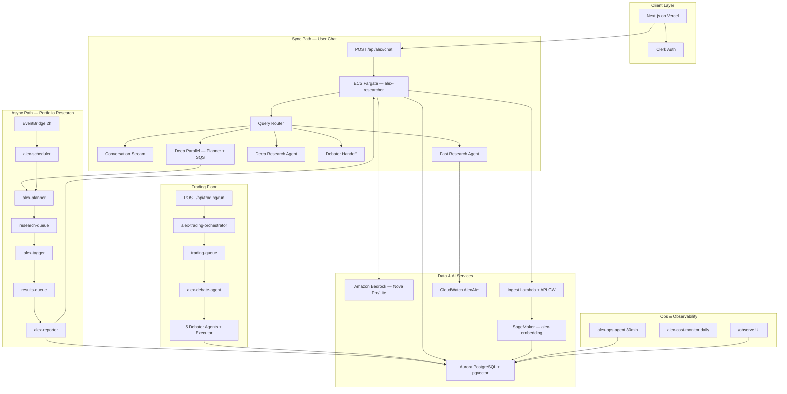

### 6.2 Architecture decisions — rationale

| Choice | Rationale | USP impact |
|--------|-----------|------------|
| **ECS Fargate for researcher** | Long SSE streams (3–5 min), Playwright MCP needs persistent Chromium | Deep research with browser automation |
| **Lambda for orchestration** | Event-driven, pay-per-invocation; no idle cost for scheduler/tagger | Cost-efficient autonomous pipeline |
| **SQS between agents** | Decouples planner from reporter; survives crashes; backpressure | Production reliability, not demo fragility |
| **Aurora + RDS Data API** | Serverless-friendly from Vercel without VPC peering | pgvector RAG from edge frontend |
| **Vercel for frontend** | Fast deploys, Clerk integration, API route proxy to AWS | Consumer-grade UX on enterprise backend |
| **Bedrock Nova** | AWS-native, guardrail integration, no API key in browser | Enterprise security posture |
| **Tiered models** | 10–50× cost difference Lite vs Pro | Sustainable unit economics at scale |
| **SSM Parameter Store** | Runtime config without redeploy (trading mode, ECS URL) | Ops agility |

### 6.3 Shared data layer — who writes, who reads

| Table | Written By | Read By |
|-------|-----------|---------|
| `portfolios` | User (portfolio page) | RAG, trading orchestrator, scheduler |
| `portfolio_digests` | Portfolio research reporter | Dashboard, RAG, trading context |
| `research_vectors` | Ingest pipeline, research agents | RAG context_service |
| `chat_sessions` | Alex chat turns | RAG conversation history |
| `simulated_trades` | Trading debate agent | Trading UI, RAG (roadmap) |
| `agent_observations` | All agents | `/observe` |
| `query_latency_metrics` | LatencyTracker | `/observe`, analytics |
| `cost_snapshots` | ops-agent, cost-monitor | Dashboard OpsCostWidget |

### 6.4 Unified chat request flow (P1)

```
User types in /research
    → POST /api/alex/chat (Next.js, Clerk auth)
    → ECS POST /research/route (classify_query)
    → SSE routing event + reasoning steps
    → Dispatch by route:
         chat      → /research/conversation/stream (Nova Lite, streaming)
         debater   → /research/debater/stream (specialist + yfinance)
         fast      → /research/stream (Nova Lite agent + tools, ~60s)
         deep+mcp  → /research/deep/stream (Nova Pro + EdgarTools + Playwright MCP)
         deep+parallel → frontend invokes alex-planner → SQS poll → synthesize
    → LatencyTracker + QueryTrace flush to Aurora
    → Optional ingest to research_vectors; chat_sessions save
    → /observe shows tool/MCP/API pass-fail
```

---

## 7. Sequence Diagrams — Per Route

### 7.1 Chat route (education / greeting)

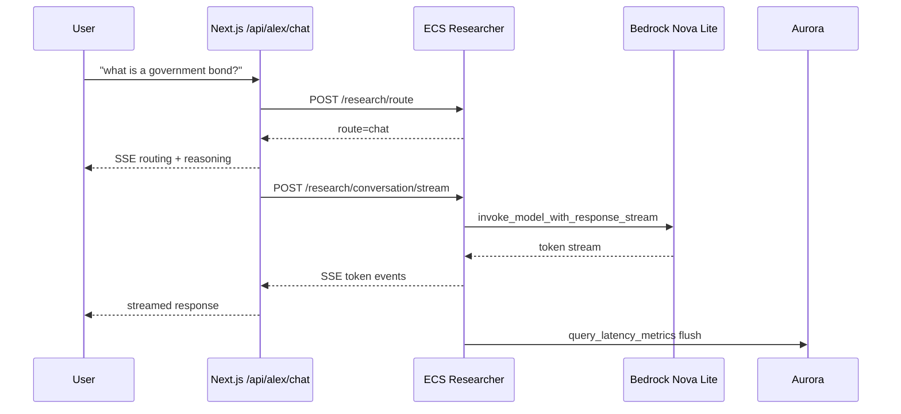

**Latency target:** 1–3s to first token; total <10s  
**No reasoning card** in UI for chat route

### 7.2 Fast research route

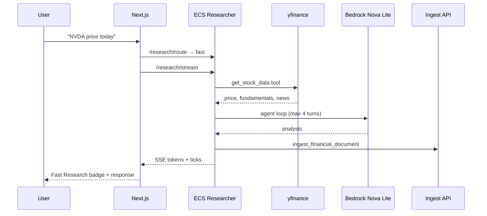

**Latency target:** ~30–90s  
**Model:** Nova Lite; **Cost:** ~$0.001–0.01 per query

### 7.3 Deep research route (MCP)

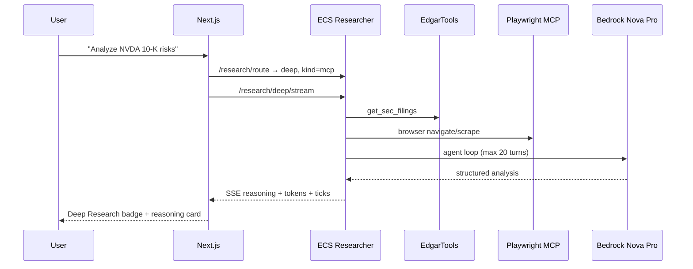

**Latency target:** 3–5 minutes  
**Model:** Nova Pro; **Shows reasoning card** in UI

### 7.4 Deep parallel route

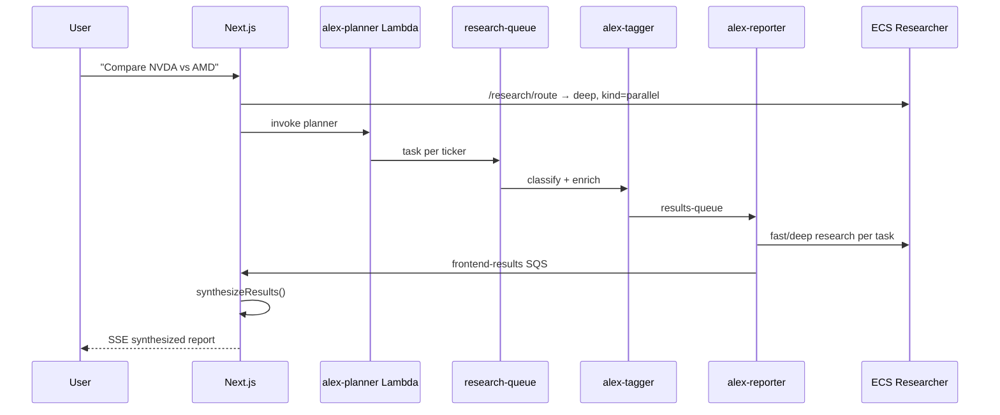

**Latency target:** 2–4 minutes (parallel)  
**Concept:** Map-reduce over agents

### 7.5 Debater handoff route

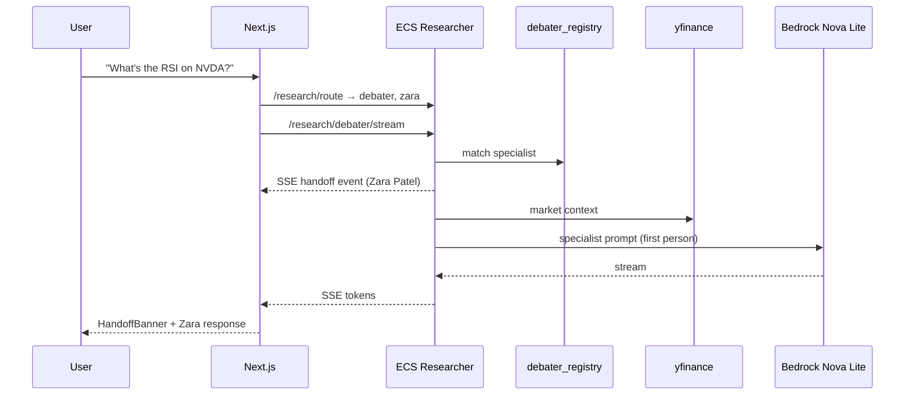

**USP:** Visible "Delegating to Zara Patel — Quantitative Strategist"

### 7.6 Guardrail block (no LLM)

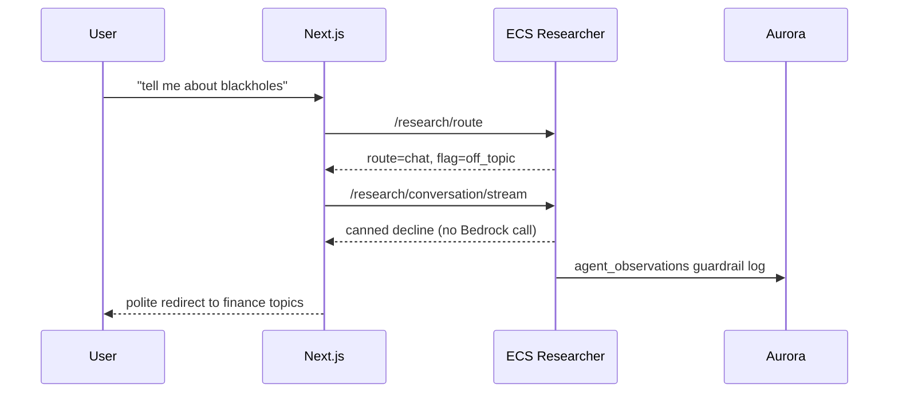

**Rationale:** Zero LLM cost; instant; consistent; auditable

### 7.7 Async portfolio research (2h)

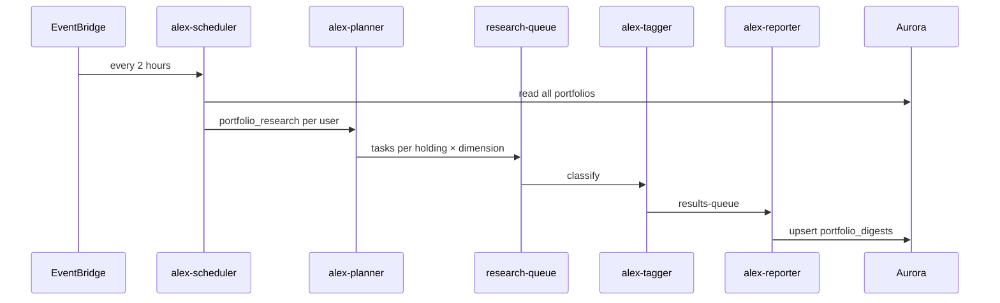

**USP:** Autonomous intelligence — user never asks

### 7.8 Trading floor debate

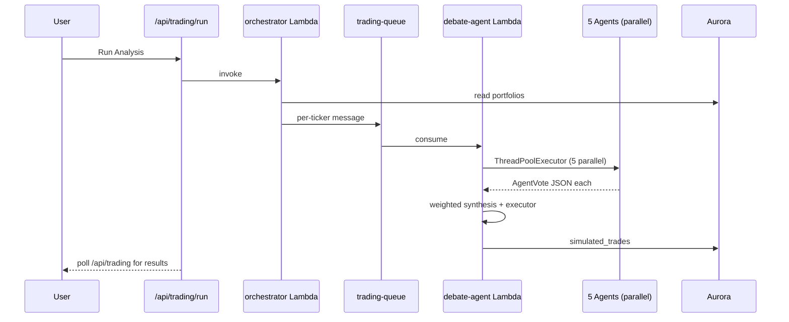

---

## 8. Technology Stack

### 8.1 Languages & frameworks

| Layer | Technology | Version / Notes |
|-------|------------|---------------|
| Frontend | Next.js, React, TypeScript | Next 16, React 19 |
| Styling | Tailwind CSS | v4 |
| Auth | Clerk | JWT sessions; `userId` = Clerk ID everywhere |
| Backend API | FastAPI (Python) | Researcher on ECS port 8000 |
| Agents | OpenAI Agents SDK + LiteLLM | Bedrock adapter for Nova models |
| IaC | Terraform | Modules `0_vpc` … `9_trading_floor` |
| Container | Docker linux/amd64 | Playwright MCP + Chromium baked in |

### 8.2 AWS services (complete list)

| Service | Role in Alex |
|---------|--------------|
| VPC | Public subnets (ALB, ECS), private (Aurora) |
| ECS Fargate | `alex-researcher` behind ALB |
| Lambda | planner, tagger, reporter, scheduler, cost-monitor, ops-agent, trading orchestrator, debate-agent |
| SQS | research-queue, results-queue, frontend-results, trading-queue, DLQ |
| EventBridge | Portfolio research 2h; ops 30min; cost monitor daily 8AM |
| Aurora Serverless v2 | PostgreSQL + pgvector |
| RDS Data API | SQL from Vercel/Lambda without persistent connections |
| SageMaker Serverless | `alex-embedding` — all-MiniLM-L6-v2 (384-dim) |
| Bedrock | Nova Pro, Nova Lite; financial guardrail |
| API Gateway | Ingest/search HTTP API for vectors |
| CloudWatch | `AlexAI/*` custom metrics; dashboards |
| SSM Parameter Store | Trading config, ECS URL, per-agent models |
| Secrets Manager | Aurora credentials |
| SES | Cost/ops alert emails |
| Cost Explorer | Ops agent billing data |
| ECR | Researcher container images |
| SNS | `alex-ai-alarms` for guardrail/error alerts |

### 8.3 AI models — use case matrix

| Use case | Model | Input $/1K | Output $/1K | Why |
|----------|-------|------------|-------------|-----|
| Query router (optional) | Nova Lite | $0.00006 | $0.00024 | Sub-second; pennies |
| Chat, fast, debater handoff | Nova Lite | $0.00006 | $0.00024 | Tool-augmented sufficient |
| Deep research, debate voters, executor | Nova Pro | $0.0008 | $0.0032 | Complex reasoning, MCP chains |
| Elena (risk agent) | Nova Lite | $0.00006 | $0.00024 | Rule-like scoring; cost opt |
| Embeddings | all-MiniLM-L6-v2 | $0.0001/1K invocations | — | 384-dim; fast retrieval |
| Claude 3.5 Sonnet (fallback ref) | — | $0.003 | $0.015 | 5× more expensive than Nova Pro |

### 8.4 Data & tool libraries

| Library | Purpose | Cost |
|---------|---------|------|
| **yfinance** | Live prices, fundamentals, 52-week range | Free |
| **EdgarTools** | SEC 10-K, 10-Q, 8-K — structured, compliant | Free |
| **@playwright/mcp** | Headless browser for deep web research | Free (compute) |
| **httpx** | Yahoo Finance RSS news headlines | Free |
| **pgvector** | Cosine similarity search in Aurora | Included |
| **Polygon.io** | Options, aggregates (trading floor) | Paid (optional) |
| **Alpha Vantage** | Technical indicators fallback | Free tier |

### 8.5 Latency expectations per route

| Route | Time to first token | Total duration | Reasoning card |
|-------|--------------------:|---------------:|:--------------:|
| Chat | 1–3s | <10s | No |
| Guardrail block | <1s | <1s | No |
| Debater handoff | 2–5s | 15–45s | Handoff banner |
| Fast research | 5–15s | 30–90s | No |
| Deep (MCP) | 10–30s | 3–5 min | Yes |
| Deep parallel | 15–30s | 2–4 min | Yes |
| Trading debate | N/A | 60–120s per ticker | N/A |

---

## 9. AI Capabilities — Deep Dive

Each section: **what**, **concept**, **implementation**, **rationale**, **USP**.

---

### 9.1 Alex Query Router (P1) ✅

**What:** Classifies every user message into the correct execution path without a manual Fast/Deep toggle.

**Concept:** *Policy-first intent classification* — regex signals for speed and determinism; optional Nova Lite LLM only when live-research is plausible.

**Routes:**

| Route | When | Example |
|-------|------|---------|
| `chat` | Greetings, education, off-topic, policy flags | "what is a government bond?" |
| `debater` | Specialist domain + ticker | "What's the RSI on NVDA?" |
| `fast` | Ticker + live data signals | "NVDA price today" |
| `deep` (mcp) | SEC/EDGAR/filing signals | "Analyze NVDA 10-K risks" |
| `deep` (parallel) | Multi-ticker comparison | "Compare NVDA vs AMD" |

**Priority order (hard overrides):**
1. Policy flag → canned decline
2. Off-topic → polite redirect
3. Social/greeting
4. Educational finance (no ticker required)
5. Debater handoff
6. High-confidence deep (SEC or parallel)
7. Live research → fast
8. Default → chat (not fast)

**Key router signals** (`query_router.py`):
- `OFF_TOPIC_SIGNALS`: weather, recipes, movies, code requests, sports scores
- `POLICY_FLAG_PATTERNS`: aggressive shorting, yolo, manipulation intent
- `_is_educational_finance`: requires finance topic, not just "tell me about"
- Session context only for follow-ups — prevents stale hijacking ("Hey Alex?" → chat)

**Files:** `backend/researcher/query_router.py`, `scripts/tests/test_p1_router.py` (32 tests)

**Rationale:** Regex-first avoids LLM latency/cost on obvious cases. Education before debater prevents "what is inflation" → Reid macro handoff.

**USP:** Smart receptionist — user never picks a mode.

---

### 9.2 Unified Chat (Conversation Mode) ✅

**What:** Conversational financial assistant for greetings, education, general Q&A.

**Concept:** *Lightweight streaming LLM* — Bedrock `invoke_model_with_response_stream` for low TTFT.

**Behaviors:**
- Streams tokens (~1–2s to first token)
- Skips session DB lookup for education (speed)
- Canned responses for `off_topic` and `policy_flag` — no LLM call
- No reasoning card in UI

**Files:** `server.py` → `generate_conversation_reply`, `stream_bedrock_conversation`; `AlexChat.tsx`

**USP:** ChatGPT feel for finance basics, bounded by guardrails.

---

### 9.3 Fast Research ✅

**What:** Live market data + news analysis on a specific ticker in ~60 seconds.

**Concept:** *Tool-augmented agent (TAG)* — OpenAI Agents SDK + Nova Lite; max 4 turns.

**Tools:** `get_stock_data` (yfinance + Yahoo RSS), `ingest_financial_document` (pgvector)

**Context:** `build_full_context(fast=True)` — skips heavy RAG embed (~2–4s saved)

**Files:** `server.py` → `run_data_agent`, `/research/stream`; `tools.py`; `prompts.py`

**USP:** Sub-minute research with real prices, not training data.

---

### 9.4 Deep Research ✅

**What:** SEC filings, web browsing, comprehensive analysis in 3–5 minutes.

**Concept:** *MCP-augmented agent* — Nova Pro + EdgarTools + Playwright MCP.

**Tools:** `get_sec_filings`, `ingest_financial_document`, Playwright browser tools

**Model:** Nova Pro, 20 max turns

**Files:** `server.py`, `mcp_servers.py`, `Dockerfile` (Chromium pre-installed)

**USP:** Compliant SEC access + browser automation — rare in retail AI finance.

---

### 9.5 Deep Parallel (Multi-Agent Comparison) ✅

**What:** Decomposes comparative queries into parallel research tasks.

**Concept:** *Map-reduce over agents* — Planner → SQS → tagger → reporter → frontend synthesis.

**Files:** `frontend/lib/deepResearch.ts`, `backend/agents/planner.py`, `reporter.py`

**USP:** Hedge-fund-style comparative analysis from a chat box.

---

### 9.6 Debater Agent Handoff ✅

**What:** Routes domain-specific questions to Trading Floor specialist personas.

**Concept:** *Agent handoff* — same personas as trading floor; research-only (no trades).

| Agent | Title | Domain signals |
|-------|-------|----------------|
| Marcus Chen | Growth Analyst | revenue, moats, earnings, bull case |
| Victoria Sterling | Short-Side Director | bear case, overvaluation, short interest |
| Zara Patel | Quant Strategist | RSI, MACD, technicals, options flow |
| Reid Morrison | Macro Strategist | Fed, rates, recession, sector rotation |
| Elena Vasquez | Chief Risk Officer | position sizing, drawdown, concentration |

**SSE `handoff` event:** `{id, name, title, expertise}`

**Files:** `debater_registry.py`, `debater_handoff.py`, `AlexChat.tsx` (HandoffBanner)

**USP:** Visible delegation to named specialists — only platform connecting chat UX to debate personas.

---

### 9.7 Alex Synthesizer — Roadmap (P4)

**What:** Commentary layer that transforms raw agent output into Alex's voice.

**Concept:** *Post-processing synthesis* — fast = 2–3 paragraphs; deep = hedge fund memo style.

**Why needed:** Today raw agent output is shown; synthesizer adds personality, proactive trading comparison, disclaimer injection.

**Target files:** `backend/researcher/synthesizer.py` (planned)

---

## 10. Prompt Engineering Patterns

**File:** `backend/researcher/prompts.py`

### 10.1 Universal patterns (all modes)

- Date injection: `datetime.now().strftime("%B %d, %Y")`
- Section dividers with `═══` blocks
- Mandatory numbered tool sequences (STEP 1–N)
- Explicit ✅/❌ output rules ("Returning full analysis is SUCCESS")
- Disclaimer footer on every response
- Guardrail decline templates for guaranteed returns, YOLO, insider tips

### 10.2 Fast agent (`get_fast_agent_instructions`)

- Nova Lite; **one tool call max** (`get_stock_data`)
- Fixed markdown table for live data + 4–5 analysis bullets
- No SEC, no ingest in fast mode

### 10.3 Standard sync agent (`get_agent_instructions`)

- 4 tools: `get_stock_data`, `get_news`, `get_sec_filings`, `ingest_financial_document`
- Mandatory 5-step sequence ending with full analysis return
- Playwright only for analyst ratings, earnings transcripts — **not** for prices/news/SEC

### 10.4 Deep research (`get_deep_research_instructions`)

- SEC first via EdgarTools, then Playwright for MarketBeat, UnusualWhales, transcripts
- 10-turn budget, 4 data sources required
- Structured output: SEC summary, insider activity, analyst ratings, options flow, synthesis

### 10.5 Trading agent prompts

**Files:** `backend/agents/trading/prompts/{marcus,victoria,zara,reid,elena,executor}.py`

- Each agent returns JSON vote schema: `action`, `confidence`, `reasoning`, `key_factors`
- Executor synthesizes narrative from all votes
- Confidence capped at 95% (`base_agent.py` guardrail)

### 10.6 Pipeline agent prompts

| Agent | Output format |
|-------|---------------|
| Planner | JSON array, max 5 tasks |
| Tagger | JSON classification: category, priority, tickers, sentiment |
| Reporter | Structured report + card digest JSON for portfolio path |

---

## 11. MCP Server Configuration

**File:** `backend/researcher/mcp_servers.py`

| Setting | Value |
|---------|-------|
| Package | `@playwright/mcp@0.0.74` |
| Container path | `/usr/local/lib/node_modules/@playwright/mcp/cli.js` |
| Local dev | `npx @playwright/mcp@0.0.74` |
| Args | `--headless`, `--isolated`, `--no-sandbox`, `--ignore-https-errors` |
| Timeout | 120s default |
| Used in | `/research/deep/stream` only |
| Trace logging | `query_trace.py` → `mcp_servers` in `query_latency_metrics` |

### Why MCP for deep research only

| Data source | Access method | Why not MCP |
|-------------|---------------|-------------|
| Stock prices | yfinance direct | Faster, structured |
| SEC filings | EdgarTools direct | Compliant, structured |
| Analyst ratings | Playwright MCP | Dynamic JS pages |
| Options flow | Playwright MCP | No free structured API |
| Earnings transcripts | Playwright MCP | Scattered sources |

### Quant MCP roadmap (P13)

Planned: `price_mcp`, `technical_mcp`, `options_flow_mcp`, `fred_mcp`, `chart_mcp` — powers Zara and quant-routed Alex queries.

---

## 12. RAG & Context Service

**File:** `backend/researcher/context_service.py` (576 lines)

### 12.1 Concept

*Retrieval-augmented generation* — embed query via SageMaker → cosine search in pgvector → inject top-k chunks into agent prompt. **Scoped by `user_id` + `session_id`** (P0 fix).

### 12.2 Six use cases

| # | Use case | Source | Rationale |
|---|----------|--------|-----------|
| 1 | Conversation follow-ups | `chat_sessions` JSONB | "What about their debt?" after NVDA query |
| 2 | Cross-session memory | `research_vectors` similarity | Remember prior research across sessions |
| 3 | Portfolio intelligence | `portfolios` holdings | "Your ASML position is worth $X today" |
| 4 | Contradiction detection | New vs prior vector content | Flag when new research contradicts old |
| 5 | Sector pattern recognition | Recent research themes | "You've researched 3 semiconductors this week" |
| 6 | Proactive suggestions | Stale ticker detection | `/suggestions` endpoint |

### 12.3 Ingest path

```
Research agent → ingest_financial_document tool
    → API Gateway POST /ingest (x-api-key)
    → alex-ingest Lambda
    → SageMaker embed (384-dim)
    → Aurora research_vectors (user_id, session_id, chunk_index)
```

### 12.4 Identity resolution

- Clerk `userId` → `users.clerk_id` → `users.id` UUID
- `ingest_pgvector._resolve_db_user_id()` ensures vectors never leak between users

### 12.5 Roadmap gaps (P2)

- Tagger-gated ingest (only durable research stored)
- Dedicated `rag_engine.py` with chunking + MMR reranking
- `rag_attributions` table for observability
- RAGAS evaluation gates (faithfulness >0.91, relevancy >0.87)

**USP:** Alex remembers *your* research — not generic internet knowledge.

---

## 13. Async Portfolio Research Pipeline

### 13.1 Flow

```
EventBridge rate(2 hours)
    → alex-scheduler Lambda
    → reads all portfolios from Aurora
    → async-invokes alex-planner per user (task: portfolio_research)
    → planner queues tasks per holding × dimension
    → alex-tagger classifies (portfolio tasks pass through)
    → alex-reporter generates research via ECS
    → upsert portfolio_digests
    → optional ingest to research_vectors
```

### 13.2 Dimension rotation (`portfolio_research.py`)

| Cycle | Dimensions researched |
|-------|----------------------|
| Standard | news, price, fundamentals, sector |
| Every 3rd cycle | + SEC deep research bonus |

### 13.3 Output schema (`portfolio_digests`)

- `headline`, `sentiment`, `dimensions` (JSONB), `key_news`, `ticker`, `user_id`
- Rendered as cards on `/dashboard`

### 13.4 Why async instead of on-demand only

| On-demand only | + Async pipeline |
|----------------|------------------|
| User must remember to ask | Alex watches portfolio proactively |
| Research stale between sessions | Fresh digest every 2 hours |
| No background intelligence | Dashboard always has current cards |

**USP:** Autonomous portfolio intelligence — the product works while you sleep.

---

## 14. Trading Floor — Complete Specification

### 14.1 Architecture

**Files:** `backend/agents/trading/core/orchestrator.py`, `debate_engine.py`, `debate_agent.py`

```
Trigger (manual / EventBridge / force=true)
    → orchestrator reads portfolios from Aurora
    → creates/resumes trading_simulations (default $10k if empty)
    → enriches holdings with get_market_data()
    → queues per-ticker to SQS (or run_direct_analysis in-process)
    → debate-agent Lambda consumes
    → run_debate() with ThreadPoolExecutor (5 parallel agents)
    → weighted synthesis + executor narrative
    → stores simulated_trades + agent_observations
```

### 14.2 Six agents

| Agent | Role | Default model | File |
|-------|------|---------------|------|
| Marcus Chen | Growth / bull | Nova Pro | `agents/marcus.py` |
| Victoria Sterling | Bear / short-side | Nova Pro | `agents/victoria.py` |
| Zara Patel | Quant / technical | Nova Pro | `agents/zara.py` |
| Reid Morrison | Macro / Fed | Nova Pro | `agents/reid.py` |
| Elena Vasquez | Risk / sizing | Nova Lite | `agents/elena.py` |
| Executor | Synthesis narrative | Nova Pro | `debate_engine.run_executor()` |

### 14.3 Mode weights (`debate_engine.py`)

| Mode | Marcus | Zara | Reid | Victoria | Elena |
|------|--------|------|------|----------|-------|
| aggressive | 2.0 | 1.5 | 1.0 | 0.5 | 0.5 |
| neutral | 1.0 | 1.0 | 1.0 | 1.0 | 1.0 |
| safe | 0.5 | 0.5 | 1.0 | 1.5 | 2.0 |

**Rationale:** Aggressive mode amplifies growth/quant voices; safe mode amplifies risk/bear voices. User-configurable via SSM `/alex/trading/mode`.

### 14.4 Decision math

```python
ACTION_VALUES = {"BUY": 1.0, "TRIM": 0.2, "HOLD": 0.0, "SELL": -1.0}

# Weighted score thresholds:
# avg > 0.3  → BUY
# avg > 0.05 → HOLD
# avg > -0.3 → TRIM
# else       → SELL

# Share sizing:
# BUY  = 5% of holding value × confidence
# SELL = full position
# TRIM = 25% of position
```

### 14.5 Market data context (`tools/market_data.py`)

Aggregates per ticker:
- **Fundamentals:** P/E, forward P/E, revenue growth, EPS growth, profit margin, market cap
- **Technicals:** RSI(14), signal, 50MA/200MA position, options sentiment
- **Sentiment:** analyst rating, price target, fear/greed, short interest
- **News:** top 3 headlines

Data sources: yfinance (primary), Polygon.io, Alpha Vantage (fallbacks)

### 14.6 SSM configuration (`terraform/9_trading_floor`)

| Parameter | Default | Purpose |
|-----------|---------|---------|
| `/alex/trading/enabled` | true | Master on/off switch |
| `/alex/trading/mode` | neutral | aggressive / neutral / safe |
| `/alex/trading/max_position_pct` | — | Position size cap |
| `/alex/trading/models/{agent}` | Nova Pro/Lite | Per-agent model override |

### 14.7 Triggers

| Trigger | Schedule / Action |
|---------|-------------------|
| Manual | `POST /api/trading/run` from UI |
| EventBridge | 9:30 AM, 2:00 PM, 3:45 PM (per docs) |
| `force=true` | Bypasses SSM enabled check |

### 14.8 Researcher debater handoff (chat only)

Same personas, different path:
- Registry: `debater_registry.py` — pattern matching
- Handoff: `debater_handoff.py` — yfinance + Nova specialist prompt
- Route: `/research/debater/stream` — no simulated trade

**USP:** Transparent AI committee — every vote, reasoning, confidence stored and visible.

---

## 15. Guardrails & Safety

### 15.1 Multi-layer model

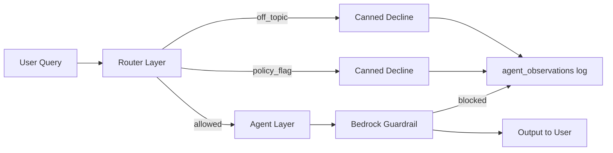

### 15.2 Layer details

| Layer | Mechanism | Example | Cost |
|-------|-----------|---------|------|
| Router policy flag | Regex `POLICY_FLAG_PATTERNS` | "I want to short stocks aggressively" | $0 |
| Router off-topic | `OFF_TOPIC_SIGNALS` + finance topic check | "tell me about blackholes" | $0 |
| Canned decline | No LLM call | Instant, consistent | $0 |
| Bedrock guardrail | `apply_guardrail()` on output | Harmful financial advice | ~$0.001 |
| Trading confidence cap | max 95% in `base_agent.py` | Prevents overconfidence | — |
| Trading action validation | Pydantic models | Invalid actions rejected | — |
| Observability log | `log_guardrail_observation()` | Every block on `/observe` | — |

### 15.3 Policy flag patterns (sample)

- `(i want|help me)...short` → risky_short_intent
- `how (do|can|should) i short` → actionable_short_advice
- `yolo`, `all in`, `life savings` → reckless_sizing
- `pump`, `manipulate`, `insider` → manipulation_intent

### 15.4 Regulatory rationale

Alex provides **research and simulation**, not personalized investment advice or trade execution. Guardrails + disclaimers + paper-only trading reduce liability surface.

**USP:** Safety is observable — audit trail of every block, not a black box.

---

## 16. Observability

### 16.1 Concept

*AI ops as first-class product feature* — every query is a traced transaction with structured pass/fail per external dependency.

### 16.2 Per-query metrics (`query_latency_metrics`)

| Field | Meaning |
|-------|---------|
| `total_ms` | End-to-end latency |
| `context_ms` | RAG + session load time |
| `agent_ms` | LLM agent execution time |
| `guardrail_ms` | Bedrock guardrail check time |
| `first_token_ms` | Time to first streamed token |
| `tools_called` | JSON array with pass/fail per tool |
| `mcp_servers` | JSON array with pass/fail per MCP |
| `data_sources` | External API outcomes |
| `route`, `model`, `user_id`, `success` | Classification metadata |

### 16.3 Per-agent metrics (`agent_observations`)

- Tokens in/out, cost USD, latency, guardrail hits
- Action distribution (BUY/SELL/HOLD/TRIM counts)
- `data_used` — which RAG chunks influenced vote (roadmap)

### 16.4 UI surfaces

| Surface | Data | Refresh |
|---------|------|---------|
| `/observe` | Query latency, guardrails, agent stats, tool/MCP pass-fail | 30s auto-refresh |
| Dashboard `OpsCostWidget` | Today, Week, MTD AWS cost, service breakdown, health | 30 min |
| CloudWatch `AlexAI/*` | Custom metrics from researcher + trading | Real-time |
| Terraform dashboard | `Alex-AI-Platform` — error rate, latency alarms | AWS console |

### 16.5 Ops agent (`alex-ops-agent`)

- Schedule: EventBridge `rate(30 minutes)` — **ENABLED**
- Upserts `cost_snapshots` with live Cost Explorer data
- Stores `ops_snapshots` with 7-service health check
- Verified MTD: **$10.52** (June 2026)

### 16.6 RAGAS quality gates (roadmap P17)

| Metric | Threshold |
|--------|-----------|
| Answer Relevancy | > 0.87 |
| Faithfulness | > 0.91 |
| Hallucination rate | < 5% |

**USP:** Production-grade AI observability — not logs, but structured dependency health per query.

---

## 17. Security & Authentication

### 17.1 Clerk auth flow

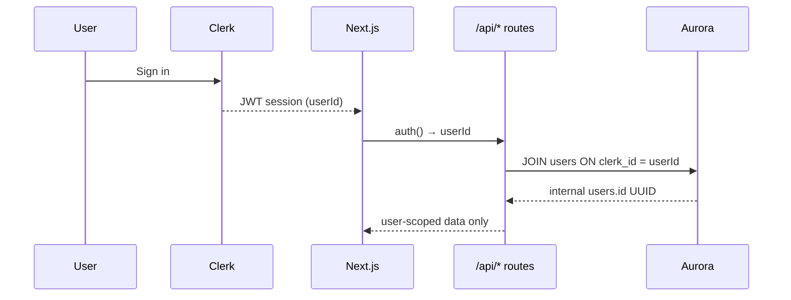

### 17.2 Protected routes (`frontend/proxy.ts`)

| Protected (middleware) | Public |
|---------------------|--------|
| `/dashboard`, `/research`, `/portfolio`, `/history` | `/`, `/sign-in`, `/sign-up` |

**Note:** `/trading`, `/observe`, `/charts`, `/retirement` rely on API-level `auth()` — not middleware-protected.

### 17.3 API auth pattern

- Server routes: `auth()` from `@clerk/nextjs/server` → 401 if no `userId`
- Client pages: `useUser()` hook
- Ingest API: `x-api-key` header (`ALEX_API_KEY`) — service-to-service only
- No AWS credentials in browser — all AWS calls via Next.js API routes

### 17.4 Data isolation

- All RAG vectors scoped by `user_id`
- `chat_sessions` unique index on `(user_id, session_id)` — P0 fix
- Portfolio queries always JOIN `users u ON u.clerk_id = :clerk_id`

### 17.5 Why Clerk + Vercel + AWS

| Choice | Rationale |
|--------|-----------|
| Clerk | Production auth in hours; OAuth; session management |
| API routes as proxy | AWS credentials never exposed to client |
| RDS Data API | No VPC peering needed from Vercel serverless |

---

## 18. Complete API Reference

### 18.1 Frontend Next.js API routes

| Route | Methods | Auth | Purpose |
|-------|---------|------|---------|
| `/api/alex/chat` | POST | Clerk | **Unified chat SSE** — all routes |
| `/api/alex/session` | GET, POST | Clerk | Chat session CRUD |
| `/api/research` | POST | Clerk | Fast or multi-agent (legacy) |
| `/api/research/stream` | POST | Clerk | Proxy ECS fast SSE |
| `/api/research/deep` | POST | Clerk | Proxy ECS deep sync |
| `/api/research/deep/stream` | POST | Clerk | Proxy ECS deep SSE |
| `/api/portfolio` | GET, POST, DELETE, PATCH | Clerk | Holdings CRUD |
| `/api/portfolio/prices` | POST | Clerk | Live price fetch |
| `/api/portfolio-research` | GET | Clerk | Digest cards |
| `/api/trading` | GET | Clerk | Simulation state, trades |
| `/api/trading/run` | POST | Clerk | Invoke orchestrator Lambda |
| `/api/trading/toggle` | GET, POST | Clerk | SSM trading enabled |
| `/api/observe` | GET | Clerk | Observability data |
| `/api/ops` | GET | Clerk | Ops snapshots + health |
| `/api/costs` | GET, POST | Clerk | Cost snapshots + manual monitor |
| `/api/history` | GET | Clerk | Research history |
| `/api/suggestions` | GET | Clerk | Proactive suggestions |
| `/api/search` | POST | Clerk | Vector search |
| `/api/auto-research` | GET | Clerk | Trigger auto-research |
| `/api/retirement` | POST | Clerk | Retirement planning |
| `/api/users/sync` | POST | Clerk | Clerk → Aurora users upsert |

**ECS URL resolution:** `frontend/lib/config.ts` — SSM `/alex/ecs_url` with 5-min cache; fallback `ECS_URL`.

### 18.2 ECS Researcher endpoints (`server.py`)

| Endpoint | Method | Purpose |
|----------|--------|---------|
| `/` | GET | Service info + timestamp |
| `/health` | GET | Config check (API, region, model) |
| `/research/route` | POST | Query classification |
| `/research/conversation/stream` | POST | Chat SSE |
| `/research/debater/stream` | POST | Debater handoff SSE |
| `/research` | POST | Sync fast research |
| `/research/deep` | POST | Sync deep research |
| `/research/stream` | POST | Fast research SSE |
| `/research/auto` | GET | Auto trending-topic research |
| `/research/deep/stream` | POST | Deep research SSE + MCP |
| `/research/multi/stream` | POST | Parallel status placeholder |
| `/suggestions` | GET | Proactive suggestions |
| `/test-network` | GET | Network connectivity test |

**ALB:** `http://alex-alb-1582546453.us-east-1.elb.amazonaws.com`

### 18.3 API Gateway (Ingest Lambda)

| Path | Method | Auth | Handler |
|------|--------|------|---------|
| `/ingest` | POST | API key | Embed + pgvector store |
| `/search` | POST | API key | Vector similarity search |

### 18.4 Lambda functions (no HTTP — invoked directly)

| Function | Handler | Trigger |
|----------|---------|---------|
| `alex-planner` | `planner.lambda_handler` | Direct invoke, scheduler |
| `alex-tagger` | `tagger.lambda_handler` | SQS research-queue |
| `alex-reporter` | `reporter.lambda_handler` | SQS results-queue |
| `alex-scheduler` | `scheduler.lambda_handler` | EventBridge 2h |
| `alex-cost-monitor` | `cost_monitor.lambda_handler` | EventBridge daily 8AM |
| `alex-ops-agent` | `ops_agent.lambda_handler` | EventBridge 30min |
| `alex-trading-orchestrator` | `orchestrator.lambda_handler` | API, EventBridge |
| `alex-debate-agent` | `debate_agent.lambda_handler` | SQS trading-queue |

---

## 19. SSE Event Types

### 19.1 Frontend `/api/alex/chat` events

| Event `type` | Payload | When |
|--------------|---------|------|
| `routing` | `routing`, `steps`, `display_route` | After ECS `/research/route` |
| `reasoning` | `content` (string) | Router steps + mode messages |
| `reasoning_done` | — | Before token stream |
| `token` | `content` | Word chunks (parallel deep synthesis) |
| `done` | `route`, `deep_kind`, `latency`, `timedOut` | Completion |
| `error` | `content` | Any failure |

**Passthrough from ECS:** debater, chat, fast, deep stream events below.

### 19.2 ECS Researcher SSE events

| Event `type` | Fields | Routes |
|--------------|--------|--------|
| `reasoning` | `content` | conversation, debater, fast, deep |
| `reasoning_done` | — | all stream endpoints |
| `token` | `content` | all stream endpoints |
| `tick` | `elapsed_ms` | fast, deep (heartbeat) |
| `handoff` | `debater` {id, name, title, expertise} | debater only |
| `done` | `route`, `latency`, `debater`, `time_to_answer` | all streams |
| `error` | `content` | all streams |
| `status` | `content` | multi/stream placeholder |

### 19.3 UI mapping (`AlexChat.tsx`)

| Route | Badge | Reasoning card | Special UI |
|-------|-------|:--------------:|------------|
| chat | — | No | — |
| fast | Fast Research | No | — |
| deep | Deep Research | Yes | — |
| debater | — | No | Amber HandoffBanner |
| block | — | No | Canned decline |

---

## 20. Database Schema — Full Reference

**Schema management:** `scripts/aurora_warmup.py` — idempotent DDL for all tables.

### 20.1 Core tables

**`users`**
- `id` UUID PK, `clerk_id` UNIQUE, `email`, `name`, timestamps

**`portfolios`**
- `user_id`, `ticker`, `company`, `shares`, `purchase_price`, `asset_class`, `sector`, `notes`
- Index: `portfolios_user_ticker_uidx`

**`preferences`**
- Risk tolerance, sectors

### 20.2 Chat & RAG

**`chat_sessions`**
- `user_id`, `session_id`, `turns` JSONB, timestamps
- Index: `chat_sessions_user_session_uidx` on `(user_id, session_id)`

**`research_vectors`**
- `embedding` vector(384), `content`, `user_id`, `session_id`, `chunk_index`, `query`, `chunk_type`, `ticker`
- pgvector cosine index

**`research_sessions`**
- Full Q&A history with `vector_id` link

**`rag_attributions`** (roadmap)
- Which chunks influenced which response

**`session_metadata`** (roadmap)
- Session complexity, route distribution

### 20.3 Portfolio intelligence

**`portfolio_digests`**
- `user_id`, `ticker`, `headline`, `sentiment`, `dimensions` JSONB, `key_news`, `updated_at`

### 20.4 Observability

**`query_latency_metrics`**
- Full latency breakdown + tools/MCP JSON + route + model

**`agent_observations`**
- Per-agent tokens, cost, guardrail hits, actions

**`ops_snapshots`**
- Platform health, service breakdown, `daily_cost`

**`cost_snapshots`**
- MTD, weekly, daily AWS costs from Cost Explorer

**`cost_alerts`**
- Threshold breach history

**`ragas_evaluations`** (roadmap P17)
- Faithfulness, relevancy, hallucination scores

### 20.5 Trading floor

**`trading_simulations`**
- Virtual account state, cash balance, total value

**`simulated_trades`**
- `ticker`, `action`, `shares`, `price`, `confidence`, `agent_votes` JSONB, `agent_debate` JSONB
- `target_price`, `stop_loss`, `realized_pnl`, `outcome`, `trigger`

**`agent_positions`**
- Current simulated positions per agent

**`trading_daily_pnl`** (roadmap)
- Daily simulation P&L tracking

**`user_trading_config`**
- Trading mode, agent model overrides

**`rl_weights`** (roadmap)
- Per-user adaptive agent weights

**`trading_events`** (roadmap)
- Event timeline for `/observe`

**`trading_floor_intelligence`** (roadmap P14)
- Debate memory vector store

**`scout_candidates`** (roadmap P9)
- Scout agent discoveries

**`quant_snapshots`** (roadmap P13)
- Structured quant data per ticker

### 20.6 Knowledge graph (roadmap)

**`knowledge_graph_entities`**, **`knowledge_graph_relationships`**
- Entity-relationship graph for unified memory

---

## 21. Environment Variables

> **Security note:** Never commit `.env` or `.env.local` values. Variable names only below.

### 21.1 Root `.env` (backend + scripts)

| Category | Variables |
|----------|-----------|
| AWS core | `AWS_ACCOUNT_ID`, `DEFAULT_AWS_REGION`, `AWS_REGION` |
| SageMaker | `SAGEMAKER_ENDPOINT_NAME`, `SAGEMAKER_ENDPOINT` |
| Ingest API | `ALEX_API_ENDPOINT`, `ALEX_API_KEY`, `NEXT_PUBLIC_API_URL` |
| ECS/ECR | `ECS_SERVICE_URL`, `ECR_REPOSITORY_URL`, `ECS_CLUSTER_NAME`, `ECS_URL` |
| Aurora | `DB_CLUSTER_ARN`, `DB_CLUSTER_ENDPOINT`, `DB_SECRET_ARN`, `DB_NAME` |
| SQS | `SQS_RESEARCH_QUEUE_URL`, `SQS_RESULTS_QUEUE_URL`, `FRONTEND_RESULTS_QUEUE_URL` |
| Lambdas | `PLANNER_FUNCTION`, `TAGGER_FUNCTION`, `REPORTER_FUNCTION` |
| Clerk | `CLERK_PUBLISHABLE_KEY`, `CLERK_SECRET_KEY` |
| Guardrails | `GUARDRAIL_ID`, `GUARDRAIL_VERSION` |
| Trading data | `POLYGON_API_KEY`, `ALPHA_VANTAGE_KEY` |

### 21.2 Frontend `frontend/.env.local`

| Category | Variables |
|----------|-----------|
| Clerk | `NEXT_PUBLIC_CLERK_*`, `CLERK_SECRET_KEY`, sign-in/up URLs |
| AWS | `AWS_REGION`, `AWS_ACCESS_KEY_ID`, `AWS_SECRET_ACCESS_KEY` |
| Aurora | `DB_CLUSTER_ARN`, `DB_SECRET_ARN`, `DB_NAME` |
| ECS | `ECS_URL`, `NEXT_PUBLIC_ECS_URL` |
| Services | `ALEX_API_KEY`, `PLANNER_FUNCTION`, `SQS_FRONTEND_RESULTS_QUEUE_URL` |

### 21.3 Runtime SSM parameters

| Parameter | Purpose |
|-----------|---------|
| `/alex/ecs_url` | ALB URL for ECS researcher |
| `/alex/trading/enabled` | Trading floor master switch |
| `/alex/trading/mode` | aggressive / neutral / safe |
| `/alex/trading/models/{agent}` | Per-agent Bedrock model |

---

## 22. Infrastructure & Terraform

### 22.1 Module map

| Module | Path | Key resources |
|--------|------|---------------|
| **0_vpc** | `terraform/0_vpc` | VPC 10.0.0.0/16, public/private subnets, IGW |
| **1_permissions** | `terraform/1_permissions` | IAM roles — Bedrock, RDS, SQS, S3 |
| **2_sagemaker** | `terraform/2_sagemaker` | `alex-embedding` serverless, all-MiniLM-L6-v2, 1024MB |
| **3_ingestion** | `terraform/3_ingestion` | `alex-ingest` Lambda, API GW, API key |
| **4_researcher** | `terraform/4_researcher` | ECR, ECS Fargate, ALB 80→8000, task roles |
| **5_database** | `terraform/5_database` | Aurora Serverless v2, Secrets Manager |
| **6_agents** | `terraform/6_agents` | SQS queues, planner/tagger/reporter/scheduler/ops/cost Lambdas, EventBridge |
| **7_guardrails** | `terraform/7_guardrails` | Bedrock guardrail, SNS alarms, CloudWatch dashboard |
| **9_trading_floor** | `terraform/9_trading_floor` | Trading SQS, orchestrator, debate-agent, SSM params |

### 22.2 Deploy order (`scripts/deploy_all.sh`)

```
0_vpc → 1_permissions → 2_sagemaker → 3_ingestion → 5_database → 6_agents → 4_researcher
```

### 22.3 Network topology

| Subnet | Contains | Access |
|--------|----------|--------|
| Public | ALB, ECS Fargate tasks | Internet via IGW |
| Private | Aurora cluster | RDS Data API only (no direct public) |

### 22.4 Why Terraform modules numbered

Each module is independently deployable and testable. Numbering enforces dependency order. Module 8 skipped (reserved). Module 9 added for trading floor without renumbering existing infra.

---

## 23. Deployment & Operations

### 23.1 Scripts reference

| Script | Purpose |
|--------|---------|
| `scripts/deploy_all.sh` | Full Terraform apply all modules |
| `scripts/start_session.sh` | Dev session: wake SageMaker, ECS, aurora warmup, health check |
| `scripts/stop_session.sh` | Tear down / pause resources |
| `scripts/destroy_all.sh` | Destroy infrastructure |
| `backend/researcher/deploy.sh` | Docker amd64 → ECR → ECS rolling deploy → SSM update |
| `scripts/deploy_ingest.sh` | Package ingest Lambda |
| `scripts/deploy_trading.sh` | Zip trading package → S3 → update Lambdas |
| `scripts/aurora_warmup.py` | Wake Aurora + ensure all tables |
| `scripts/toggle_eventbridge.sh` | Enable/disable 2h scheduler |
| `scripts/health_check.sh` | Health verification |
| `scripts/alex_control.sh` | Platform control utilities |
| `scripts/benchmark_latency.sh` | Latency benchmarking |

### 23.2 Standard change workflow

```
1. Implement change
2. Run tests (test_p0.sh / test_p1_router.py)
3. Deploy touched service only (deploy.sh / deploy_trading.sh)
4. Frontend playbook checkpoints (TEST_PLAYBOOK.md)
5. Verify /observe + /health
```

### 23.3 ECS researcher deploy

```bash
cd backend/researcher && bash deploy.sh
# → docker build linux/amd64
# → ECR push
# → ECS force new deployment
# → SSM /alex/ecs_url updated
```

### 23.4 EventBridge schedules

| Schedule | Function | Purpose |
|----------|----------|---------|
| `rate(2 hours)` | alex-scheduler | Portfolio research |
| `rate(30 minutes)` | alex-ops-agent | Cost + health snapshots |
| `cron(0 8 * * ? *)` | alex-cost-monitor | Daily cost alert |
| Trading times | alex-trading-orchestrator | 9:30 AM, 2PM, 3:45 PM |

### 23.5 Cost alert threshold

- `DAILY_COST_THRESHOLD` default: **$10/day**
- Alert via SES email
- Dashboard shows MTD (Cost Explorer has ~24h lag on "today")

---

## 24. Test Suite & Verification

### 24.1 Automated tests

| File | Tests | What it covers |
|------|-------|----------------|
| `scripts/test_p0.sh` | 51 passed | Foundation: SQL, identity, schema, orchestrator |
| `scripts/tests/test_p0_foundation.py` | — | Static + live Aurora schema checks |
| `scripts/tests/test_p1_router.py` | 32 passed | All router routes: chat/fast/deep/debater/block |
| `scripts/test_trading.sh` | E2E | Orchestrator → debate → simulated_trades |
| `scripts/tests/test_ragas.py` | 5 queries | Faithfulness >0.91, relevancy >0.87 |
| `scripts/tests/test_planner.py` | — | Lambda decomposition + SQS |
| `scripts/tests/test_multi_agent.py` | — | Full planner → poll → synthesize |
| `scripts/tests/test_edgar.py` | — | EdgarTools + ECS deep endpoint |

### 24.2 Manual playbook (`scripts/TEST_PLAYBOOK.md`)

| Step | Action | Pass criteria |
|------|--------|---------------|
| 0.1 | `npm run dev` | Ready on :3000 |
| 0.2 | `aurora_warmup.py` | Aurora connected |
| 0.4 | Sign in → dashboard | Name visible |
| 1.1 | Portfolio cards | NVDA/ASML digests |
| NEW | Cost widget | MTD, health badges |
| 2.2 | Fast: "Brief NVDA outlook" | Streams ~60s |
| 3.2 | Deep: SEC query | 3–5 min, reasoning |
| 4.2 | Trading → Run Analysis | Trades queued |
| O.2 | /observe | Tool pass/fail rows |

### 24.3 Quick verification commands

```bash
./scripts/test_p0.sh --full                    # 51 checks
python3 scripts/tests/test_p1_router.py         # 32 checks
python3 scripts/aurora_warmup.py                # Schema OK
curl http://alex-alb-1582546453.us-east-1.elb.amazonaws.com/health
cd backend/researcher && bash deploy.sh         # Deploy ECS
./scripts/test_trading.sh                       # Trading E2E
```

---

## 25. Cost Model & Pricing Math

### 25.1 Per-query cost estimates

| Route | Model | Est. tokens | Est. cost |
|-------|-------|-------------|-----------|
| Chat | Nova Lite | 500–2K | $0.0001–0.001 |
| Fast research | Nova Lite | 2K–8K + tools | $0.001–0.01 |
| Deep research | Nova Pro | 10K–50K + MCP | $0.05–0.25 |
| Debater handoff | Nova Lite | 2K–6K | $0.001–0.01 |
| Trading debate (5 agents) | Nova Pro ×5 | 20K–60K | $0.10–0.50 |
| Embedding ingest | SageMaker | 1 invocation | $0.0000001 |

### 25.2 Infrastructure monthly (observed June 2026)

| Component | Est. monthly |
|-----------|-------------|
| ECS Fargate (researcher) | $15–40 |
| Aurora Serverless v2 | $10–30 |
| Lambda (all agents) | $5–15 |
| SageMaker serverless | $2–10 |
| Bedrock (usage-dependent) | $5–50 |
| Other (SQS, ALB, etc.) | $5–15 |
| **Total observed MTD** | **~$10.52** (early month) |

### 25.3 Unit economics at $29/mo Pro tier

| Assumption | Value |
|------------|-------|
| Avg queries/user/day | 10 |
| Avg cost/query | $0.02 |
| Monthly AI cost/user | ~$6 |
| Gross margin | ~79% at $29/mo |

### 25.4 Cost optimization strategies built in

- Nova Lite for chat/router/fast (10–50× cheaper than Pro)
- Regex router blocks skip LLM entirely
- `build_full_context(fast=True)` skips RAG embed
- Elena uses Nova Lite (risk is more rule-like)
- SageMaker 1024MB not 2048MB (halves inference cost)
- SSM cache TTL 5 min reduces parameter reads

---

## 26. Implementation Status & Roadmap

### 26.1 P0 — ✅ Complete (June 14, 2026)

| # | Item | Status |
|---|------|--------|
| 1 | Fix SQL typos in context_service | ✅ |
| 2 | portfolio_stocks → portfolios | ✅ |
| 3 | user_id/session_id on research_vectors | ✅ |
| 4 | Identity through all research routes | ✅ |
| 5 | agent_observations in warmup | ✅ |
| 6 | simulated_trades schema columns | ✅ |
| 7 | Remove MessageGroupId from orchestrator | ✅ |
| 8 | chat_sessions unique index | ✅ |
| 9 | All tables in aurora_warmup | ✅ |

**Tests:** 51 passed

### 26.2 P1 — ✅ Substantially live

| Deliverable | Status |
|-------------|--------|
| Query router | ✅ 32 tests |
| Unified /api/alex/chat | ✅ |
| AlexChat component | ✅ No manual toggle |
| Conversation mode | ✅ Streaming |
| Debater handoff | ✅ 5 specialists |
| Policy + off-topic guardrails | ✅ Logged |
| ECS deployed | ✅ |

### 26.3 Full phase roadmap (`Alex_Master_Implementation_Plan.md`)

| Phase | Name | Status | Key deliverable |
|-------|------|--------|-----------------|
| P0 | Foundation fixes | ✅ Complete | Identity, schema, observability |
| P1 | Query router + unified chat | ✅ Live | Auto-routing, AlexChat |
| P2 | Tagger-gated ingest + chunking | 🔲 Planned | Only durable research stored |
| P3 | RAG engine | 🔲 Planned | `rag_engine.py`, MMR reranking |
| P4 | Alex synthesizer | 🔲 Planned | Commentary layer, Alex voice |
| P5 | MCP expansion | 🔲 Planned | Earnings, news gateway MCPs |
| P6 | Trading context bridge | 🔲 Planned | Debates read Alex vectors |
| P7 | Paper trade executor | 🔲 Planned | Update agent_positions |
| P8 | RL weight updater | 🔲 Planned | Adaptive agent trust |
| P9 | Scout + Sentinel | 🔲 Planned | Discovery + stop-loss monitor |
| P10 | Unified guardrails | 🔲 Planned | Shared guardrails.py |
| P11 | Full observability | 🔲 Planned | All panels on /observe |
| P12 | Observer + daily digests | 🔲 Planned | Email P&L digest |
| P13 | Quant intelligence layer | 🔲 Planned | Technical MCP, FRED, charts |
| P14 | Trading floor intelligence | 🔲 Planned | Debate memory vector store |
| P15 | Async deep sub-agents | 🔲 Planned | Parallel SEC/News/Quant |
| P17 | RAGAS evaluation | 🔲 Planned | CI quality gates |

---

## 27. Production Engineering Pillars

From `Alex_Master_Implementation_Plan.md` — implementable from current setup:

| Pillar | Alex implementation | Why it matters |
|--------|---------------------|----------------|
| **Multi-agent orchestration** | Planner → SQS → tagger → reporter; trading debate ThreadPool | Production agents need decoupling, not monoliths |
| **MCP tool integration** | Playwright MCP for deep research | Standard protocol for tool extensibility |
| **Observability** | query_latency_metrics, agent_observations, /observe | AI without metrics is unmaintainable |
| **Eval & reliability** | RAGAS gates, guardrails, 83 automated tests | Quality must be measured, not assumed |
| **Infrastructure as code** | 9 Terraform modules, deploy scripts | Reproducible environments |
| **Identity & isolation** | Clerk → per-user vectors, sessions | Financial data requires strict scoping |
| **Cost controls** | Tiered models, router blocks, DAILY_COST_THRESHOLD | AI economics must be sustainable |
| **Async durability** | SQS + EventBridge + idempotent DDL | Survives Lambda timeouts and crashes |

---

## 28. Ophelia.md — Engineering Narrative Mapping

`Ophelia.md` maps Alex architecture to enterprise execution-layer engineering (relevant for technical interviews and system design narratives).

### 28.1 Core analogy

| Enterprise problem (Ophelia) | Alex implementation |
|------------------------------|---------------------|
| Intent ≠ confirmed outcome | Confirmed `portfolio_digests`, not chat-only |
| Async durable pipelines | EventBridge 2h → scheduler → planner → SQS → tagger → reporter |
| Sync user path | ECS researcher SSE + Playwright MCP + pgvector ingest |
| Third-party fragility | SEC EDGAR, Playwright MCP, ECS→Bedrock fallback |
| Retries / idempotency | Aurora warm-up retries, SQS decoupling, ON CONFLICT upserts |
| Outcome evals | RAGAS gates, /observe per-query metrics |
| Orchestration | SQS (Alex) ↔ RabbitMQ (Robothons) — same pattern |

### 28.2 Documented hard problems solved

| Problem | Solution |
|---------|----------|
| Aurora NUMERIC stringValue | Explicit casting in RDS Data API queries |
| ECS cold starts | Bedrock fallback in reporter when ECS unavailable |
| SQS visibility = Lambda timeout | Visibility timeout matched to function timeout |
| Stale session hijacking router | Session context only for follow-ups |
| ContextVar reset in streaming | try/except in latency_tracker.py |

### 28.3 Pillars for resume narrative

1. Multi-agent orchestration (planner/taggers/reporters)
2. MCP tool integration (Playwright)
3. Observability (CloudWatch AlexAI/*, query_latency_metrics)
4. Eval/reliability (RAGAS, guardrails)
5. IaC (9 Terraform modules)

---

## 29. Regulatory Positioning & Moat

### 29.1 Regulatory positioning

| Risk | Mitigation |
|------|------------|
| Broker-dealer registration | No real trade execution — paper simulation only |
| Investment adviser registration | Research + education framing; disclaimers on all outputs |
| Signal service liability | Show agent debate reasoning, not blind tips |
| Data privacy | Per-user isolation; Clerk auth; no cross-user vectors |

### 29.2 Moat & defensibility (`Startup.md`)

| Moat layer | Why it's hard to copy |
|------------|----------------------|
| **Multi-agent infrastructure** | 9 Terraform modules, 8 Lambdas, ECS, SQS — months of integration |
| **Per-user memory graph** | RAG + chat + portfolio + debate vectors interconnected |
| **Observability culture** | Pass/fail per tool/MCP — requires instrumentation from day one |
| **Debate transparency** | 5-agent voting with stored JSON — unique UX |
| **Cost-optimized routing** | Nova Lite/Pro tiering with regex-first router |
| **Data flywheel** | More usage → better RL weights → better debates → more usage |

### 29.3 Fundraising narrative

> "Alex is the intelligence layer between retail investors and the market — the research team, quant desk, and risk committee they can't afford, delivered as a $29/month subscription with full transparency."

---

## 30. Key Concepts Glossary

| Concept | Definition | Alex usage |
|---------|------------|------------|
| **Intent routing** | Classify query before agent selection | Regex + optional Nova Lite in query_router |
| **TAG (tool-augmented generation)** | LLM + external tool calls | yfinance, EdgarTools in fast/deep agents |
| **MCP** | Model Context Protocol for tool servers | Playwright browser in deep research |
| **RAG** | Retrieval-augmented generation | SageMaker embed + pgvector per user |
| **SSE** | Server-sent events for streaming | Token-by-token UX in AlexChat |
| **Map-reduce agents** | Split → parallel execute → synthesize | Deep parallel via planner/reporter |
| **Agent handoff** | Delegate to specialist sub-agent | Debater route to Marcus/Zara/etc. |
| **Guardrail layering** | Multiple safety checks at different stages | Router → Bedrock → observability log |
| **Event-driven pipeline** | Async processing via queues + schedules | 2h portfolio research pipeline |
| **Parallel voting** | Multiple agents vote concurrently | ThreadPoolExecutor in debate_engine |
| **Mode weights** | Bias agent influence by risk mode | aggressive/neutral/safe in trading |
| **Paper trading** | Simulated trades, no real money | simulated_trades table |
| **Observability-as-product** | Metrics UI is a user-facing feature | /observe page |
| **pgvector** | PostgreSQL vector extension | 384-dim cosine similarity in Aurora |
| **RDS Data API** | HTTP SQL without persistent connections | Vercel → Aurora without VPC peering |
| **Tiered model economics** | Cheap model for simple, expensive for complex | Nova Lite vs Pro routing |
| **Idempotent DDL** | Schema migrations safe to re-run | aurora_warmup.py |
| **Flywheel** | Usage improves system over time | RL weights roadmap |

---

## 31. File Reference Map

```
ai_financial_advisor/
├── Alex_report.md                    # This document
├── P0_report.md                      # Foundation completion report
├── Alex_AI_2.0.md                    # Conversational AI vision
├── Alex_Trading_Floor_2.0.md         # Trading simulation vision
├── Alex_Master_Implementation_Plan.md # Unified phase plan
├── Startup.md                        # Business model & monetization
├── Ophelia.md                        # Engineering narrative / interview prep
│
├── backend/
│   ├── researcher/                   # ECS FastAPI service (port 8000)
│   │   ├── server.py                 # All endpoints, agents, guardrails
│   │   ├── query_router.py           # P1 routing logic
│   │   ├── context_service.py        # RAG + session memory (6 use cases)
│   │   ├── debater_registry.py       # Specialist pattern matching
│   │   ├── debater_handoff.py        # Debater stream execution
│   │   ├── tools.py                  # yfinance, EdgarTools, ingest
│   │   ├── mcp_servers.py            # Playwright MCP config
│   │   ├── prompts.py                # All agent prompt templates
│   │   ├── latency_tracker.py        # Aurora observability flush
│   │   ├── query_trace.py            # Tool/MCP/API pass-fail
│   │   ├── deploy.sh                 # ECR → ECS deploy
│   │   └── Dockerfile                # Chromium + Playwright baked in
│   │
│   ├── agents/                       # Lambda agents
│   │   ├── planner.py                # Task decomposition
│   │   ├── tagger.py                 # Topic classification
│   │   ├── reporter.py               # Research execution + cards
│   │   ├── scheduler.py              # 2h portfolio trigger
│   │   ├── ops_agent.py              # 30min health + cost
│   │   ├── cost_monitor.py           # Daily cost alerts
│   │   └── portfolio_research.py     # Dimension rotation logic
│   │
│   ├── agents/trading/               # Trading floor
│   │   ├── core/
│   │   │   ├── debate_engine.py      # 6-agent debate + weights
│   │   │   ├── debate_agent.py       # SQS Lambda handler
│   │   │   └── orchestrator.py       # Portfolio → SQS
│   │   ├── agents/                   # marcus, victoria, zara, reid, elena
│   │   ├── prompts/                  # Per-agent vote prompts
│   │   └── tools/market_data.py      # Fundamentals + technicals + sentiment
│   │
│   └── ingest/
│       └── ingest_pgvector.py        # Embed + store vectors
│
├── frontend/
│   ├── app/
│   │   ├── api/alex/chat/route.ts    # Unified SSE entry point
│   │   ├── api/alex/session/route.ts # Session CRUD
│   │   ├── api/trading/              # run, toggle, state
│   │   ├── api/observe/route.ts      # Observability API
│   │   ├── api/ops/route.ts          # Cost + health API
│   │   ├── research/page.tsx         # Unified Alex chat UI
│   │   ├── dashboard/page.tsx        # Digests + cost widget
│   │   ├── trading/page.tsx          # Debate UI
│   │   └── observe/page.tsx          # Observability UI
│   ├── components/
│   │   ├── AlexChat.tsx              # SSE chat, badges, handoff banner
│   │   ├── OpsCostWidget.tsx         # Live AWS cost on dashboard
│   │   └── AlexMarkdown.tsx          # Markdown rendering
│   └── lib/
│       ├── deepResearch.ts           # Planner + SQS poll + synthesize
│       └── config.ts                 # ECS URL from SSM
│
├── scripts/
│   ├── test_p0.sh                    # 51 foundation checks
│   ├── tests/test_p1_router.py        # 32 router tests
│   ├── tests/test_p0_foundation.py   # Extended P0 tests
│   ├── test_trading.sh               # Trading E2E
│   ├── aurora_warmup.py              # Schema + wake
│   ├── deploy_all.sh                 # Full Terraform
│   └── TEST_PLAYBOOK.md              # Manual frontend checkpoints
│
└── terraform/
    ├── 0_vpc/ … 9_trading_floor/     # 9 IaC modules
```

---

## 32. Known Gaps & Technical Debt

| Gap | Impact | Planned phase |
|-----|--------|---------------|
| No Alex synthesizer — raw agent output shown | No unified Alex voice | P4 |
| No chunking — full responses ingested as single vector | Poor RAG for long answers | P2/P3 |
| Tagger does not gate vector ingest | Chat noise may pollute vectors | P2 |
| Trading agents don't read Alex research vectors | Debates ignore chat intelligence | P6 |
| No paper trade executor updating positions | simulated_trades not reflected in positions | P7 |
| No RL weights loop | Agent trust static | P8 |
| `/trading`, `/observe` not middleware-protected | Relies on API auth only | Security hardening |
| Multi/stream endpoint is placeholder | 150s status loop only | P15 |
| No proactive sim vs portfolio comparison in chat | Missed USP insight | P4/P6 |
| RAGAS eval not in CI | Quality not gated on deploy | P17 |
| Quant MCP layer not built | Zara lacks live indicator tools | P13 |
| `trading_floor_intelligence` table empty | No debate memory flywheel | P14 |

---

## Why Alex Wins — Final USP Summary

1. **One interface, many intelligences** — Chat, Fast, Deep, Debater, Parallel — user never configures
2. **Real data, not hallucinations** — yfinance, EdgarTools, Playwright MCP with pass/fail logging
3. **Named specialists** — Marcus, Zara, Reid, Victoria, Elena — visible delegation with expertise
4. **Autonomous + on-demand** — 2h portfolio research *and* instant chat research
5. **Transparent AI committee** — Trading floor stores every agent vote and reasoning
6. **Per-user memory** — RAG scoped to Clerk ID and session
7. **Production observability** — Cost, latency, guardrails, tool/MCP failures per query
8. **Layered safety** — Policy flags, off-topic blocks, Bedrock guardrail
9. **Cost-efficient architecture** — Nova Lite for routing/chat; Pro only when depth requires it
10. **AWS-native, deployable** — 9 Terraform modules, not a localhost demo
11. **Clear regulatory posture** — Research + simulation, not brokerage or robo-advisor
12. **Sustainable unit economics** — ~79% gross margin at $29/mo with tiered models
13. **Documented engineering** — 83+ automated tests, full observability, IaC

---

*This report reflects the codebase as deployed and tested on June 14, 2026. For living roadmap details see `Alex_Master_Implementation_Plan.md`, `Alex_AI_2.0.md`, `Alex_Trading_Floor_2.0.md`, and `Startup.md`.*
